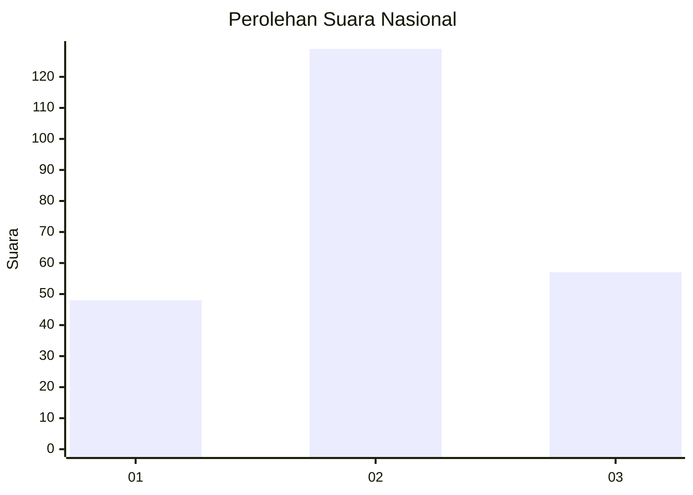
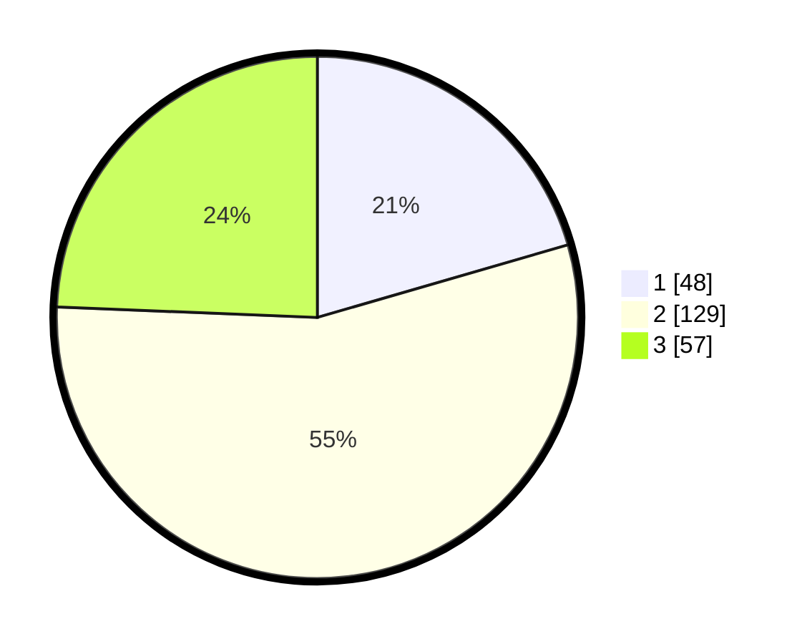

# Hasil

## Grafik

## Tabel

| No. | Nama Paslon    | Suara | Suara (raw) | Persentase |
|:--- |:-------------- | -----:| -----------:| ----------:|
| 1   | ANIES MUHAIMIN | 48    | [48][p-1]   | 20,51      |
| 2   | PRABOWO GIBRAN | 129   | [129][p-2]  | 55,13      |
| 3   | GANJAR MAHFUD  | 57    | [57][p-3]   | 24,36      |

[p-1]: https://github.com/gigit-pemilu/pemilu-2024/blob/main/pilpres/hitung-suara/sub/34-di-yogyakarta/sub/02-bantul/sub/09-jetis/sub/2003-sumberagung/sub/011-tps/sub/paslon-1.txt
[p-2]: https://github.com/gigit-pemilu/pemilu-2024/blob/main/pilpres/hitung-suara/sub/34-di-yogyakarta/sub/02-bantul/sub/09-jetis/sub/2003-sumberagung/sub/011-tps/sub/paslon-2.txt
[p-3]: https://github.com/gigit-pemilu/pemilu-2024/blob/main/pilpres/hitung-suara/sub/34-di-yogyakarta/sub/02-bantul/sub/09-jetis/sub/2003-sumberagung/sub/011-tps/sub/paslon-3.txt

## Foto C Plano

https://sirekap-obj-formc.kpu.go.id/21f0/pemilu/ppwp/34/02/09/20/03/3402092003011-20240216-145833--bfd9d37a-5960-43db-80fc-a1951aca4d1d.jpg

https://sirekap-obj-formc.kpu.go.id/21f0/pemilu/ppwp/34/02/09/20/03/3402092003011-20240216-145955--724cc3d4-31f2-4810-8c36-83a6afac74d4.jpg

https://sirekap-obj-formc.kpu.go.id/21f0/pemilu/ppwp/34/02/09/20/03/3402092003011-20240216-150048--c6b069a4-9ee8-4a2e-b921-20317d4e062f.jpg

## Metadata

| Key        | Value               |
| ---------- | ------------------- |
| Time Stamp | 2024-02-24 22:31:28 |

