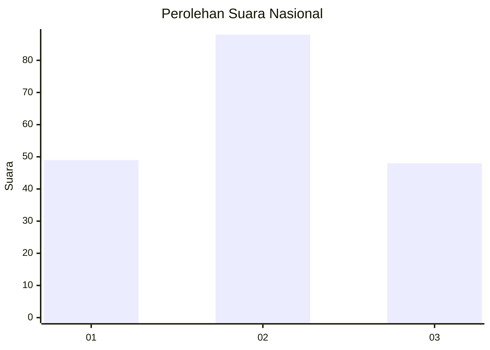
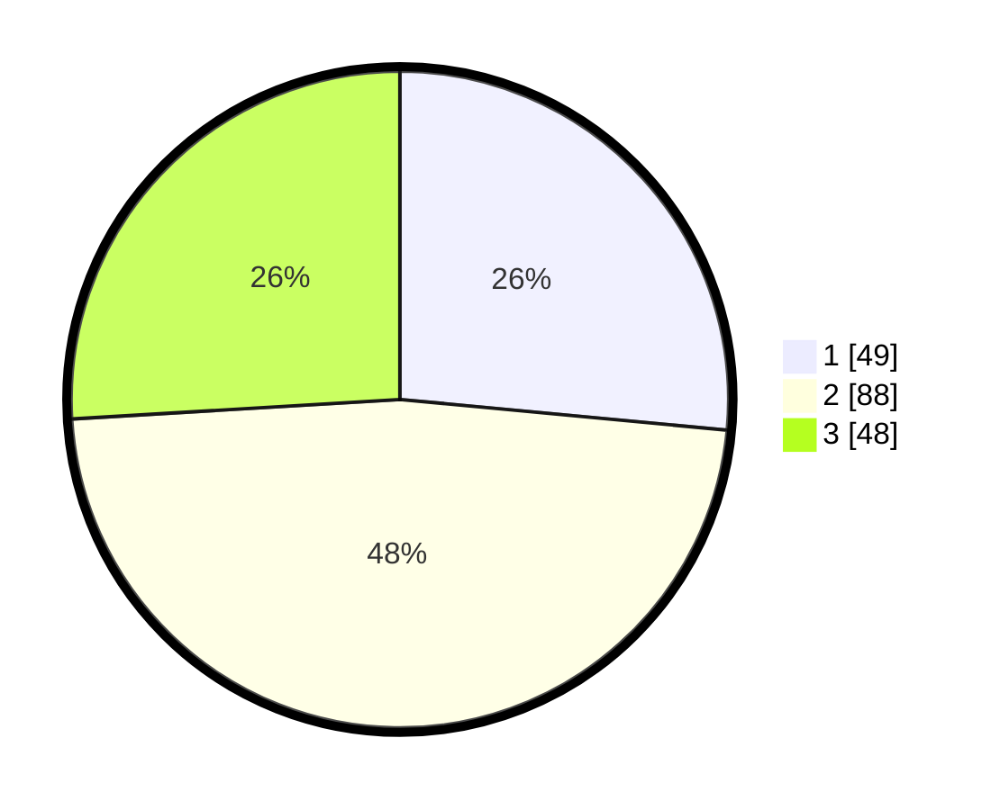

# Hasil

## Grafik

## Tabel

| No. | Nama Paslon    | Suara | Suara (raw) | Persentase |
|:--- |:-------------- | -----:| -----------:| ----------:|
| 1   | ANIES MUHAIMIN | 49    | [49][p-1]   | 26,49      |
| 2   | PRABOWO GIBRAN | 88    | [88][p-2]   | 47,57      |
| 3   | GANJAR MAHFUD  | 48    | [48][p-3]   | 25,95      |

[p-1]: https://github.com/gigit-pemilu/pemilu-2024/blob/main/pilpres/hitung-suara/sub/34-di-yogyakarta/sub/02-bantul/sub/09-jetis/sub/2003-sumberagung/sub/017-tps/sub/paslon-1.txt
[p-2]: https://github.com/gigit-pemilu/pemilu-2024/blob/main/pilpres/hitung-suara/sub/34-di-yogyakarta/sub/02-bantul/sub/09-jetis/sub/2003-sumberagung/sub/017-tps/sub/paslon-2.txt
[p-3]: https://github.com/gigit-pemilu/pemilu-2024/blob/main/pilpres/hitung-suara/sub/34-di-yogyakarta/sub/02-bantul/sub/09-jetis/sub/2003-sumberagung/sub/017-tps/sub/paslon-3.txt

## Foto C Plano

https://sirekap-obj-formc.kpu.go.id/aa61/pemilu/ppwp/34/02/09/20/03/3402092003017-20240216-160850--85161cd3-6e40-4fc3-acd4-62dcc36263c9.jpg

https://sirekap-obj-formc.kpu.go.id/aa61/pemilu/ppwp/34/02/09/20/03/3402092003017-20240216-161024--0de25a1a-e8a8-4977-85be-067e3f536264.jpg

https://sirekap-obj-formc.kpu.go.id/aa61/pemilu/ppwp/34/02/09/20/03/3402092003017-20240216-161121--4483f496-2e97-4a0a-ac38-d99a392f3c88.jpg

## Metadata

| Key        | Value               |
| ---------- | ------------------- |
| Time Stamp | 2024-02-24 22:31:28 |

