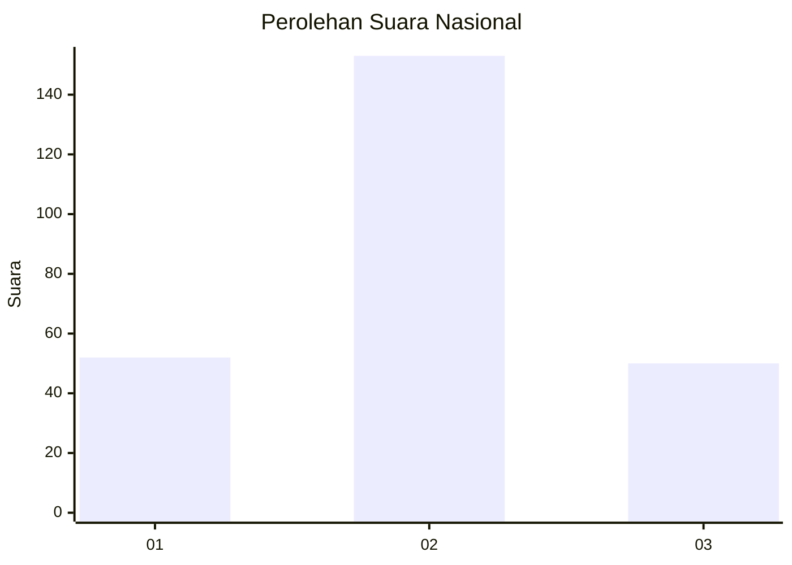
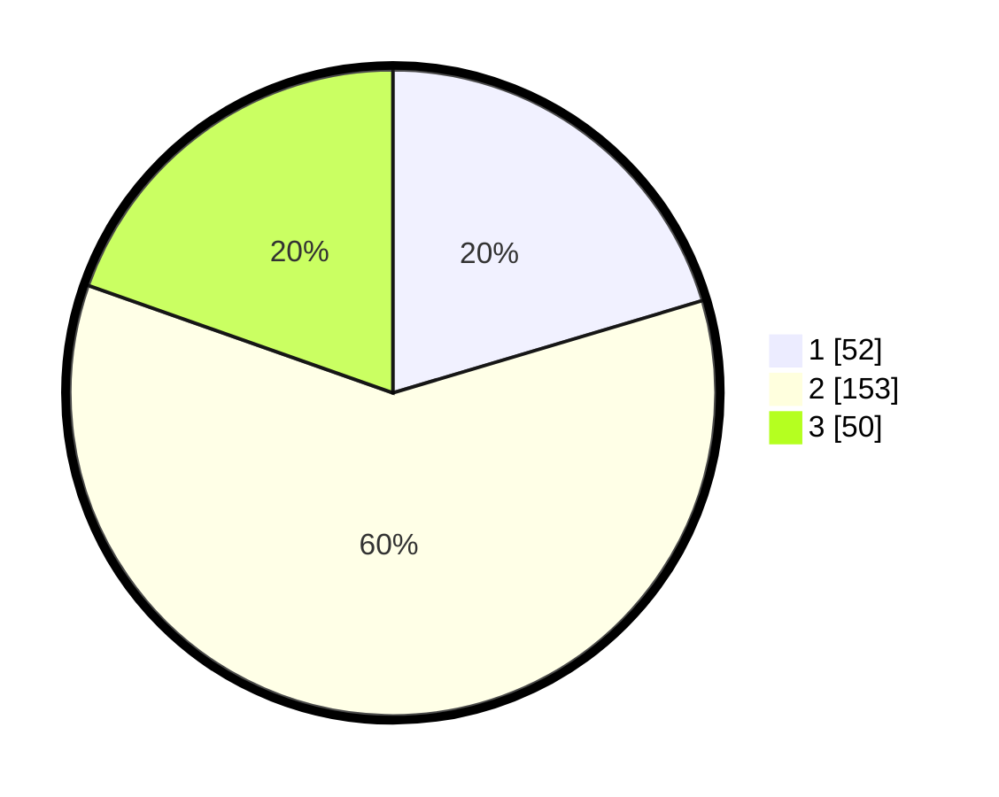

# Hasil

## Grafik

## Tabel

| No. | Nama Paslon    | Suara | Suara (raw) | Persentase |
|:--- |:-------------- | -----:| -----------:| ----------:|
| 1   | ANIES MUHAIMIN | 52    | [52][p-1]   | 20,39      |
| 2   | PRABOWO GIBRAN | 153   | [153][p-2]  | 60,00      |
| 3   | GANJAR MAHFUD  | 50    | [50][p-3]   | 19,61      |

[p-1]: https://github.com/gigit-pemilu/pemilu-2024/blob/main/pilpres/hitung-suara/sub/34-di-yogyakarta/sub/02-bantul/sub/09-jetis/sub/2003-sumberagung/sub/019-tps/sub/paslon-1.txt
[p-2]: https://github.com/gigit-pemilu/pemilu-2024/blob/main/pilpres/hitung-suara/sub/34-di-yogyakarta/sub/02-bantul/sub/09-jetis/sub/2003-sumberagung/sub/019-tps/sub/paslon-2.txt
[p-3]: https://github.com/gigit-pemilu/pemilu-2024/blob/main/pilpres/hitung-suara/sub/34-di-yogyakarta/sub/02-bantul/sub/09-jetis/sub/2003-sumberagung/sub/019-tps/sub/paslon-3.txt

## Foto C Plano

https://sirekap-obj-formc.kpu.go.id/20c3/pemilu/ppwp/34/02/09/20/03/3402092003019-20240216-162519--6f63947a-0ad2-498f-8c7d-e0a0ce9fa31f.jpg

https://sirekap-obj-formc.kpu.go.id/20c3/pemilu/ppwp/34/02/09/20/03/3402092003019-20240216-162743--abb55782-15ad-4bb5-a052-bfaecf965b93.jpg

https://sirekap-obj-formc.kpu.go.id/20c3/pemilu/ppwp/34/02/09/20/03/3402092003019-20240216-162835--d8eac9a6-aa54-4bbc-9c70-885b8ac89ca2.jpg

## Metadata

| Key        | Value               |
| ---------- | ------------------- |
| Time Stamp | 2024-02-24 22:31:28 |

