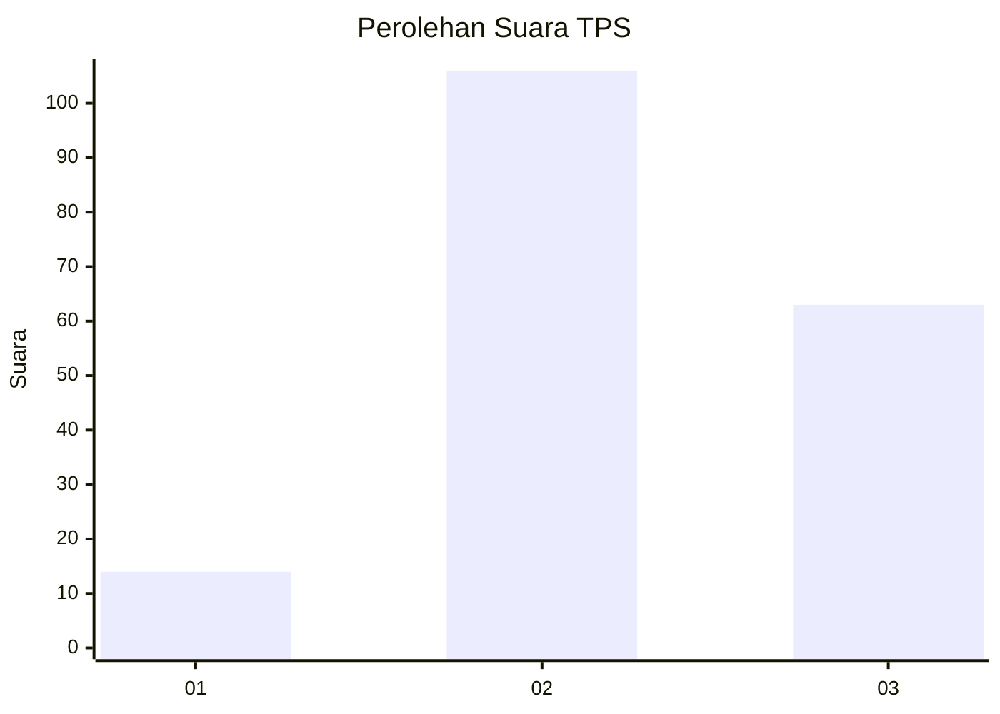
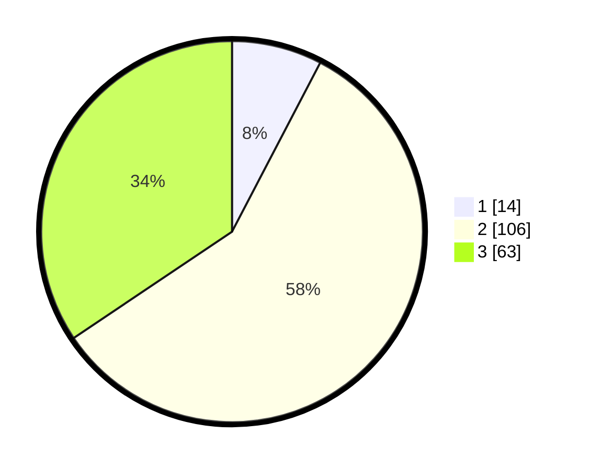

# Hasil

## Grafik

## Tabel

| No. | Nama Paslon    | Suara | Suara (raw) | Persentase |
|:--- |:-------------- | -----:| -----------:| ----------:|
| 1   | ANIES MUHAIMIN | 14    | [14][p-1]   | 7,65       |
| 2   | PRABOWO GIBRAN | 106   | [106][p-2]  | 57,92      |
| 3   | GANJAR MAHFUD  | 63    | [63][p-3]   | 34,43      |

[p-1]: https://github.com/gigit-pemilu/pemilu-2024-34-di-yogyakarta/blob/main/pilpres/hitung-suara/sub/34-di-yogyakarta/sub/02-bantul/sub/09-jetis/sub/2003-sumberagung/sub/020-tps/sub/paslon-1.txt
[p-2]: https://github.com/gigit-pemilu/pemilu-2024-34-di-yogyakarta/blob/main/pilpres/hitung-suara/sub/34-di-yogyakarta/sub/02-bantul/sub/09-jetis/sub/2003-sumberagung/sub/020-tps/sub/paslon-2.txt
[p-3]: https://github.com/gigit-pemilu/pemilu-2024-34-di-yogyakarta/blob/main/pilpres/hitung-suara/sub/34-di-yogyakarta/sub/02-bantul/sub/09-jetis/sub/2003-sumberagung/sub/020-tps/sub/paslon-3.txt

## Foto C Plano

https://sirekap-obj-formc.kpu.go.id/f42a/pemilu/ppwp/34/02/09/20/03/3402092003020-20240214-214142--fd93a000-b9e4-47a0-a8fd-9009770ffe49.jpg

https://sirekap-obj-formc.kpu.go.id/f42a/pemilu/ppwp/34/02/09/20/03/3402092003020-20240214-214207--8ddba713-0974-4c6f-ad2e-9f464656ba93.jpg

https://sirekap-obj-formc.kpu.go.id/f42a/pemilu/ppwp/34/02/09/20/03/3402092003020-20240214-214224--6444067e-6344-4ece-8979-3eb7f97ec9bd.jpg

## Metadata

| Key        | Value               |
| ---------- | ------------------- |
| Time Stamp | 2024-02-24 22:31:28 |

