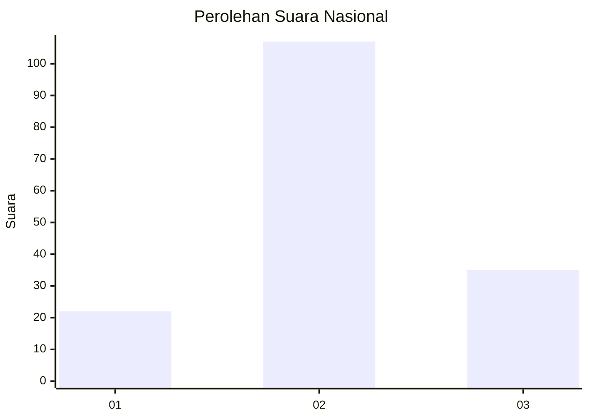
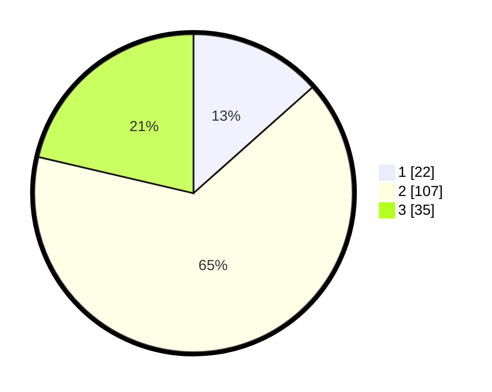

# Hasil

## Grafik

## Tabel

| No. | Nama Paslon    | Suara | Suara (raw) | Persentase |
|:--- |:-------------- | -----:| -----------:| ----------:|
| 1   | ANIES MUHAIMIN | 22    | [22][p-1]   | 13,41      |
| 2   | PRABOWO GIBRAN | 107   | [107][p-2]  | 65,24      |
| 3   | GANJAR MAHFUD  | 35    | [35][p-3]   | 21,34      |

[p-1]: https://github.com/gigit-pemilu/pemilu-2024/blob/main/pilpres/hitung-suara/sub/34-di-yogyakarta/sub/02-bantul/sub/09-jetis/sub/2003-sumberagung/sub/021-tps/sub/paslon-1.txt
[p-2]: https://github.com/gigit-pemilu/pemilu-2024/blob/main/pilpres/hitung-suara/sub/34-di-yogyakarta/sub/02-bantul/sub/09-jetis/sub/2003-sumberagung/sub/021-tps/sub/paslon-2.txt
[p-3]: https://github.com/gigit-pemilu/pemilu-2024/blob/main/pilpres/hitung-suara/sub/34-di-yogyakarta/sub/02-bantul/sub/09-jetis/sub/2003-sumberagung/sub/021-tps/sub/paslon-3.txt

## Foto C Plano

https://sirekap-obj-formc.kpu.go.id/7073/pemilu/ppwp/34/02/09/20/03/3402092003021-20240218-151258--d1746434-0192-4939-ba5f-f67cbf9f7db8.jpg

https://sirekap-obj-formc.kpu.go.id/7073/pemilu/ppwp/34/02/09/20/03/3402092003021-20240218-151423--ca033c58-a03a-48a4-bc68-f02c1c22072d.jpg

https://sirekap-obj-formc.kpu.go.id/7073/pemilu/ppwp/34/02/09/20/03/3402092003021-20240218-151534--54575ef5-be0f-4f62-a682-3a0da15cc8a3.jpg

## Metadata

| Key        | Value               |
| ---------- | ------------------- |
| Time Stamp | 2024-02-25 11:00:00 |

