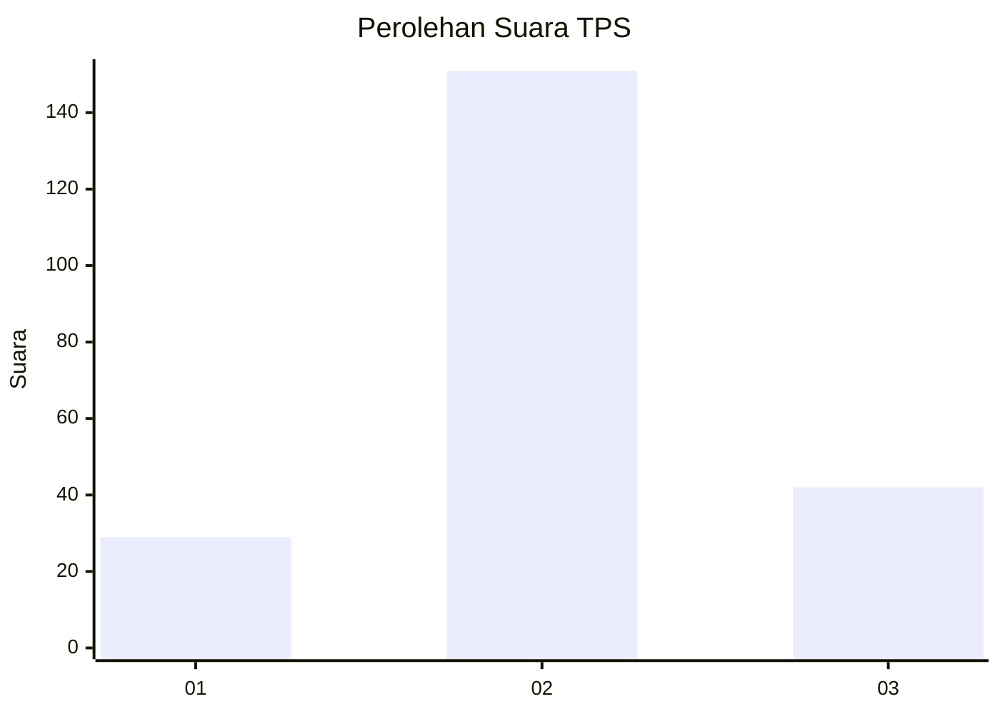
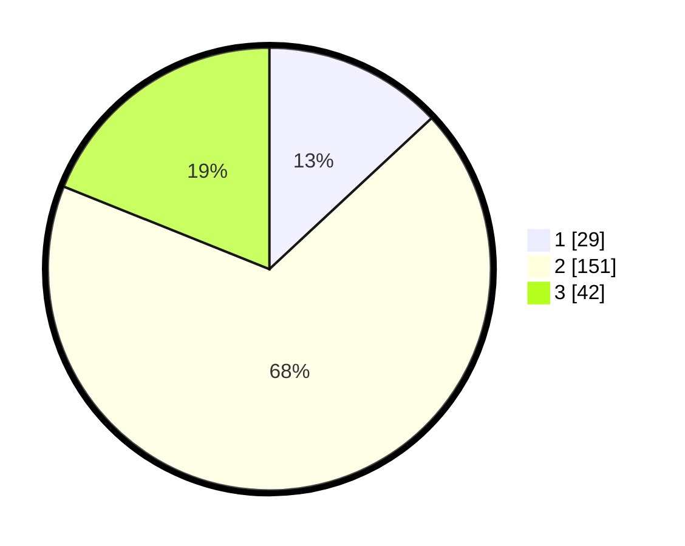

# Hasil

## Grafik

## Tabel

| No. | Nama Paslon    | Suara | Suara (raw) | Persentase |
|:--- |:-------------- | -----:| -----------:| ----------:|
| 1   | ANIES MUHAIMIN | 29    | [29][p-1]   | 13,06      |
| 2   | PRABOWO GIBRAN | 151   | [151][p-2]  | 68,02      |
| 3   | GANJAR MAHFUD  | 42    | [42][p-3]   | 18,92      |

[p-1]: https://github.com/gigit-pemilu/pemilu-2024-34-di-yogyakarta/blob/main/pilpres/hitung-suara/sub/34-di-yogyakarta/sub/02-bantul/sub/09-jetis/sub/2003-sumberagung/sub/023-tps/sub/paslon-1.txt
[p-2]: https://github.com/gigit-pemilu/pemilu-2024-34-di-yogyakarta/blob/main/pilpres/hitung-suara/sub/34-di-yogyakarta/sub/02-bantul/sub/09-jetis/sub/2003-sumberagung/sub/023-tps/sub/paslon-2.txt
[p-3]: https://github.com/gigit-pemilu/pemilu-2024-34-di-yogyakarta/blob/main/pilpres/hitung-suara/sub/34-di-yogyakarta/sub/02-bantul/sub/09-jetis/sub/2003-sumberagung/sub/023-tps/sub/paslon-3.txt

## Foto C Plano

https://sirekap-obj-formc.kpu.go.id/a57a/pemilu/ppwp/34/02/09/20/03/3402092003023-20240218-165039--09a6a180-db13-4027-a803-e70ac78bd242.jpg

https://sirekap-obj-formc.kpu.go.id/a57a/pemilu/ppwp/34/02/09/20/03/3402092003023-20240218-165245--767cdbec-e562-4643-9f67-b21b19c7b6ef.jpg

https://sirekap-obj-formc.kpu.go.id/a57a/pemilu/ppwp/34/02/09/20/03/3402092003023-20240218-165358--29a5ef6b-6c39-4563-aa96-bcdc0656f41b.jpg

## Metadata

| Key        | Value               |
| ---------- | ------------------- |
| Time Stamp | 2024-02-25 11:00:00 |

