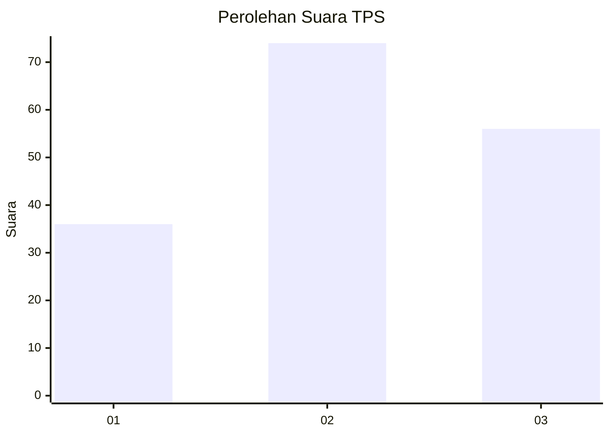
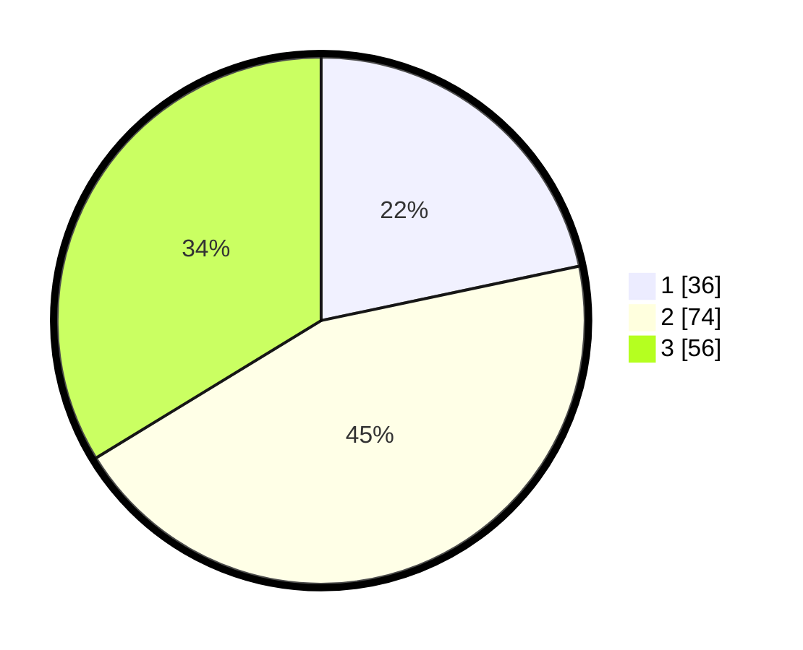

# Hasil

## Grafik

## Tabel

| No. | Nama Paslon    | Suara | Suara (raw) | Persentase |
|:--- |:-------------- | -----:| -----------:| ----------:|
| 1   | ANIES MUHAIMIN | 36    | [36][p-1]   | 21,69      |
| 2   | PRABOWO GIBRAN | 74    | [74][p-2]   | 44,58      |
| 3   | GANJAR MAHFUD  | 56    | [56][p-3]   | 33,73      |

[p-1]: https://github.com/gigit-pemilu/pemilu-2024-34-di-yogyakarta/blob/main/pilpres/hitung-suara/sub/34-di-yogyakarta/sub/02-bantul/sub/09-jetis/sub/2003-sumberagung/sub/030-tps/sub/paslon-1.txt
[p-2]: https://github.com/gigit-pemilu/pemilu-2024-34-di-yogyakarta/blob/main/pilpres/hitung-suara/sub/34-di-yogyakarta/sub/02-bantul/sub/09-jetis/sub/2003-sumberagung/sub/030-tps/sub/paslon-2.txt
[p-3]: https://github.com/gigit-pemilu/pemilu-2024-34-di-yogyakarta/blob/main/pilpres/hitung-suara/sub/34-di-yogyakarta/sub/02-bantul/sub/09-jetis/sub/2003-sumberagung/sub/030-tps/sub/paslon-3.txt

## Foto C Plano

https://sirekap-obj-formc.kpu.go.id/6dbd/pemilu/ppwp/34/02/09/20/03/3402092003030-20240214-190001--26785da8-9452-423f-9f98-e4ba3d5c677f.jpg

https://sirekap-obj-formc.kpu.go.id/6dbd/pemilu/ppwp/34/02/09/20/03/3402092003030-20240214-190020--04b1fb08-2226-4551-b0f6-a2f4ed7eb700.jpg

https://sirekap-obj-formc.kpu.go.id/6dbd/pemilu/ppwp/34/02/09/20/03/3402092003030-20240215-002357--63483176-58cf-4809-8ae6-80677d795830.jpg

## Metadata

| Key        | Value               |
| ---------- | ------------------- |
| Time Stamp | 2024-02-15 00:41:44 |

