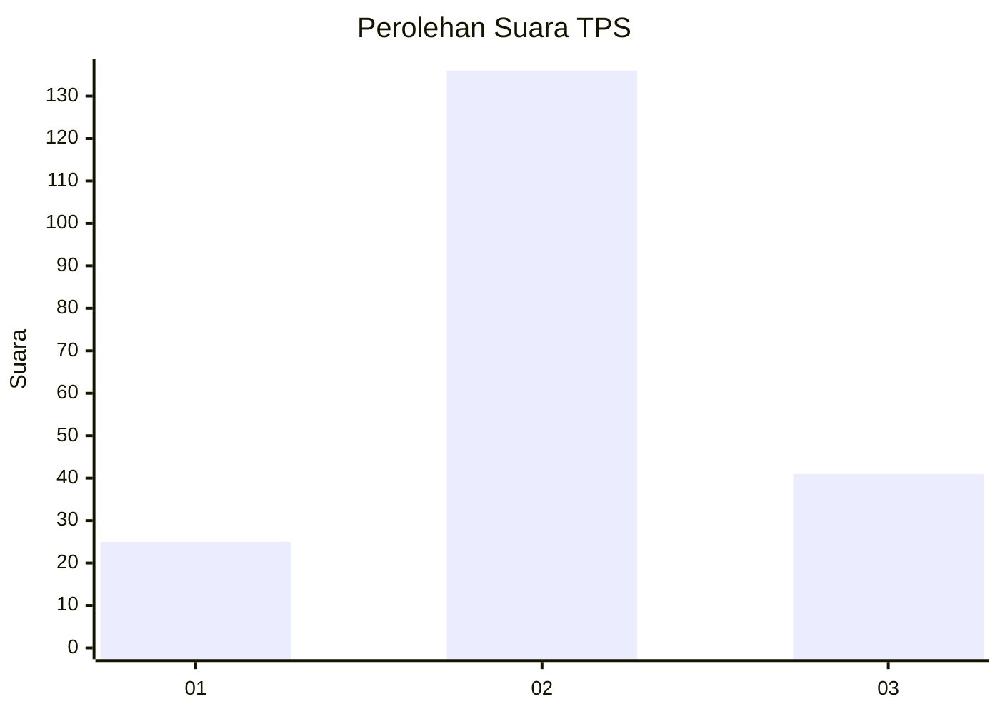
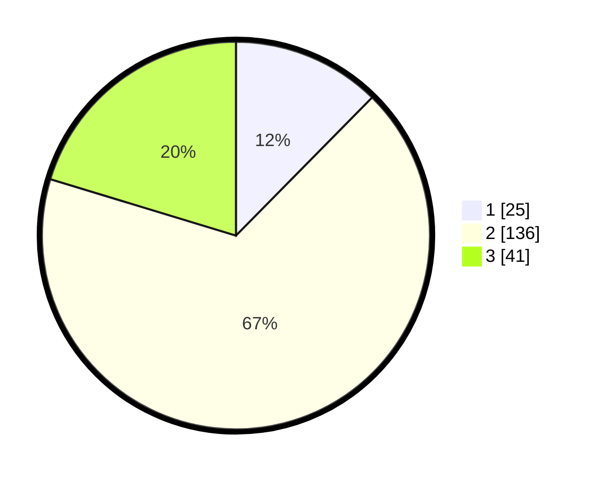

# Hasil

## Grafik

## Tabel

| No. | Nama Paslon    | Suara | Suara (raw) | Persentase |
|:--- |:-------------- | -----:| -----------:| ----------:|
| 1   | ANIES MUHAIMIN | 25    | [25][p-1]   | 12,38      |
| 2   | PRABOWO GIBRAN | 136   | [136][p-2]  | 67,33      |
| 3   | GANJAR MAHFUD  | 41    | [41][p-3]   | 20,30      |

[p-1]: https://github.com/gigit-pemilu/pemilu-2024-34-di-yogyakarta/blob/main/pilpres/hitung-suara/sub/34-di-yogyakarta/sub/02-bantul/sub/09-jetis/sub/2003-sumberagung/sub/033-tps/sub/paslon-1.txt
[p-2]: https://github.com/gigit-pemilu/pemilu-2024-34-di-yogyakarta/blob/main/pilpres/hitung-suara/sub/34-di-yogyakarta/sub/02-bantul/sub/09-jetis/sub/2003-sumberagung/sub/033-tps/sub/paslon-2.txt
[p-3]: https://github.com/gigit-pemilu/pemilu-2024-34-di-yogyakarta/blob/main/pilpres/hitung-suara/sub/34-di-yogyakarta/sub/02-bantul/sub/09-jetis/sub/2003-sumberagung/sub/033-tps/sub/paslon-3.txt

## Foto C Plano

https://sirekap-obj-formc.kpu.go.id/3cb6/pemilu/ppwp/34/02/09/20/03/3402092003033-20240214-223514--d1cd4c36-ea34-4429-88a9-43e79da20e01.jpg

https://sirekap-obj-formc.kpu.go.id/3cb6/pemilu/ppwp/34/02/09/20/03/3402092003033-20240214-223851--68bf6fa1-bddd-4353-a57f-7baca01c1f2f.jpg

https://sirekap-obj-formc.kpu.go.id/3cb6/pemilu/ppwp/34/02/09/20/03/3402092003033-20240214-224036--7782be40-f8e1-40be-beb7-079bb95bdd1b.jpg

## Metadata

| Key        | Value               |
| ---------- | ------------------- |
| Time Stamp | 2024-02-24 22:31:28 |

