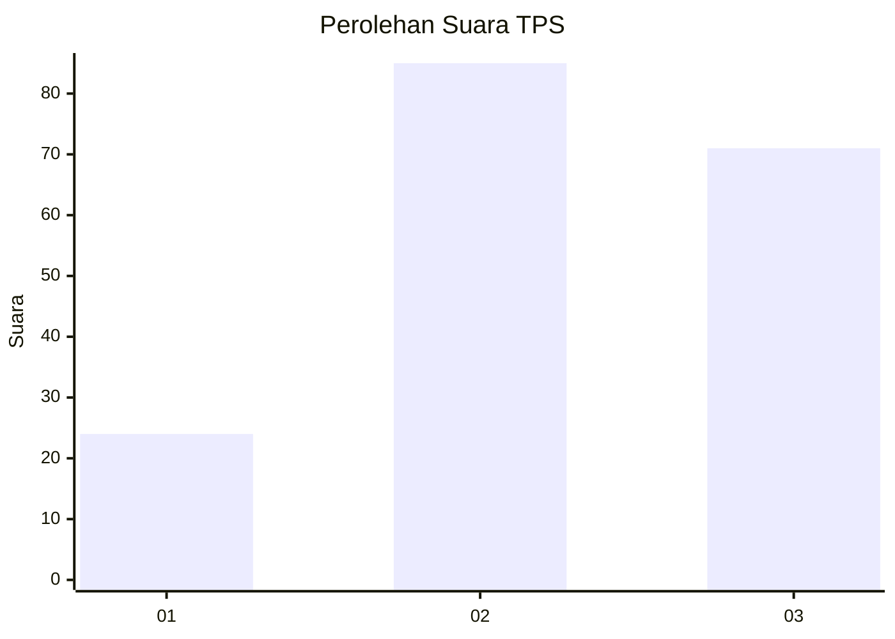
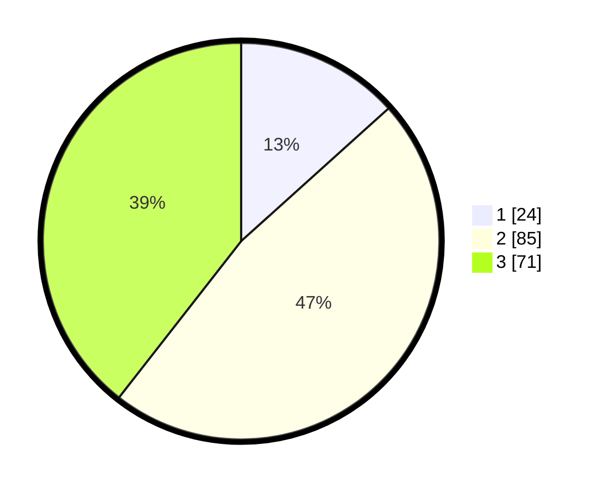

# Hasil

## Grafik

## Tabel

| No. | Nama Paslon    | Suara | Suara (raw) | Persentase |
|:--- |:-------------- | -----:| -----------:| ----------:|
| 1   | ANIES MUHAIMIN | 24    | [24][p-1]   | 13,33      |
| 2   | PRABOWO GIBRAN | 85    | [85][p-2]   | 47,22      |
| 3   | GANJAR MAHFUD  | 71    | [71][p-3]   | 39,44      |

[p-1]: https://github.com/gigit-pemilu/pemilu-2024-34-di-yogyakarta/blob/main/pilpres/hitung-suara/sub/34-di-yogyakarta/sub/02-bantul/sub/09-jetis/sub/2003-sumberagung/sub/034-tps/sub/paslon-1.txt
[p-2]: https://github.com/gigit-pemilu/pemilu-2024-34-di-yogyakarta/blob/main/pilpres/hitung-suara/sub/34-di-yogyakarta/sub/02-bantul/sub/09-jetis/sub/2003-sumberagung/sub/034-tps/sub/paslon-2.txt
[p-3]: https://github.com/gigit-pemilu/pemilu-2024-34-di-yogyakarta/blob/main/pilpres/hitung-suara/sub/34-di-yogyakarta/sub/02-bantul/sub/09-jetis/sub/2003-sumberagung/sub/034-tps/sub/paslon-3.txt

## Foto C Plano

https://sirekap-obj-formc.kpu.go.id/7d76/pemilu/ppwp/34/02/09/20/03/3402092003034-20240215-001641--c41a4702-9bdc-49bb-93bb-8dcca51a66cc.jpg

https://sirekap-obj-formc.kpu.go.id/7d76/pemilu/ppwp/34/02/09/20/03/3402092003034-20240215-001726--5bee7962-8590-4c2f-b3e1-94646da3ffc5.jpg

https://sirekap-obj-formc.kpu.go.id/7d76/pemilu/ppwp/34/02/09/20/03/3402092003034-20240215-002028--730be290-f630-4dba-af11-21fbf53ea600.jpg

## Metadata

| Key        | Value               |
| ---------- | ------------------- |
| Time Stamp | 2024-02-25 12:00:00 |

