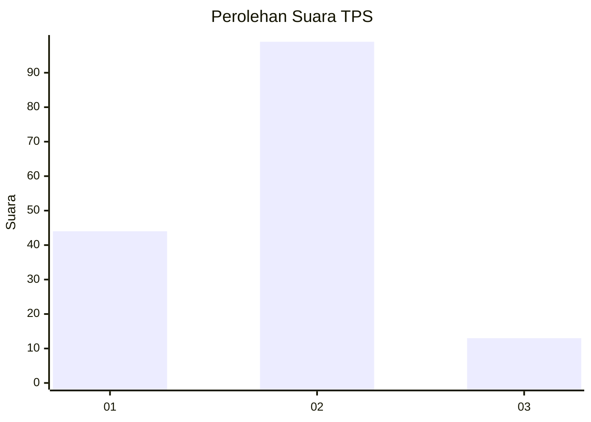
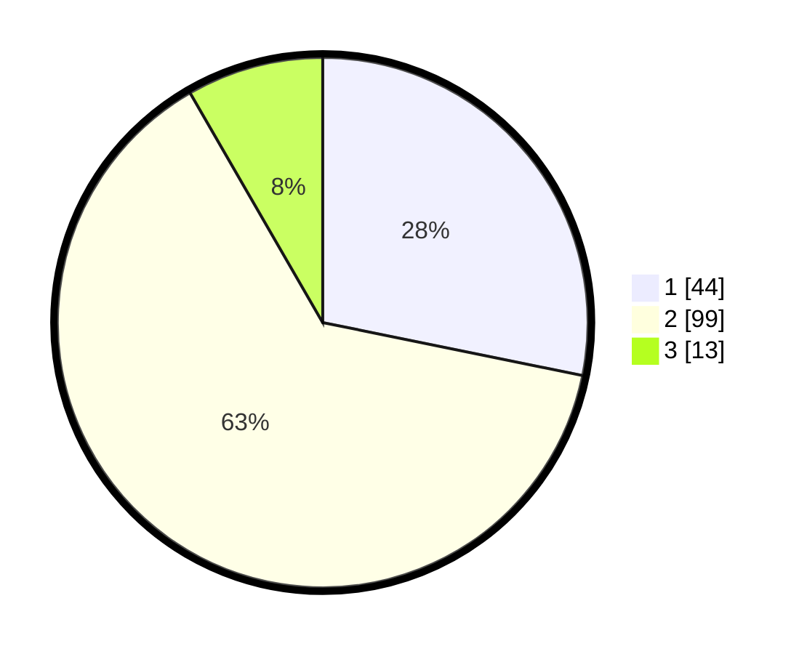

# Hasil

## Grafik

## Tabel

| No. | Nama Paslon    | Suara | Suara (raw) | Persentase |
|:--- |:-------------- | -----:| -----------:| ----------:|
| 1   | ANIES MUHAIMIN | 44    | [44][p-1]   | 28,21      |
| 2   | PRABOWO GIBRAN | 99    | [99][p-2]   | 63,46      |
| 3   | GANJAR MAHFUD  | 13    | [13][p-3]   | 8,33       |

[p-1]: https://github.com/gigit-pemilu/pemilu-2024-34-di-yogyakarta/blob/main/pilpres/hitung-suara/sub/34-di-yogyakarta/sub/02-bantul/sub/09-jetis/sub/2003-sumberagung/sub/041-tps/sub/paslon-1.txt
[p-2]: https://github.com/gigit-pemilu/pemilu-2024-34-di-yogyakarta/blob/main/pilpres/hitung-suara/sub/34-di-yogyakarta/sub/02-bantul/sub/09-jetis/sub/2003-sumberagung/sub/041-tps/sub/paslon-2.txt
[p-3]: https://github.com/gigit-pemilu/pemilu-2024-34-di-yogyakarta/blob/main/pilpres/hitung-suara/sub/34-di-yogyakarta/sub/02-bantul/sub/09-jetis/sub/2003-sumberagung/sub/041-tps/sub/paslon-3.txt

## Foto C Plano

https://sirekap-obj-formc.kpu.go.id/fb38/pemilu/ppwp/34/02/09/20/03/3402092003041-20240214-232345--02d558f3-5c75-46a0-b004-4d271a3c7d7c.jpg

https://sirekap-obj-formc.kpu.go.id/fb38/pemilu/ppwp/34/02/09/20/03/3402092003041-20240214-232421--2c3425b6-37b1-4798-8bd0-ae95fbcb1934.jpg

https://sirekap-obj-formc.kpu.go.id/fb38/pemilu/ppwp/34/02/09/20/03/3402092003041-20240214-232533--efb693ec-f0b6-453b-8e5e-eb117e93677f.jpg

## Metadata

| Key        | Value               |
| ---------- | ------------------- |
| Time Stamp | 2024-02-16 22:01:00 |

