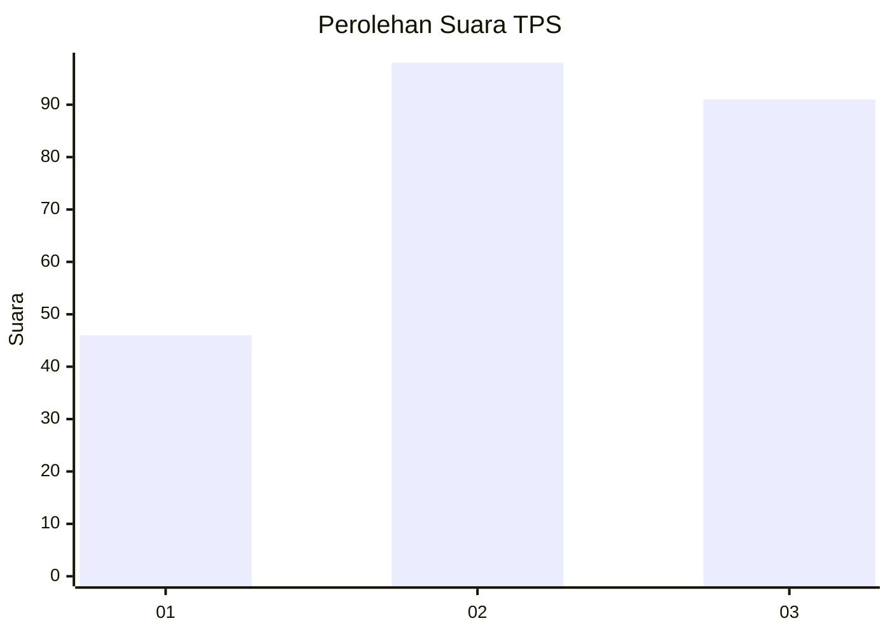
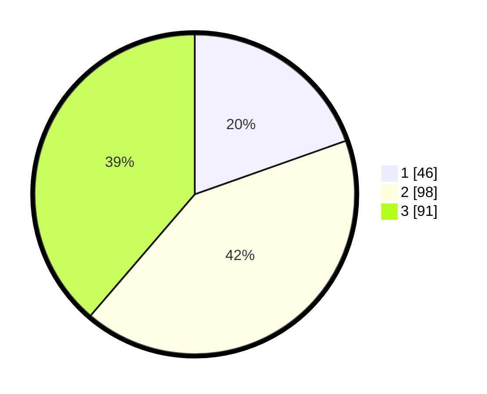

# Hasil

## Grafik

## Tabel

| No. | Nama Paslon    | Suara | Suara (raw) | Persentase |
|:--- |:-------------- | -----:| -----------:| ----------:|
| 1   | ANIES MUHAIMIN | 46    | [46][p-1]   | 19,57      |
| 2   | PRABOWO GIBRAN | 98    | [98][p-2]   | 41,70      |
| 3   | GANJAR MAHFUD  | 91    | [91][p-3]   | 38,72      |

[p-1]: https://github.com/gigit-pemilu/pemilu-2024-34-di-yogyakarta/blob/main/pilpres/hitung-suara/sub/34-di-yogyakarta/sub/02-bantul/sub/09-jetis/sub/2003-sumberagung/sub/050-tps/sub/paslon-1.txt
[p-2]: https://github.com/gigit-pemilu/pemilu-2024-34-di-yogyakarta/blob/main/pilpres/hitung-suara/sub/34-di-yogyakarta/sub/02-bantul/sub/09-jetis/sub/2003-sumberagung/sub/050-tps/sub/paslon-2.txt
[p-3]: https://github.com/gigit-pemilu/pemilu-2024-34-di-yogyakarta/blob/main/pilpres/hitung-suara/sub/34-di-yogyakarta/sub/02-bantul/sub/09-jetis/sub/2003-sumberagung/sub/050-tps/sub/paslon-3.txt

## Foto C Plano

https://sirekap-obj-formc.kpu.go.id/63e4/pemilu/ppwp/34/02/09/20/03/3402092003050-20240214-215845--dfd466de-5a1a-4ebb-8a7c-14e3c6316278.jpg

https://sirekap-obj-formc.kpu.go.id/63e4/pemilu/ppwp/34/02/09/20/03/3402092003050-20240214-215942--b97a63c9-dcf2-40d8-b8e3-62efa11a9b8b.jpg

https://sirekap-obj-formc.kpu.go.id/63e4/pemilu/ppwp/34/02/09/20/03/3402092003050-20240214-220052--b79e398f-b423-4ea0-92fa-2c61d02d5e8a.jpg

## Metadata

| Key        | Value               |
| ---------- | ------------------- |
| Time Stamp | 2024-02-24 22:31:28 |

