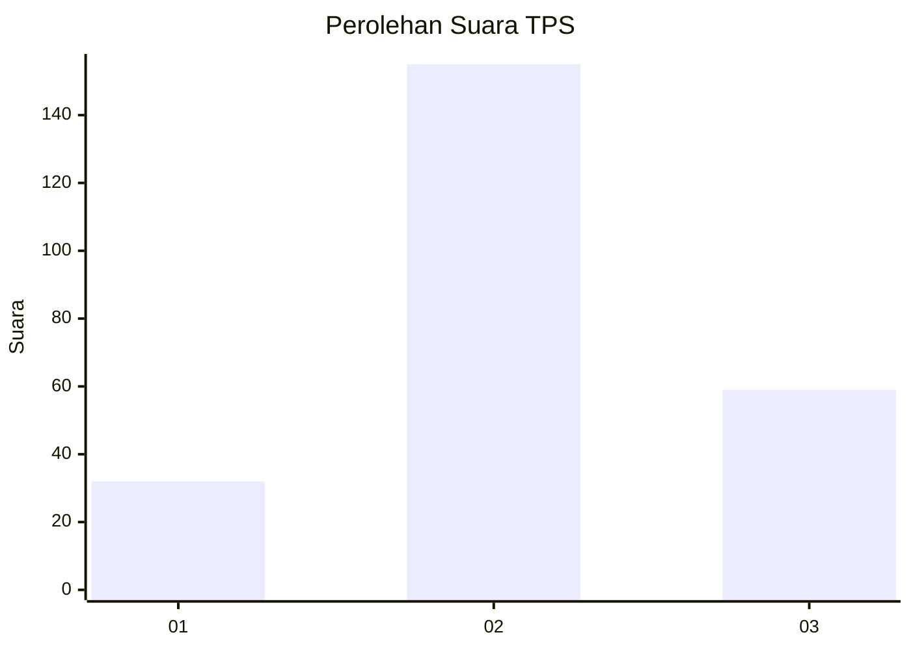
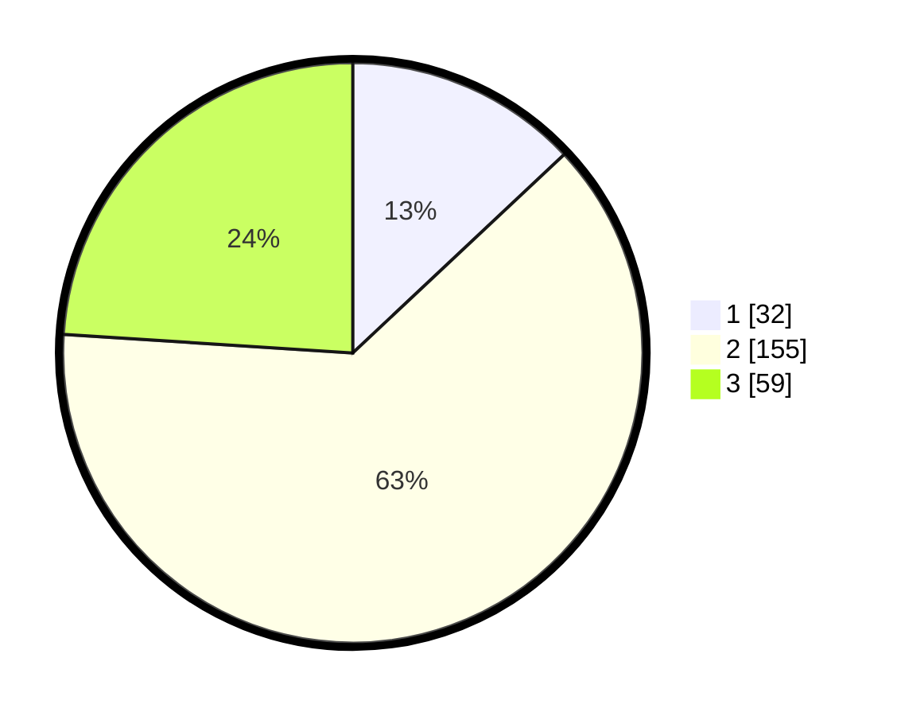

# Hasil

## Grafik

## Tabel

| No. | Nama Paslon    | Suara | Suara (raw) | Persentase |
|:--- |:-------------- | -----:| -----------:| ----------:|
| 1   | ANIES MUHAIMIN | 32    | [32][p-1]   | 13,01      |
| 2   | PRABOWO GIBRAN | 155   | [155][p-2]  | 63,01      |
| 3   | GANJAR MAHFUD  | 59    | [59][p-3]   | 23,98      |

[p-1]: https://github.com/gigit-pemilu/pemilu-2024-34-di-yogyakarta/blob/main/pilpres/hitung-suara/sub/34-di-yogyakarta/sub/02-bantul/sub/09-jetis/sub/2003-sumberagung/sub/052-tps/sub/paslon-1.txt
[p-2]: https://github.com/gigit-pemilu/pemilu-2024-34-di-yogyakarta/blob/main/pilpres/hitung-suara/sub/34-di-yogyakarta/sub/02-bantul/sub/09-jetis/sub/2003-sumberagung/sub/052-tps/sub/paslon-2.txt
[p-3]: https://github.com/gigit-pemilu/pemilu-2024-34-di-yogyakarta/blob/main/pilpres/hitung-suara/sub/34-di-yogyakarta/sub/02-bantul/sub/09-jetis/sub/2003-sumberagung/sub/052-tps/sub/paslon-3.txt

## Foto C Plano

https://sirekap-obj-formc.kpu.go.id/716e/pemilu/ppwp/34/02/09/20/03/3402092003052-20240214-232336--37f0f96d-173e-47d4-83c4-f72346b34cbc.jpg

https://sirekap-obj-formc.kpu.go.id/716e/pemilu/ppwp/34/02/09/20/03/3402092003052-20240214-232448--98f596e5-e25c-4069-ab10-b9d6f34a8454.jpg

https://sirekap-obj-formc.kpu.go.id/716e/pemilu/ppwp/34/02/09/20/03/3402092003052-20240214-232817--adacc9c7-5f53-4317-942e-74a9019502a5.jpg

## Metadata

| Key        | Value               |
| ---------- | ------------------- |
| Time Stamp | 2024-02-16 22:01:00 |

