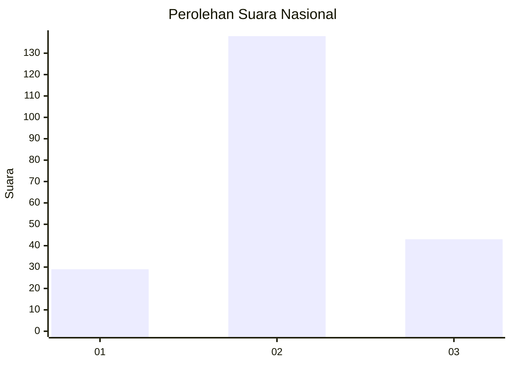
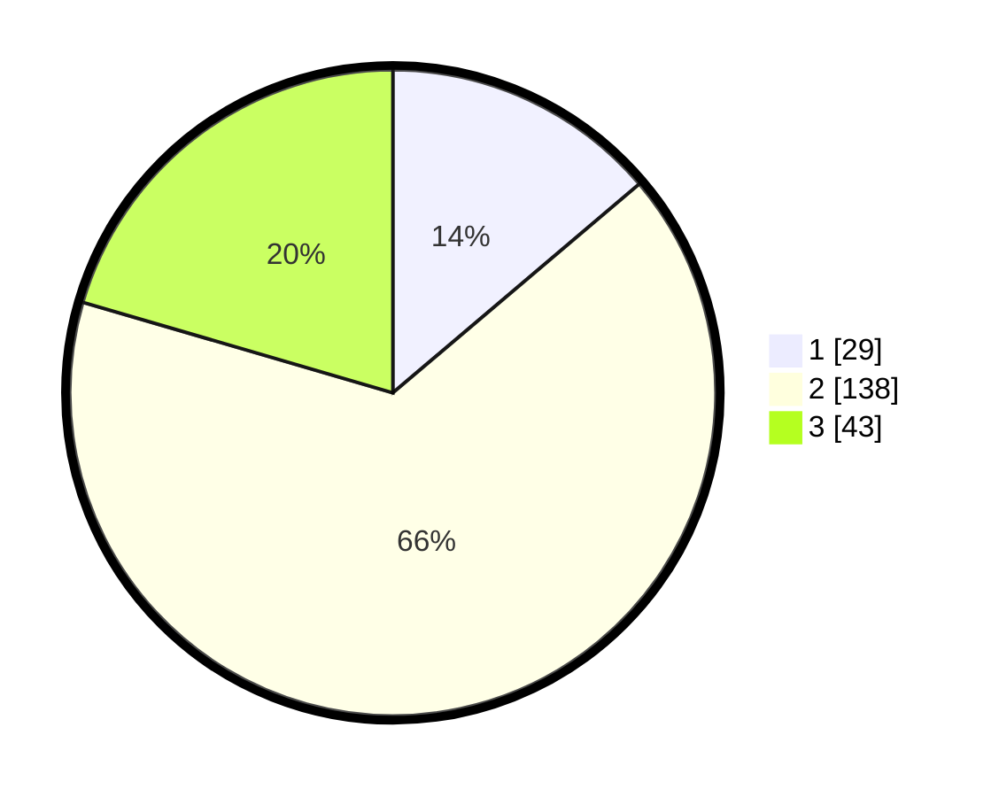

# Hasil

## Grafik

## Tabel

| No. | Nama Paslon    | Suara | Suara (raw) | Persentase |
|:--- |:-------------- | -----:| -----------:| ----------:|
| 1   | ANIES MUHAIMIN | 29    | [29][p-1]   | 13,81      |
| 2   | PRABOWO GIBRAN | 138   | [138][p-2]  | 65,71      |
| 3   | GANJAR MAHFUD  | 43    | [43][p-3]   | 20,48      |

[p-1]: https://github.com/gigit-pemilu/pemilu-2024/blob/main/pilpres/hitung-suara/sub/34-di-yogyakarta/sub/02-bantul/sub/09-jetis/sub/2003-sumberagung/sub/053-tps/sub/paslon-1.txt
[p-2]: https://github.com/gigit-pemilu/pemilu-2024/blob/main/pilpres/hitung-suara/sub/34-di-yogyakarta/sub/02-bantul/sub/09-jetis/sub/2003-sumberagung/sub/053-tps/sub/paslon-2.txt
[p-3]: https://github.com/gigit-pemilu/pemilu-2024/blob/main/pilpres/hitung-suara/sub/34-di-yogyakarta/sub/02-bantul/sub/09-jetis/sub/2003-sumberagung/sub/053-tps/sub/paslon-3.txt

## Foto C Plano

https://sirekap-obj-formc.kpu.go.id/8bd5/pemilu/ppwp/34/02/09/20/03/3402092003053-20240215-093634--44da39ac-bc0d-44c8-9c36-4cb39147c66a.jpg

https://sirekap-obj-formc.kpu.go.id/8bd5/pemilu/ppwp/34/02/09/20/03/3402092003053-20240215-093640--de789d69-0dc3-40c6-9faa-c052ebda1796.jpg

https://sirekap-obj-formc.kpu.go.id/8bd5/pemilu/ppwp/34/02/09/20/03/3402092003053-20240215-093733--bdef13b2-d832-4ff8-99b6-473ad2126cd9.jpg

## Metadata

| Key        | Value               |
| ---------- | ------------------- |
| Time Stamp | 2024-02-24 22:31:28 |

