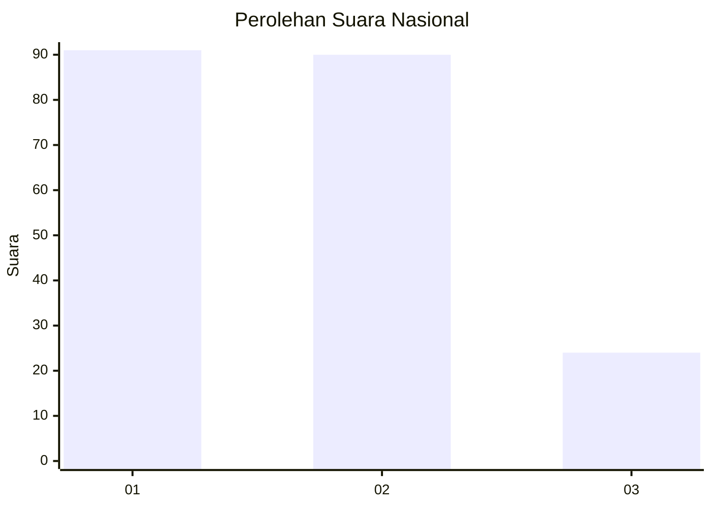
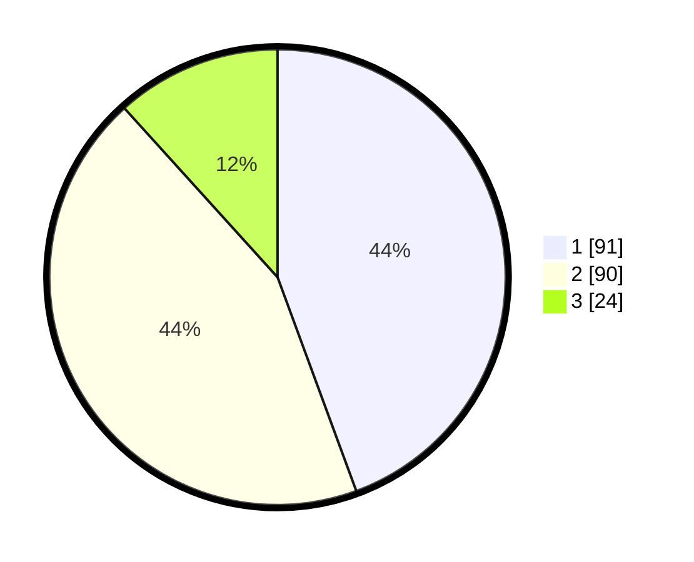

# Hasil

## Grafik

## Tabel

| No. | Nama Paslon    | Suara | Suara (raw) | Persentase |
|:--- |:-------------- | -----:| -----------:| ----------:|
| 1   | ANIES MUHAIMIN | 91    | [91][p-1]   | 44,39      |
| 2   | PRABOWO GIBRAN | 90    | [90][p-2]   | 43,90      |
| 3   | GANJAR MAHFUD  | 24    | [24][p-3]   | 11,71      |

[p-1]: https://github.com/gigit-pemilu/pemilu-2024/blob/main/pilpres/hitung-suara/sub/34-di-yogyakarta/sub/02-bantul/sub/09-jetis/sub/2004-trimulyo/sub/001-tps/sub/paslon-1.txt
[p-2]: https://github.com/gigit-pemilu/pemilu-2024/blob/main/pilpres/hitung-suara/sub/34-di-yogyakarta/sub/02-bantul/sub/09-jetis/sub/2004-trimulyo/sub/001-tps/sub/paslon-2.txt
[p-3]: https://github.com/gigit-pemilu/pemilu-2024/blob/main/pilpres/hitung-suara/sub/34-di-yogyakarta/sub/02-bantul/sub/09-jetis/sub/2004-trimulyo/sub/001-tps/sub/paslon-3.txt

## Foto C Plano

https://sirekap-obj-formc.kpu.go.id/73c3/pemilu/ppwp/34/02/09/20/04/3402092004001-20240215-002802--c6796f63-7c39-4015-9c83-a24ee5b1d5f9.jpg

https://sirekap-obj-formc.kpu.go.id/73c3/pemilu/ppwp/34/02/09/20/04/3402092004001-20240215-002902--40f1f1ac-b9ee-4437-ae91-f331e8e2540f.jpg

https://sirekap-obj-formc.kpu.go.id/73c3/pemilu/ppwp/34/02/09/20/04/3402092004001-20240215-002948--eb702213-913d-40cc-a208-cdee265e1ac1.jpg

## Metadata

| Key        | Value               |
| ---------- | ------------------- |
| Time Stamp | 2024-02-25 12:00:00 |

