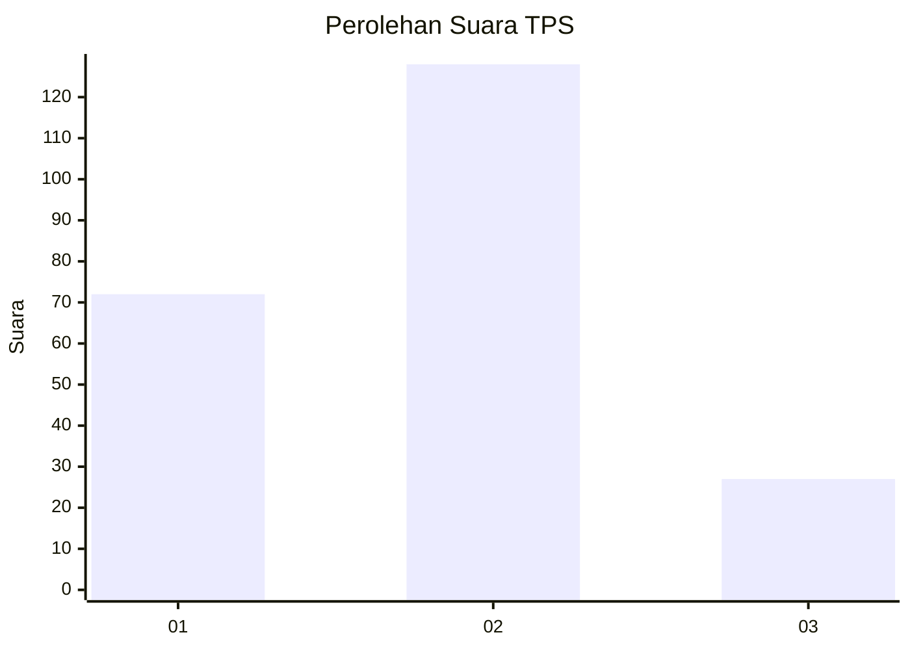
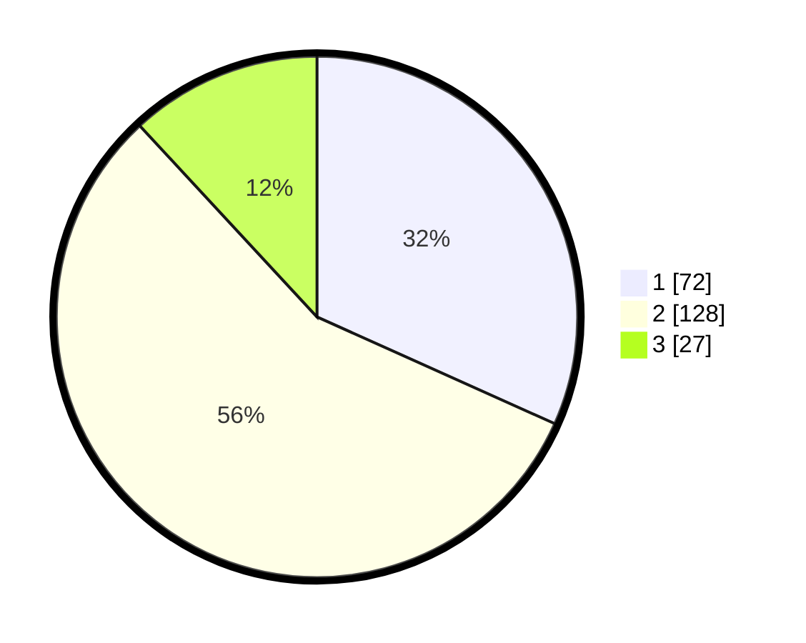

# Hasil

## Grafik

## Tabel

| No. | Nama Paslon    | Suara | Suara (raw) | Persentase |
|:--- |:-------------- | -----:| -----------:| ----------:|
| 1   | ANIES MUHAIMIN | 72    | [72][p-1]   | 31,72      |
| 2   | PRABOWO GIBRAN | 128   | [128][p-2]  | 56,39      |
| 3   | GANJAR MAHFUD  | 27    | [27][p-3]   | 11,89      |

[p-1]: https://github.com/gigit-pemilu/pemilu-2024-34-di-yogyakarta/blob/main/pilpres/hitung-suara/sub/34-di-yogyakarta/sub/02-bantul/sub/09-jetis/sub/2004-trimulyo/sub/003-tps/sub/paslon-1.txt
[p-2]: https://github.com/gigit-pemilu/pemilu-2024-34-di-yogyakarta/blob/main/pilpres/hitung-suara/sub/34-di-yogyakarta/sub/02-bantul/sub/09-jetis/sub/2004-trimulyo/sub/003-tps/sub/paslon-2.txt
[p-3]: https://github.com/gigit-pemilu/pemilu-2024-34-di-yogyakarta/blob/main/pilpres/hitung-suara/sub/34-di-yogyakarta/sub/02-bantul/sub/09-jetis/sub/2004-trimulyo/sub/003-tps/sub/paslon-3.txt

## Foto C Plano

https://sirekap-obj-formc.kpu.go.id/663d/pemilu/ppwp/34/02/09/20/04/3402092004003-20240214-141257--1f98c363-37ea-466f-9013-582e9c3582d9.jpg

https://sirekap-obj-formc.kpu.go.id/663d/pemilu/ppwp/34/02/09/20/04/3402092004003-20240214-141414--7df96610-4d9f-4279-be79-25a57fe6f4b9.jpg

https://sirekap-obj-formc.kpu.go.id/663d/pemilu/ppwp/34/02/09/20/04/3402092004003-20240214-141526--ff833332-5d2f-464d-be64-531501217534.jpg

## Metadata

| Key        | Value               |
| ---------- | ------------------- |
| Time Stamp | 2024-02-25 12:00:00 |

