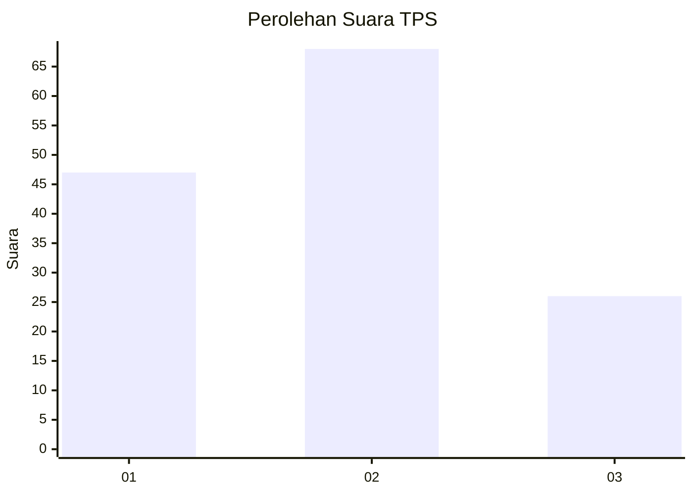
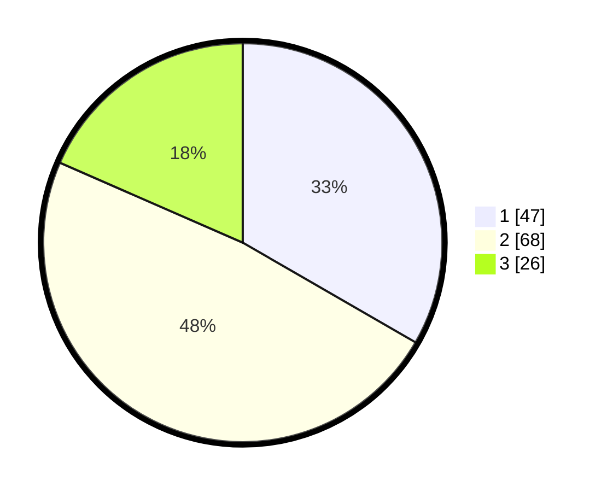

# Hasil

## Grafik

## Tabel

| No. | Nama Paslon    | Suara | Suara (raw) | Persentase |
|:--- |:-------------- | -----:| -----------:| ----------:|
| 1   | ANIES MUHAIMIN | 47    | [47][p-1]   | 33,33      |
| 2   | PRABOWO GIBRAN | 68    | [68][p-2]   | 48,23      |
| 3   | GANJAR MAHFUD  | 26    | [26][p-3]   | 18,44      |

[p-1]: https://github.com/gigit-pemilu/pemilu-2024-34-di-yogyakarta/blob/main/pilpres/hitung-suara/sub/34-di-yogyakarta/sub/02-bantul/sub/09-jetis/sub/2004-trimulyo/sub/005-tps/sub/paslon-1.txt
[p-2]: https://github.com/gigit-pemilu/pemilu-2024-34-di-yogyakarta/blob/main/pilpres/hitung-suara/sub/34-di-yogyakarta/sub/02-bantul/sub/09-jetis/sub/2004-trimulyo/sub/005-tps/sub/paslon-2.txt
[p-3]: https://github.com/gigit-pemilu/pemilu-2024-34-di-yogyakarta/blob/main/pilpres/hitung-suara/sub/34-di-yogyakarta/sub/02-bantul/sub/09-jetis/sub/2004-trimulyo/sub/005-tps/sub/paslon-3.txt

## Foto C Plano

https://sirekap-obj-formc.kpu.go.id/56db/pemilu/ppwp/34/02/09/20/04/3402092004005-20240214-185432--24f5c1df-e221-4afa-a255-6faeb5ffcecd.jpg

https://sirekap-obj-formc.kpu.go.id/56db/pemilu/ppwp/34/02/09/20/04/3402092004005-20240214-185430--06755d75-4c02-4521-a156-0da98d703c69.jpg

https://sirekap-obj-formc.kpu.go.id/56db/pemilu/ppwp/34/02/09/20/04/3402092004005-20240214-185426--5572d52d-db85-46eb-9823-e69826e75b67.jpg

## Metadata

| Key        | Value               |
| ---------- | ------------------- |
| Time Stamp | 2024-02-24 22:31:28 |

