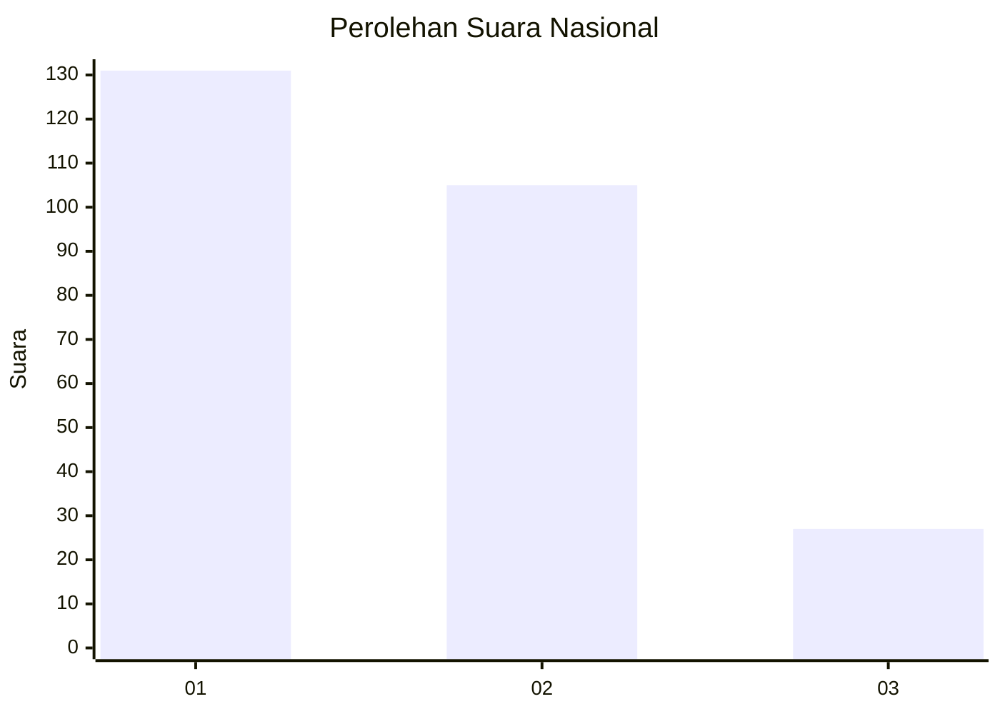
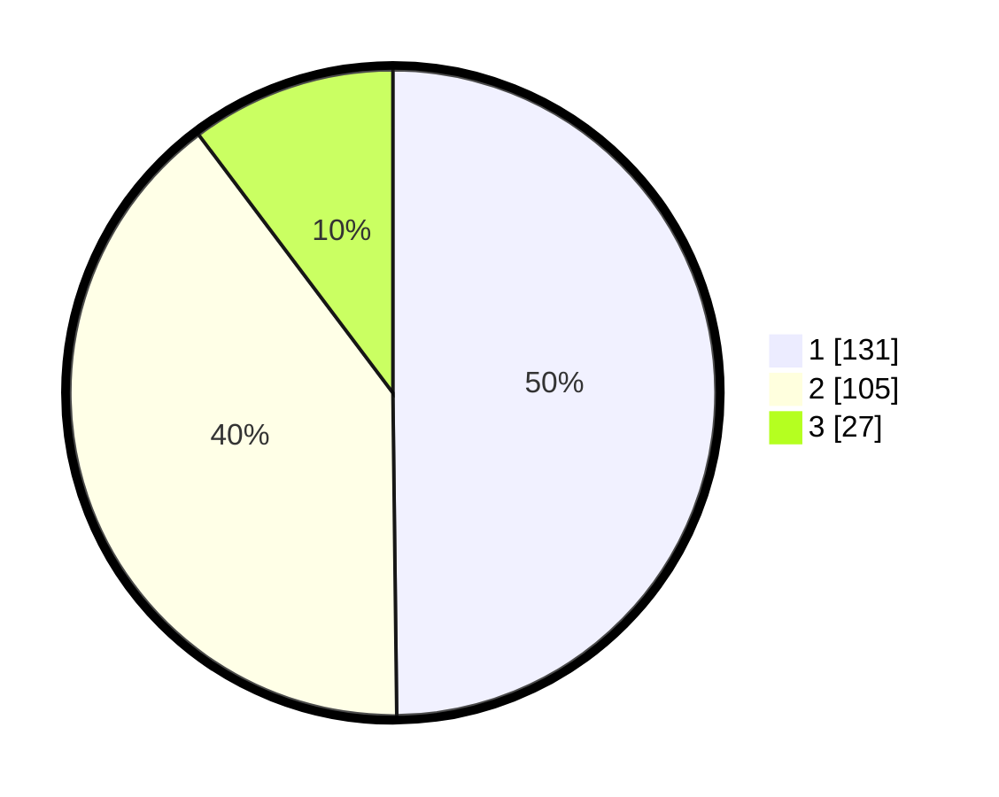

# Hasil

## Grafik

## Tabel

| No. | Nama Paslon    | Suara | Suara (raw) | Persentase |
|:--- |:-------------- | -----:| -----------:| ----------:|
| 1   | ANIES MUHAIMIN | 131   | [131][p-1]  | 49,81      |
| 2   | PRABOWO GIBRAN | 105   | [105][p-2]  | 39,92      |
| 3   | GANJAR MAHFUD  | 27    | [27][p-3]   | 10,27      |

[p-1]: https://github.com/gigit-pemilu/pemilu-2024/blob/main/pilpres/hitung-suara/sub/34-di-yogyakarta/sub/02-bantul/sub/09-jetis/sub/2004-trimulyo/sub/006-tps/sub/paslon-1.txt
[p-2]: https://github.com/gigit-pemilu/pemilu-2024/blob/main/pilpres/hitung-suara/sub/34-di-yogyakarta/sub/02-bantul/sub/09-jetis/sub/2004-trimulyo/sub/006-tps/sub/paslon-2.txt
[p-3]: https://github.com/gigit-pemilu/pemilu-2024/blob/main/pilpres/hitung-suara/sub/34-di-yogyakarta/sub/02-bantul/sub/09-jetis/sub/2004-trimulyo/sub/006-tps/sub/paslon-3.txt

## Foto C Plano

https://sirekap-obj-formc.kpu.go.id/87a5/pemilu/ppwp/34/02/09/20/04/3402092004006-20240216-204319--1c3dec4f-4bbf-4cbe-aedc-58b72526d37c.jpg

https://sirekap-obj-formc.kpu.go.id/87a5/pemilu/ppwp/34/02/09/20/04/3402092004006-20240216-204345--a2ae856e-48fb-4dc7-8679-790b446c54b0.jpg

https://sirekap-obj-formc.kpu.go.id/87a5/pemilu/ppwp/34/02/09/20/04/3402092004006-20240216-204406--cee625b3-d3f3-4193-aef9-2f0ea4d00c0f.jpg

## Metadata

| Key        | Value               |
| ---------- | ------------------- |
| Time Stamp | 2024-02-24 22:31:28 |

