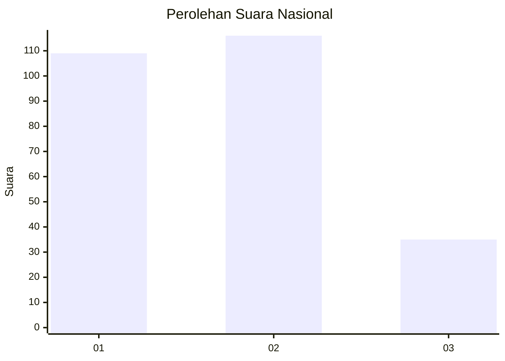
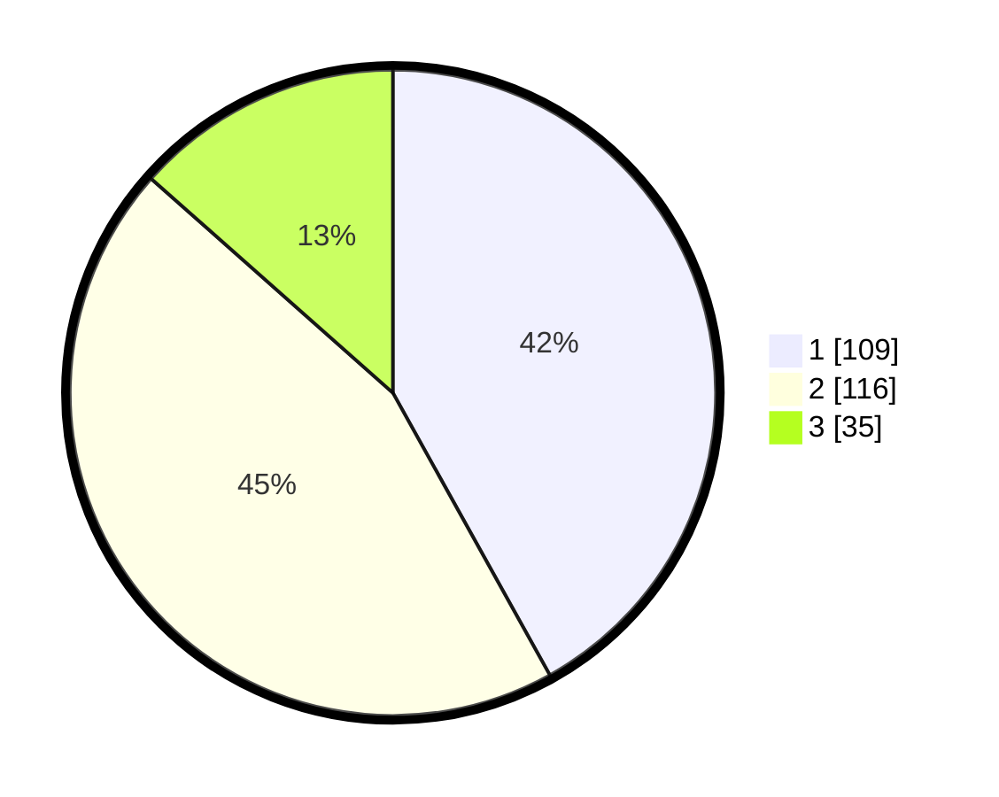

# Hasil

## Grafik

## Tabel

| No. | Nama Paslon    | Suara | Suara (raw) | Persentase |
|:--- |:-------------- | -----:| -----------:| ----------:|
| 1   | ANIES MUHAIMIN | 109   | [109][p-1]  | 41,92      |
| 2   | PRABOWO GIBRAN | 116   | [116][p-2]  | 44,62      |
| 3   | GANJAR MAHFUD  | 35    | [35][p-3]   | 13,46      |

[p-1]: https://github.com/gigit-pemilu/pemilu-2024/blob/main/pilpres/hitung-suara/sub/34-di-yogyakarta/sub/02-bantul/sub/09-jetis/sub/2004-trimulyo/sub/008-tps/sub/paslon-1.txt
[p-2]: https://github.com/gigit-pemilu/pemilu-2024/blob/main/pilpres/hitung-suara/sub/34-di-yogyakarta/sub/02-bantul/sub/09-jetis/sub/2004-trimulyo/sub/008-tps/sub/paslon-2.txt
[p-3]: https://github.com/gigit-pemilu/pemilu-2024/blob/main/pilpres/hitung-suara/sub/34-di-yogyakarta/sub/02-bantul/sub/09-jetis/sub/2004-trimulyo/sub/008-tps/sub/paslon-3.txt

## Foto C Plano

https://sirekap-obj-formc.kpu.go.id/8a73/pemilu/ppwp/34/02/09/20/04/3402092004008-20240216-220350--ba91f242-89ca-4573-b53a-9575197b7de6.jpg

https://sirekap-obj-formc.kpu.go.id/8a73/pemilu/ppwp/34/02/09/20/04/3402092004008-20240216-220307--926eb608-568f-437e-842e-d8ea73b2564f.jpg

https://sirekap-obj-formc.kpu.go.id/8a73/pemilu/ppwp/34/02/09/20/04/3402092004008-20240216-220229--020e5a56-1788-4a52-b369-bbb289cc60c0.jpg

## Metadata

| Key        | Value               |
| ---------- | ------------------- |
| Time Stamp | 2024-02-25 18:00:00 |

