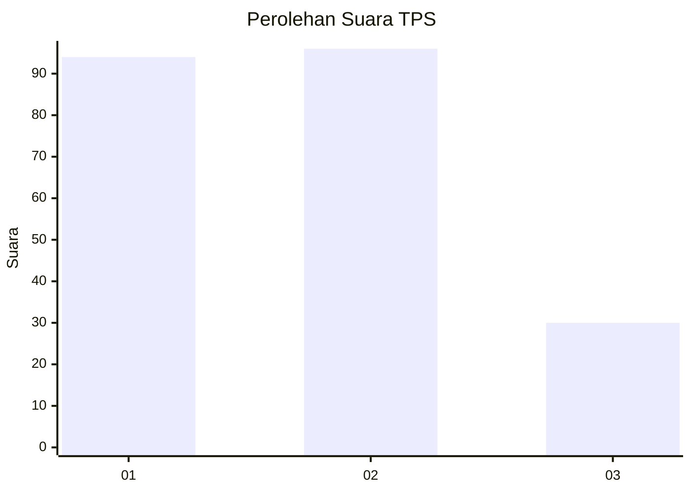
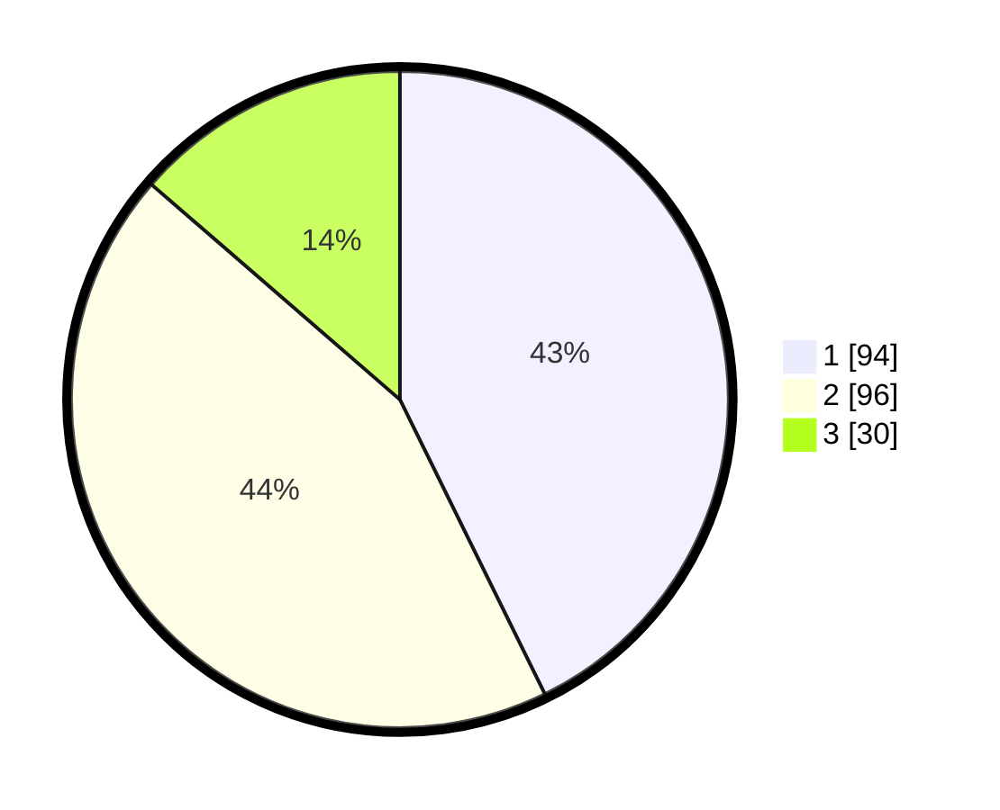

# Hasil

## Grafik

## Tabel

| No. | Nama Paslon    | Suara | Suara (raw) | Persentase |
|:--- |:-------------- | -----:| -----------:| ----------:|
| 1   | ANIES MUHAIMIN | 94    | [94][p-1]   | 42,73      |
| 2   | PRABOWO GIBRAN | 96    | [96][p-2]   | 43,64      |
| 3   | GANJAR MAHFUD  | 30    | [30][p-3]   | 13,64      |

[p-1]: https://github.com/gigit-pemilu/pemilu-2024-34-di-yogyakarta/blob/main/pilpres/hitung-suara/sub/34-di-yogyakarta/sub/02-bantul/sub/09-jetis/sub/2004-trimulyo/sub/009-tps/sub/paslon-1.txt
[p-2]: https://github.com/gigit-pemilu/pemilu-2024-34-di-yogyakarta/blob/main/pilpres/hitung-suara/sub/34-di-yogyakarta/sub/02-bantul/sub/09-jetis/sub/2004-trimulyo/sub/009-tps/sub/paslon-2.txt
[p-3]: https://github.com/gigit-pemilu/pemilu-2024-34-di-yogyakarta/blob/main/pilpres/hitung-suara/sub/34-di-yogyakarta/sub/02-bantul/sub/09-jetis/sub/2004-trimulyo/sub/009-tps/sub/paslon-3.txt

## Foto C Plano

https://sirekap-obj-formc.kpu.go.id/de21/pemilu/ppwp/34/02/09/20/04/3402092004009-20240214-195422--6df2cb50-384a-4070-8bda-a4c3d7027a40.jpg

https://sirekap-obj-formc.kpu.go.id/de21/pemilu/ppwp/34/02/09/20/04/3402092004009-20240214-195415--c751f0a0-5d32-4caf-9e7d-990ad7f5739c.jpg

https://sirekap-obj-formc.kpu.go.id/de21/pemilu/ppwp/34/02/09/20/04/3402092004009-20240214-195557--edcbe3eb-1258-4774-851a-a3a1a4975e49.jpg

## Metadata

| Key        | Value               |
| ---------- | ------------------- |
| Time Stamp | 2024-02-24 22:31:28 |

