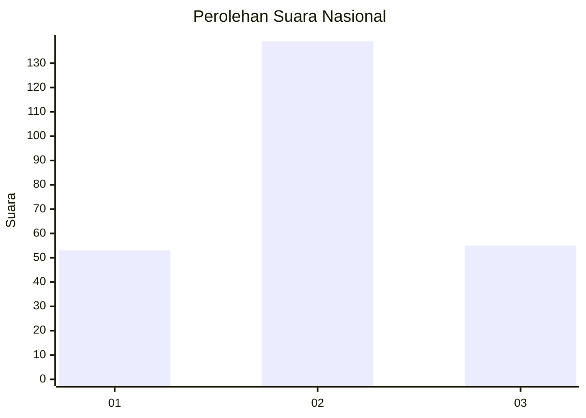
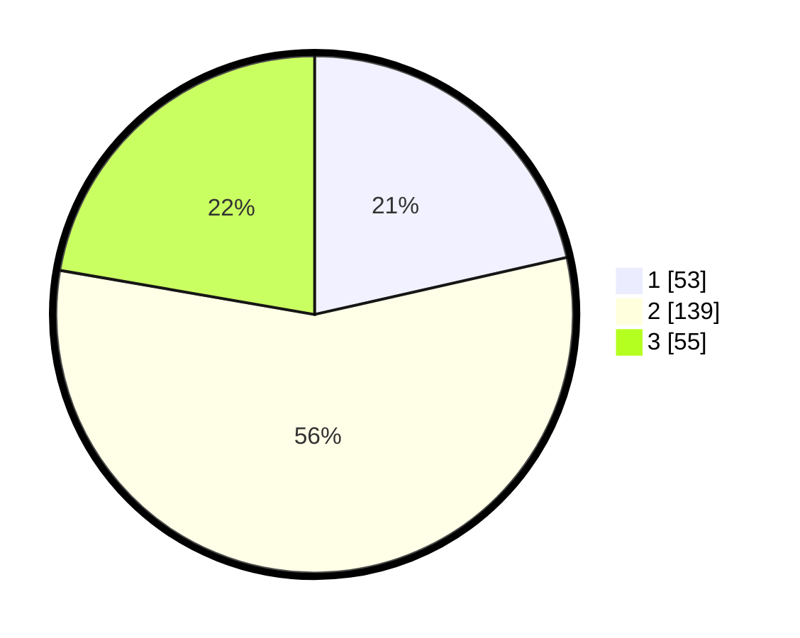

# Hasil

## Grafik

## Tabel

| No. | Nama Paslon    | Suara | Suara (raw) | Persentase |
|:--- |:-------------- | -----:| -----------:| ----------:|
| 1   | ANIES MUHAIMIN | 53    | [53][p-1]   | 21,46      |
| 2   | PRABOWO GIBRAN | 139   | [139][p-2]  | 56,28      |
| 3   | GANJAR MAHFUD  | 55    | [55][p-3]   | 22,27      |

[p-1]: https://github.com/gigit-pemilu/pemilu-2024/blob/main/pilpres/hitung-suara/sub/34-di-yogyakarta/sub/02-bantul/sub/09-jetis/sub/2004-trimulyo/sub/011-tps/sub/paslon-1.txt
[p-2]: https://github.com/gigit-pemilu/pemilu-2024/blob/main/pilpres/hitung-suara/sub/34-di-yogyakarta/sub/02-bantul/sub/09-jetis/sub/2004-trimulyo/sub/011-tps/sub/paslon-2.txt
[p-3]: https://github.com/gigit-pemilu/pemilu-2024/blob/main/pilpres/hitung-suara/sub/34-di-yogyakarta/sub/02-bantul/sub/09-jetis/sub/2004-trimulyo/sub/011-tps/sub/paslon-3.txt

## Foto C Plano

https://sirekap-obj-formc.kpu.go.id/5007/pemilu/ppwp/34/02/09/20/04/3402092004011-20240214-223617--de59a6b5-f758-4fa0-98ea-750ca14ae39c.jpg

https://sirekap-obj-formc.kpu.go.id/5007/pemilu/ppwp/34/02/09/20/04/3402092004011-20240214-202459--a349e78b-0654-4df5-ad6a-c692d0f97df6.jpg

https://sirekap-obj-formc.kpu.go.id/5007/pemilu/ppwp/34/02/09/20/04/3402092004011-20240214-223756--23a8ca7d-095a-4776-be27-68fae7a0c4a3.jpg

## Metadata

| Key        | Value               |
| ---------- | ------------------- |
| Time Stamp | 2024-02-25 14:00:00 |

