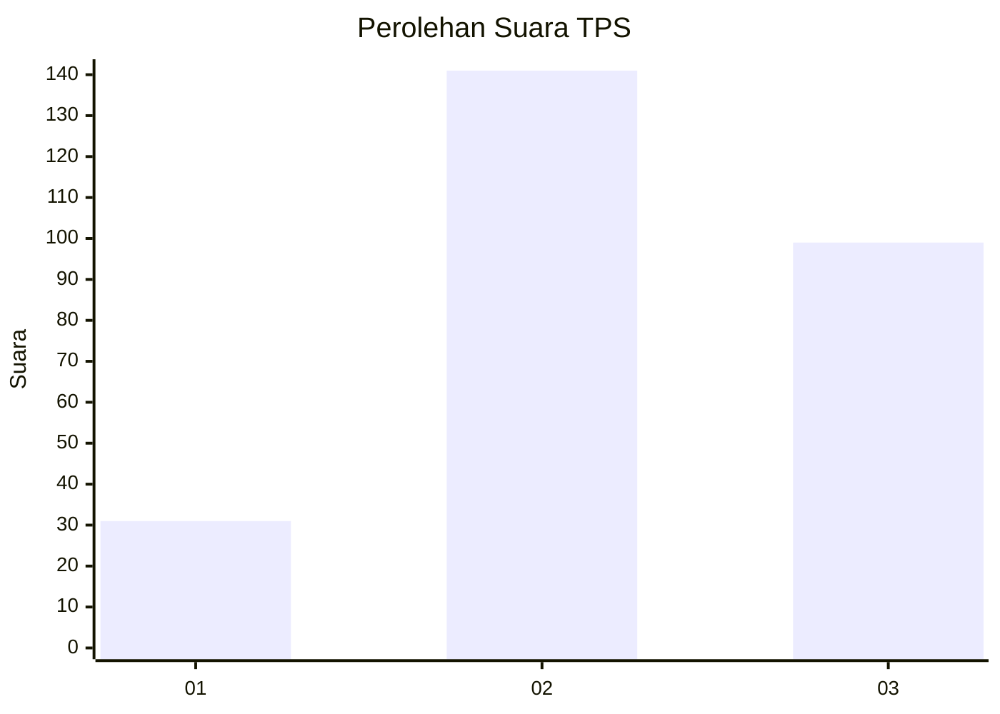
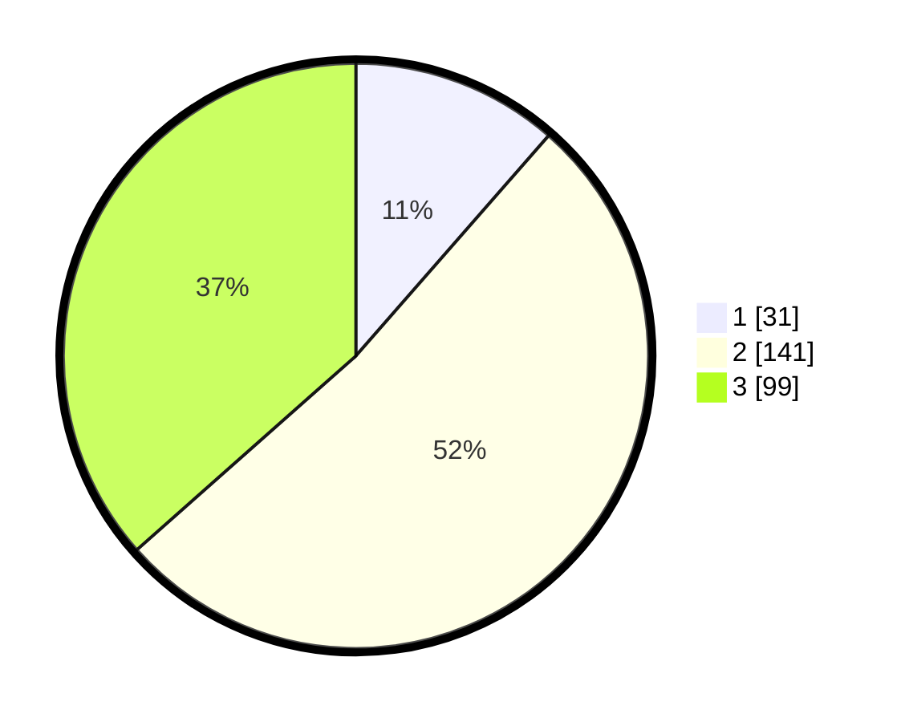

# Hasil

## Grafik

## Tabel

| No. | Nama Paslon    | Suara | Suara (raw) | Persentase |
|:--- |:-------------- | -----:| -----------:| ----------:|
| 1   | ANIES MUHAIMIN | 31    | [31][p-1]   | 11,44      |
| 2   | PRABOWO GIBRAN | 141   | [141][p-2]  | 52,03      |
| 3   | GANJAR MAHFUD  | 99    | [99][p-3]   | 36,53      |

[p-1]: https://github.com/gigit-pemilu/pemilu-2024-34-di-yogyakarta/blob/main/pilpres/hitung-suara/sub/34-di-yogyakarta/sub/02-bantul/sub/09-jetis/sub/2004-trimulyo/sub/012-tps/sub/paslon-1.txt
[p-2]: https://github.com/gigit-pemilu/pemilu-2024-34-di-yogyakarta/blob/main/pilpres/hitung-suara/sub/34-di-yogyakarta/sub/02-bantul/sub/09-jetis/sub/2004-trimulyo/sub/012-tps/sub/paslon-2.txt
[p-3]: https://github.com/gigit-pemilu/pemilu-2024-34-di-yogyakarta/blob/main/pilpres/hitung-suara/sub/34-di-yogyakarta/sub/02-bantul/sub/09-jetis/sub/2004-trimulyo/sub/012-tps/sub/paslon-3.txt

## Foto C Plano

https://sirekap-obj-formc.kpu.go.id/f761/pemilu/ppwp/34/02/09/20/04/3402092004012-20240215-000749--0f7b347e-f6b3-4628-ad53-83b7b39cfa49.jpg

https://sirekap-obj-formc.kpu.go.id/f761/pemilu/ppwp/34/02/09/20/04/3402092004012-20240214-140949--0c749ede-67ae-48ae-9757-624ff822a5f0.jpg

https://sirekap-obj-formc.kpu.go.id/f761/pemilu/ppwp/34/02/09/20/04/3402092004012-20240214-141437--97b0dff3-5ca2-4e59-b7d8-5ede42bf17fa.jpg

## Metadata

| Key        | Value               |
| ---------- | ------------------- |
| Time Stamp | 2024-02-16 08:00:28 |

