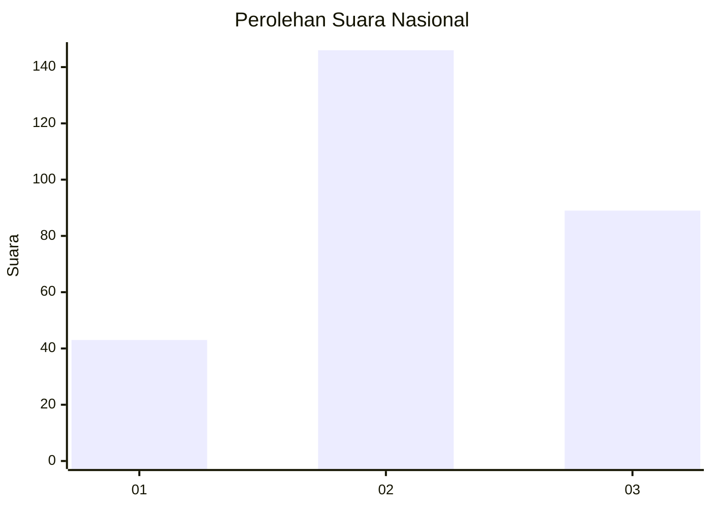
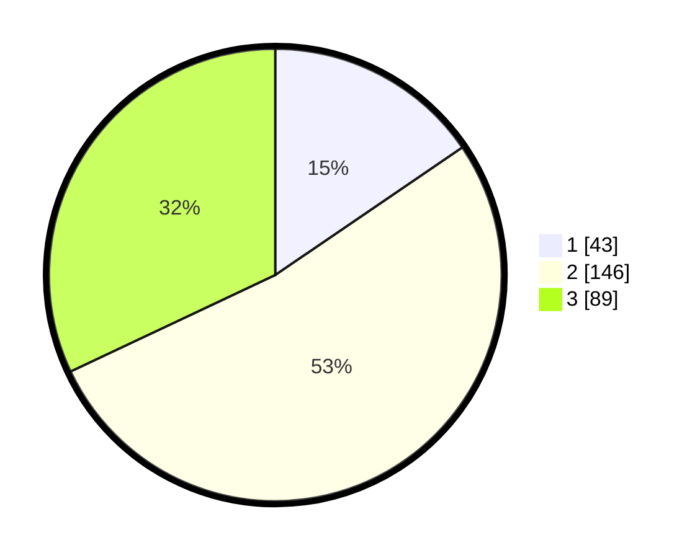

# Hasil

## Grafik

## Tabel

| No. | Nama Paslon    | Suara | Suara (raw) | Persentase |
|:--- |:-------------- | -----:| -----------:| ----------:|
| 1   | ANIES MUHAIMIN | 43    | [43][p-1]   | 15,47      |
| 2   | PRABOWO GIBRAN | 146   | [146][p-2]  | 52,52      |
| 3   | GANJAR MAHFUD  | 89    | [89][p-3]   | 32,01      |

[p-1]: https://github.com/gigit-pemilu/pemilu-2024/blob/main/pilpres/hitung-suara/sub/34-di-yogyakarta/sub/02-bantul/sub/09-jetis/sub/2004-trimulyo/sub/013-tps/sub/paslon-1.txt
[p-2]: https://github.com/gigit-pemilu/pemilu-2024/blob/main/pilpres/hitung-suara/sub/34-di-yogyakarta/sub/02-bantul/sub/09-jetis/sub/2004-trimulyo/sub/013-tps/sub/paslon-2.txt
[p-3]: https://github.com/gigit-pemilu/pemilu-2024/blob/main/pilpres/hitung-suara/sub/34-di-yogyakarta/sub/02-bantul/sub/09-jetis/sub/2004-trimulyo/sub/013-tps/sub/paslon-3.txt

## Foto C Plano

https://sirekap-obj-formc.kpu.go.id/b4b1/pemilu/ppwp/34/02/09/20/04/3402092004013-20240215-050549--8d752019-52de-43ea-8dd9-9ea09c538565.jpg

https://sirekap-obj-formc.kpu.go.id/b4b1/pemilu/ppwp/34/02/09/20/04/3402092004013-20240215-022936--73d84fb3-5beb-49e1-9d63-1fca2176a495.jpg

https://sirekap-obj-formc.kpu.go.id/b4b1/pemilu/ppwp/34/02/09/20/04/3402092004013-20240215-023300--59102141-3afa-45bc-af1e-0695da3a51a9.jpg

## Metadata

| Key        | Value               |
| ---------- | ------------------- |
| Time Stamp | 2024-02-15 06:00:23 |

