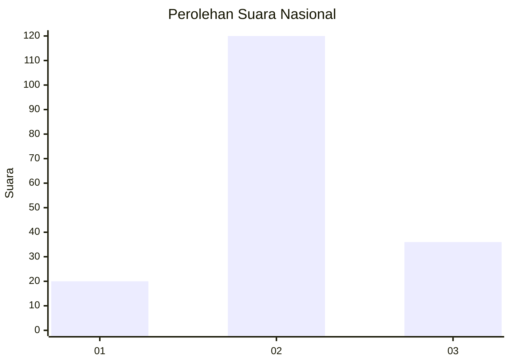
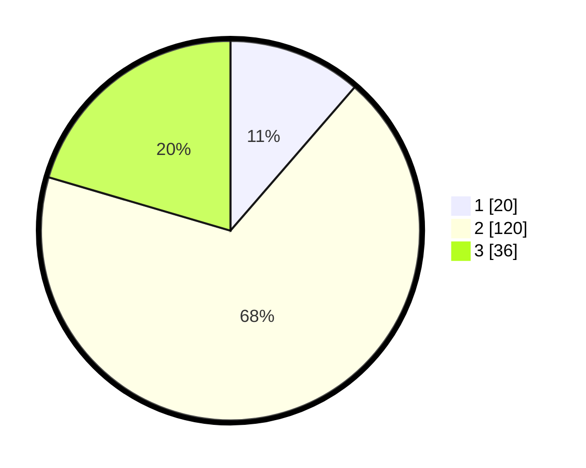

# Hasil

## Grafik

## Tabel

| No. | Nama Paslon    | Suara | Suara (raw) | Persentase |
|:--- |:-------------- | -----:| -----------:| ----------:|
| 1   | ANIES MUHAIMIN | 20    | [20][p-1]   | 11,36      |
| 2   | PRABOWO GIBRAN | 120   | [120][p-2]  | 68,18      |
| 3   | GANJAR MAHFUD  | 36    | [36][p-3]   | 20,45      |

[p-1]: https://github.com/gigit-pemilu/pemilu-2024/blob/main/pilpres/hitung-suara/sub/34-di-yogyakarta/sub/02-bantul/sub/09-jetis/sub/2004-trimulyo/sub/016-tps/sub/paslon-1.txt
[p-2]: https://github.com/gigit-pemilu/pemilu-2024/blob/main/pilpres/hitung-suara/sub/34-di-yogyakarta/sub/02-bantul/sub/09-jetis/sub/2004-trimulyo/sub/016-tps/sub/paslon-2.txt
[p-3]: https://github.com/gigit-pemilu/pemilu-2024/blob/main/pilpres/hitung-suara/sub/34-di-yogyakarta/sub/02-bantul/sub/09-jetis/sub/2004-trimulyo/sub/016-tps/sub/paslon-3.txt

## Foto C Plano

https://sirekap-obj-formc.kpu.go.id/d445/pemilu/ppwp/34/02/09/20/04/3402092004016-20240214-224703--160fd9a3-43c0-4061-89a0-e0c035912d03.jpg

https://sirekap-obj-formc.kpu.go.id/d445/pemilu/ppwp/34/02/09/20/04/3402092004016-20240214-225715--acd9f4fa-d75e-41ea-8025-a13bbcfaaa0d.jpg

https://sirekap-obj-formc.kpu.go.id/d445/pemilu/ppwp/34/02/09/20/04/3402092004016-20240214-225552--297eb7e4-1629-4628-8458-123995bcaa02.jpg

## Metadata

| Key        | Value               |
| ---------- | ------------------- |
| Time Stamp | 2024-02-24 22:31:28 |

