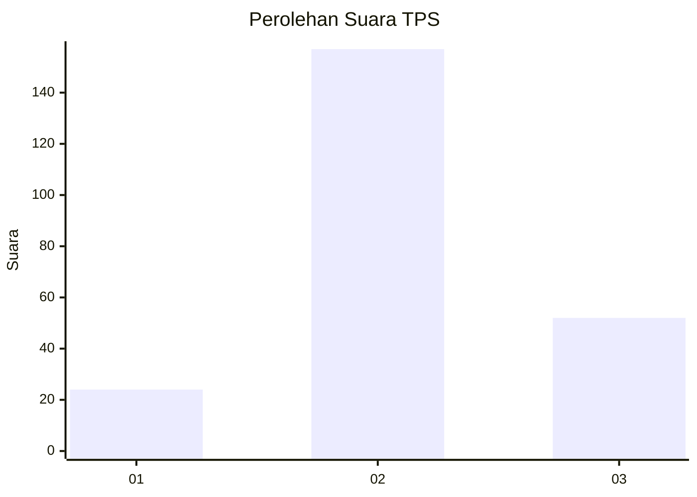
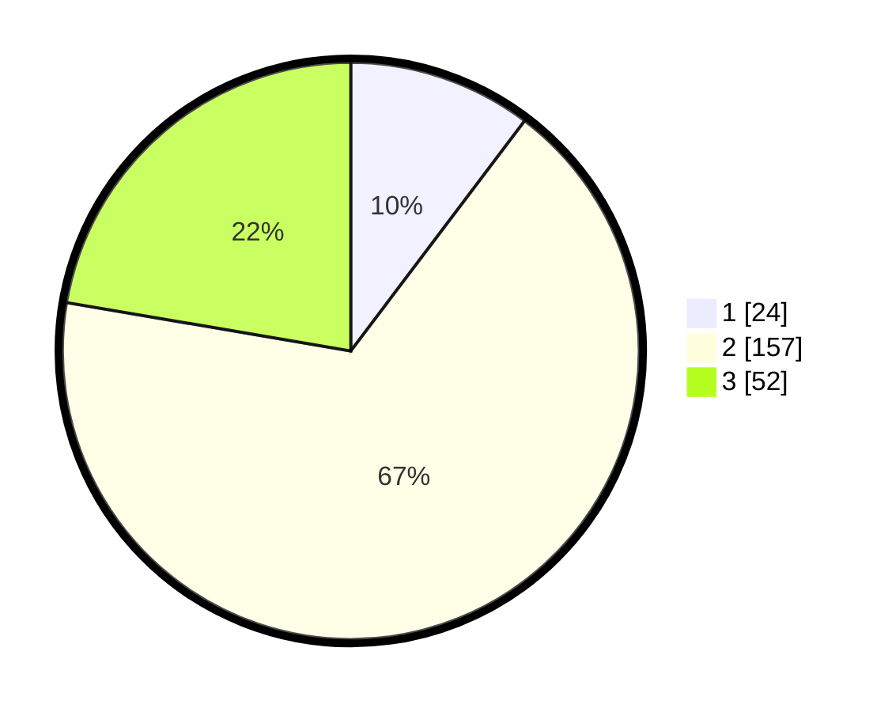

# Hasil

## Grafik

## Tabel

| No. | Nama Paslon    | Suara | Suara (raw) | Persentase |
|:--- |:-------------- | -----:| -----------:| ----------:|
| 1   | ANIES MUHAIMIN | 24    | [24][p-1]   | 10,30      |
| 2   | PRABOWO GIBRAN | 157   | [157][p-2]  | 67,38      |
| 3   | GANJAR MAHFUD  | 52    | [52][p-3]   | 22,32      |

[p-1]: https://github.com/gigit-pemilu/pemilu-2024-34-di-yogyakarta/blob/main/pilpres/hitung-suara/sub/34-di-yogyakarta/sub/02-bantul/sub/09-jetis/sub/2004-trimulyo/sub/017-tps/sub/paslon-1.txt
[p-2]: https://github.com/gigit-pemilu/pemilu-2024-34-di-yogyakarta/blob/main/pilpres/hitung-suara/sub/34-di-yogyakarta/sub/02-bantul/sub/09-jetis/sub/2004-trimulyo/sub/017-tps/sub/paslon-2.txt
[p-3]: https://github.com/gigit-pemilu/pemilu-2024-34-di-yogyakarta/blob/main/pilpres/hitung-suara/sub/34-di-yogyakarta/sub/02-bantul/sub/09-jetis/sub/2004-trimulyo/sub/017-tps/sub/paslon-3.txt

## Foto C Plano

https://sirekap-obj-formc.kpu.go.id/895b/pemilu/ppwp/34/02/09/20/04/3402092004017-20240214-224937--8e78642f-648c-4f91-849c-08c6d702d6f3.jpg

https://sirekap-obj-formc.kpu.go.id/895b/pemilu/ppwp/34/02/09/20/04/3402092004017-20240214-225152--86b888c7-9ae2-4159-bf36-1d3f18041df6.jpg

https://sirekap-obj-formc.kpu.go.id/895b/pemilu/ppwp/34/02/09/20/04/3402092004017-20240214-225330--567b983d-a6b6-497f-a3c3-b5034a3285df.jpg

## Metadata

| Key        | Value               |
| ---------- | ------------------- |
| Time Stamp | 2024-02-27 13:00:00 |

