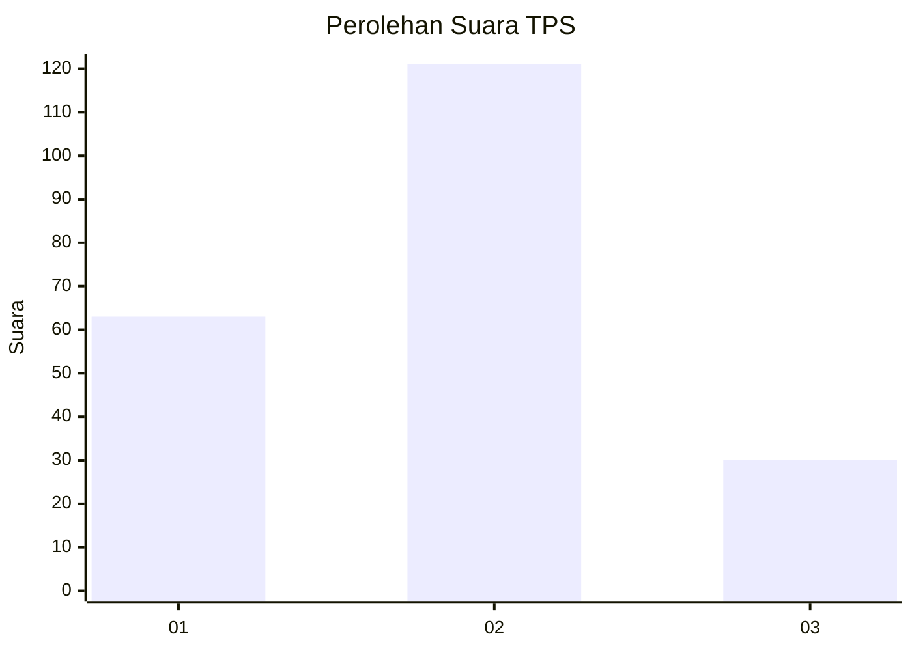
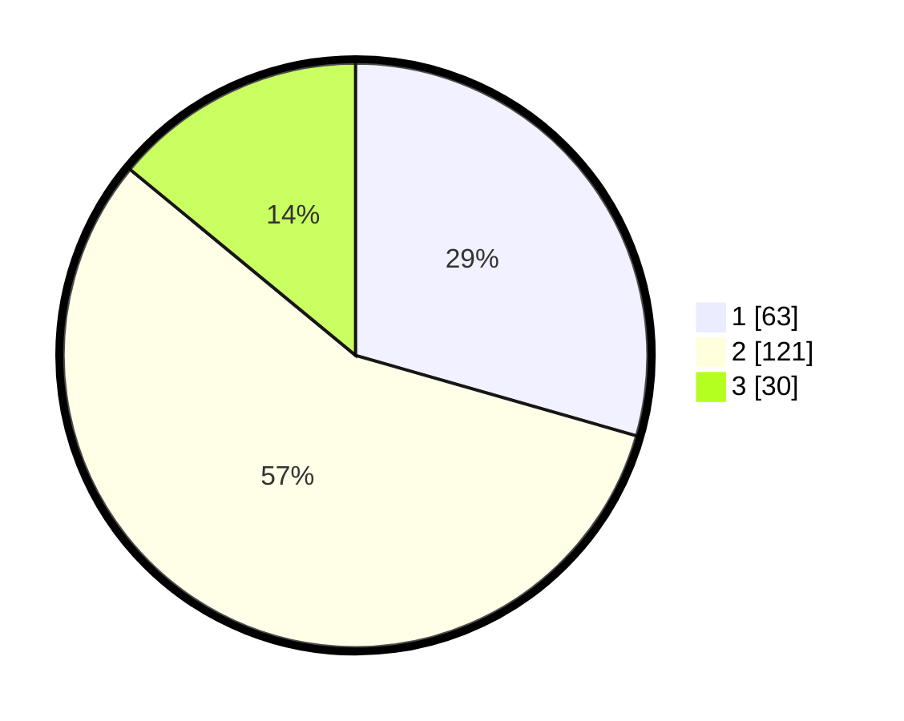

# Hasil

## Grafik

## Tabel

| No. | Nama Paslon    | Suara | Suara (raw) | Persentase |
|:--- |:-------------- | -----:| -----------:| ----------:|
| 1   | ANIES MUHAIMIN | 63    | [63][p-1]   | 29,44      |
| 2   | PRABOWO GIBRAN | 121   | [121][p-2]  | 56,54      |
| 3   | GANJAR MAHFUD  | 30    | [30][p-3]   | 14,02      |

[p-1]: https://github.com/gigit-pemilu/pemilu-2024-34-di-yogyakarta/blob/main/pilpres/hitung-suara/sub/34-di-yogyakarta/sub/02-bantul/sub/09-jetis/sub/2004-trimulyo/sub/020-tps/sub/paslon-1.txt
[p-2]: https://github.com/gigit-pemilu/pemilu-2024-34-di-yogyakarta/blob/main/pilpres/hitung-suara/sub/34-di-yogyakarta/sub/02-bantul/sub/09-jetis/sub/2004-trimulyo/sub/020-tps/sub/paslon-2.txt
[p-3]: https://github.com/gigit-pemilu/pemilu-2024-34-di-yogyakarta/blob/main/pilpres/hitung-suara/sub/34-di-yogyakarta/sub/02-bantul/sub/09-jetis/sub/2004-trimulyo/sub/020-tps/sub/paslon-3.txt

## Foto C Plano

https://sirekap-obj-formc.kpu.go.id/e7d5/pemilu/ppwp/34/02/09/20/04/3402092004020-20240214-220048--7e662f5b-1ff9-497c-8123-faeb1b2ff3e0.jpg

https://sirekap-obj-formc.kpu.go.id/e7d5/pemilu/ppwp/34/02/09/20/04/3402092004020-20240214-220231--ebf2a7b1-bfec-473b-8067-1d9c2bb11714.jpg

https://sirekap-obj-formc.kpu.go.id/e7d5/pemilu/ppwp/34/02/09/20/04/3402092004020-20240214-220353--3f2ff62c-1670-40a4-937f-8b364af57f42.jpg

## Metadata

| Key        | Value               |
| ---------- | ------------------- |
| Time Stamp | 2024-02-24 22:31:28 |

