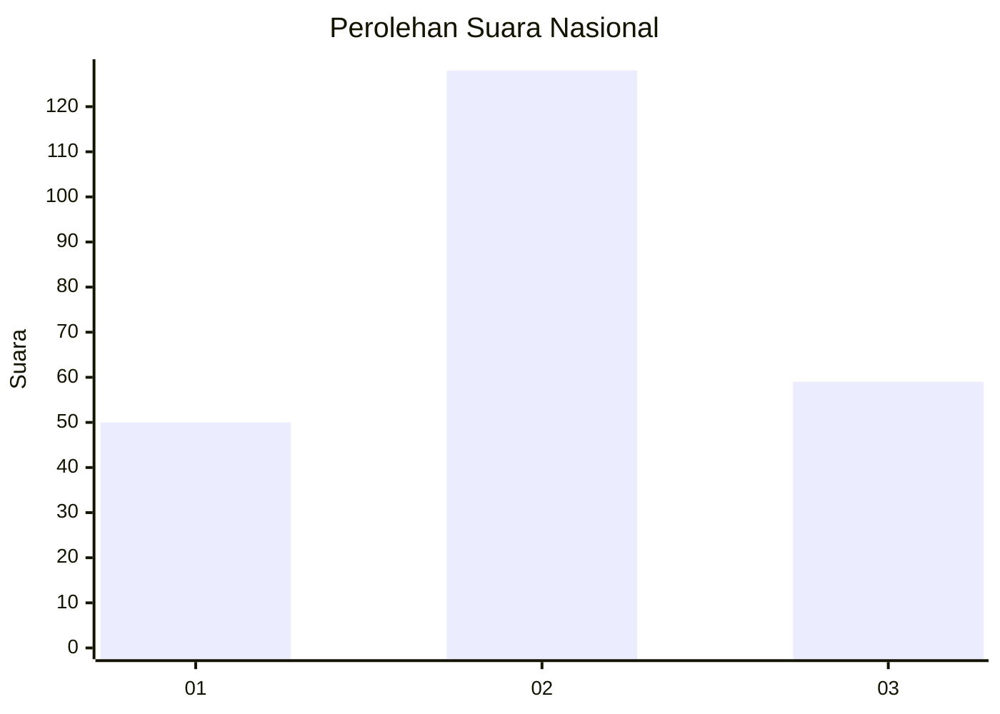
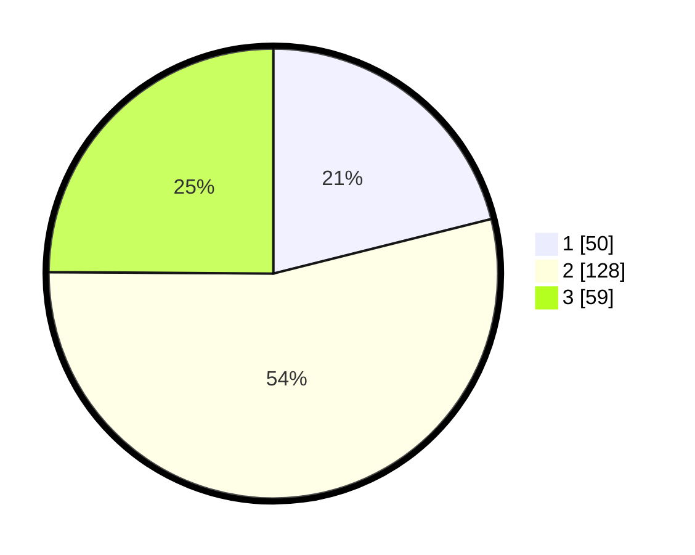

# Hasil

## Grafik

## Tabel

| No. | Nama Paslon    | Suara | Suara (raw) | Persentase |
|:--- |:-------------- | -----:| -----------:| ----------:|
| 1   | ANIES MUHAIMIN | 50    | [50][p-1]   | 21,10      |
| 2   | PRABOWO GIBRAN | 128   | [128][p-2]  | 54,01      |
| 3   | GANJAR MAHFUD  | 59    | [59][p-3]   | 24,89      |

[p-1]: https://github.com/gigit-pemilu/pemilu-2024/blob/main/pilpres/hitung-suara/sub/34-di-yogyakarta/sub/02-bantul/sub/09-jetis/sub/2004-trimulyo/sub/022-tps/sub/paslon-1.txt
[p-2]: https://github.com/gigit-pemilu/pemilu-2024/blob/main/pilpres/hitung-suara/sub/34-di-yogyakarta/sub/02-bantul/sub/09-jetis/sub/2004-trimulyo/sub/022-tps/sub/paslon-2.txt
[p-3]: https://github.com/gigit-pemilu/pemilu-2024/blob/main/pilpres/hitung-suara/sub/34-di-yogyakarta/sub/02-bantul/sub/09-jetis/sub/2004-trimulyo/sub/022-tps/sub/paslon-3.txt

## Foto C Plano

https://sirekap-obj-formc.kpu.go.id/bc84/pemilu/ppwp/34/02/09/20/04/3402092004022-20240217-222347--e931c373-1620-4919-8695-a726cb1e23ff.jpg

https://sirekap-obj-formc.kpu.go.id/bc84/pemilu/ppwp/34/02/09/20/04/3402092004022-20240217-223038--7bf0c2a9-9906-4784-8856-f7fbb880e5e1.jpg

https://sirekap-obj-formc.kpu.go.id/bc84/pemilu/ppwp/34/02/09/20/04/3402092004022-20240217-223254--320f70db-8917-40fc-9c68-14c7e3d9dfae.jpg

## Metadata

| Key        | Value               |
| ---------- | ------------------- |
| Time Stamp | 2024-02-24 22:31:28 |

