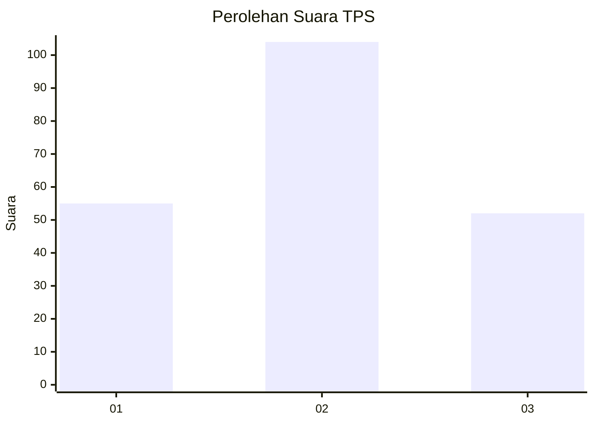
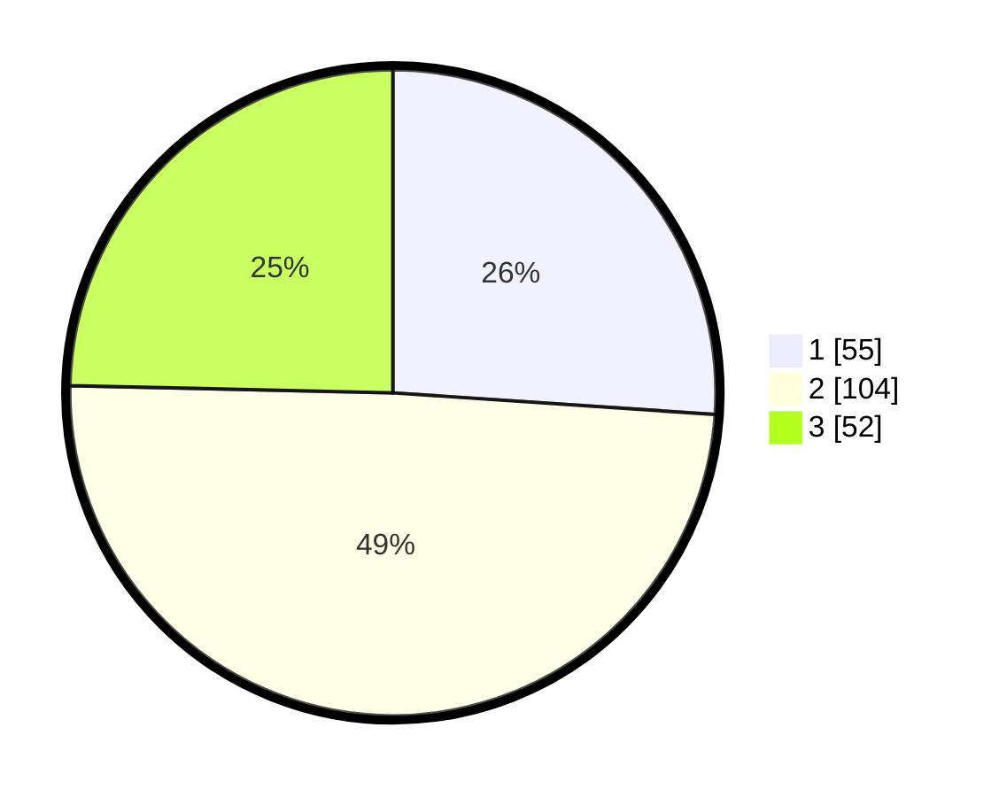

# Hasil

## Grafik

## Tabel

| No. | Nama Paslon    | Suara | Suara (raw) | Persentase |
|:--- |:-------------- | -----:| -----------:| ----------:|
| 1   | ANIES MUHAIMIN | 55    | [55][p-1]   | 26,07      |
| 2   | PRABOWO GIBRAN | 104   | [104][p-2]  | 49,29      |
| 3   | GANJAR MAHFUD  | 52    | [52][p-3]   | 24,64      |

[p-1]: https://github.com/gigit-pemilu/pemilu-2024-34-di-yogyakarta/blob/main/pilpres/hitung-suara/sub/34-di-yogyakarta/sub/02-bantul/sub/09-jetis/sub/2004-trimulyo/sub/026-tps/sub/paslon-1.txt
[p-2]: https://github.com/gigit-pemilu/pemilu-2024-34-di-yogyakarta/blob/main/pilpres/hitung-suara/sub/34-di-yogyakarta/sub/02-bantul/sub/09-jetis/sub/2004-trimulyo/sub/026-tps/sub/paslon-2.txt
[p-3]: https://github.com/gigit-pemilu/pemilu-2024-34-di-yogyakarta/blob/main/pilpres/hitung-suara/sub/34-di-yogyakarta/sub/02-bantul/sub/09-jetis/sub/2004-trimulyo/sub/026-tps/sub/paslon-3.txt

## Foto C Plano

https://sirekap-obj-formc.kpu.go.id/0ad6/pemilu/ppwp/34/02/09/20/04/3402092004026-20240214-230214--a47f8beb-05dd-4096-ac6b-631dc7d374b4.jpg

https://sirekap-obj-formc.kpu.go.id/0ad6/pemilu/ppwp/34/02/09/20/04/3402092004026-20240214-185140--e47df2ab-be2b-4a50-9118-9e0b18921548.jpg

https://sirekap-obj-formc.kpu.go.id/0ad6/pemilu/ppwp/34/02/09/20/04/3402092004026-20240215-025403--db95174c-421e-40b1-8a11-9ac1255e1628.jpg

## Metadata

| Key        | Value               |
| ---------- | ------------------- |
| Time Stamp | 2024-02-24 22:31:28 |

