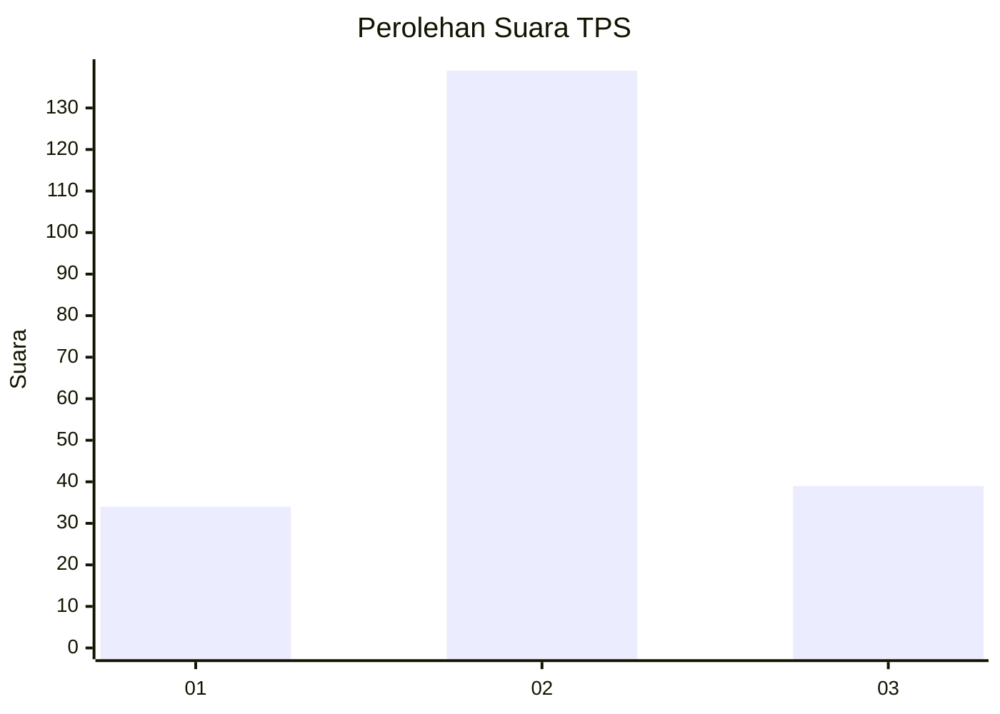
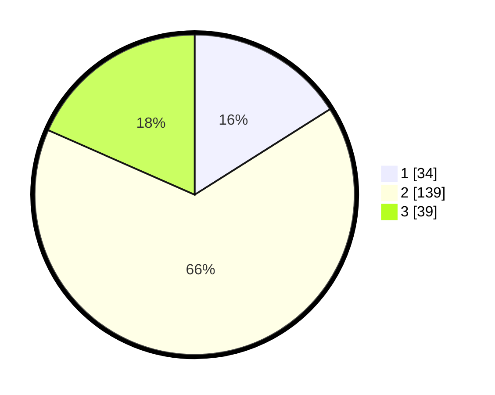

# Hasil

## Grafik

## Tabel

| No. | Nama Paslon    | Suara | Suara (raw) | Persentase |
|:--- |:-------------- | -----:| -----------:| ----------:|
| 1   | ANIES MUHAIMIN | 34    | [34][p-1]   | 16,04      |
| 2   | PRABOWO GIBRAN | 139   | [139][p-2]  | 65,57      |
| 3   | GANJAR MAHFUD  | 39    | [39][p-3]   | 18,40      |

[p-1]: https://github.com/gigit-pemilu/pemilu-2024-34-di-yogyakarta/blob/main/pilpres/hitung-suara/sub/34-di-yogyakarta/sub/02-bantul/sub/09-jetis/sub/2004-trimulyo/sub/027-tps/sub/paslon-1.txt
[p-2]: https://github.com/gigit-pemilu/pemilu-2024-34-di-yogyakarta/blob/main/pilpres/hitung-suara/sub/34-di-yogyakarta/sub/02-bantul/sub/09-jetis/sub/2004-trimulyo/sub/027-tps/sub/paslon-2.txt
[p-3]: https://github.com/gigit-pemilu/pemilu-2024-34-di-yogyakarta/blob/main/pilpres/hitung-suara/sub/34-di-yogyakarta/sub/02-bantul/sub/09-jetis/sub/2004-trimulyo/sub/027-tps/sub/paslon-3.txt

## Foto C Plano

https://sirekap-obj-formc.kpu.go.id/81a0/pemilu/ppwp/34/02/09/20/04/3402092004027-20240214-224046--a2aabcd5-273a-4f86-8c21-b546453b1a66.jpg

https://sirekap-obj-formc.kpu.go.id/81a0/pemilu/ppwp/34/02/09/20/04/3402092004027-20240214-210856--656a1212-136d-4075-afd4-32734e12ffe8.jpg

https://sirekap-obj-formc.kpu.go.id/81a0/pemilu/ppwp/34/02/09/20/04/3402092004027-20240214-210952--28d5e35d-3c24-4b1e-9424-ca525a1f8516.jpg

## Metadata

| Key        | Value               |
| ---------- | ------------------- |
| Time Stamp | 2024-02-15 02:10:27 |

