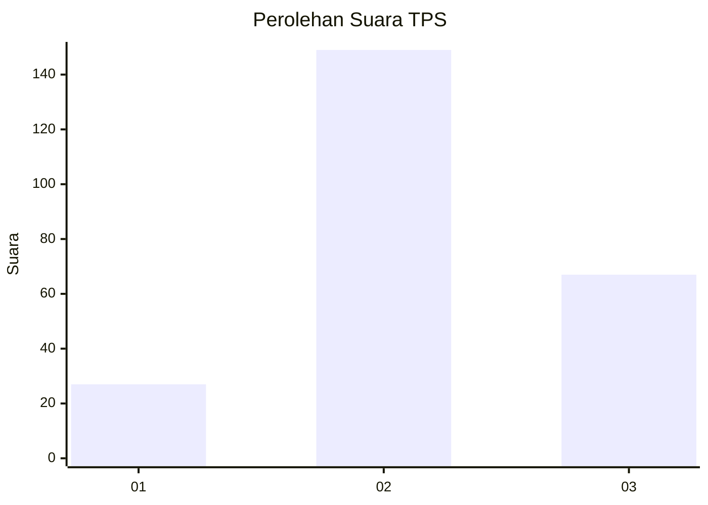
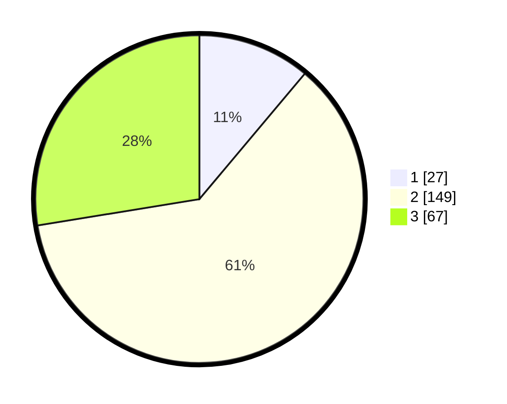

# Hasil

## Grafik

## Tabel

| No. | Nama Paslon    | Suara | Suara (raw) | Persentase |
|:--- |:-------------- | -----:| -----------:| ----------:|
| 1   | ANIES MUHAIMIN | 27    | [27][p-1]   | 11,11      |
| 2   | PRABOWO GIBRAN | 149   | [149][p-2]  | 61,32      |
| 3   | GANJAR MAHFUD  | 67    | [67][p-3]   | 27,57      |

[p-1]: https://github.com/gigit-pemilu/pemilu-2024-34-di-yogyakarta/blob/main/pilpres/hitung-suara/sub/34-di-yogyakarta/sub/02-bantul/sub/09-jetis/sub/2004-trimulyo/sub/028-tps/sub/paslon-1.txt
[p-2]: https://github.com/gigit-pemilu/pemilu-2024-34-di-yogyakarta/blob/main/pilpres/hitung-suara/sub/34-di-yogyakarta/sub/02-bantul/sub/09-jetis/sub/2004-trimulyo/sub/028-tps/sub/paslon-2.txt
[p-3]: https://github.com/gigit-pemilu/pemilu-2024-34-di-yogyakarta/blob/main/pilpres/hitung-suara/sub/34-di-yogyakarta/sub/02-bantul/sub/09-jetis/sub/2004-trimulyo/sub/028-tps/sub/paslon-3.txt

## Foto C Plano

https://sirekap-obj-formc.kpu.go.id/925c/pemilu/ppwp/34/02/09/20/04/3402092004028-20240218-113024--9e2423cb-7203-495b-9f0c-26fcd7e3bc27.jpg

https://sirekap-obj-formc.kpu.go.id/925c/pemilu/ppwp/34/02/09/20/04/3402092004028-20240218-113056--d68d2151-5726-4cc3-a03c-dcbfc56ef02f.jpg

https://sirekap-obj-formc.kpu.go.id/925c/pemilu/ppwp/34/02/09/20/04/3402092004028-20240218-113136--f4ebc325-15aa-4b38-833c-e3ed0c3a3f6d.jpg

## Metadata

| Key        | Value               |
| ---------- | ------------------- |
| Time Stamp | 2024-02-25 10:00:00 |

