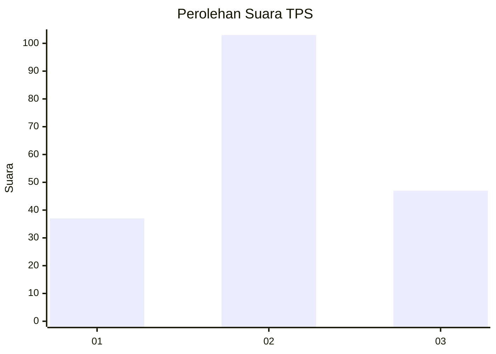
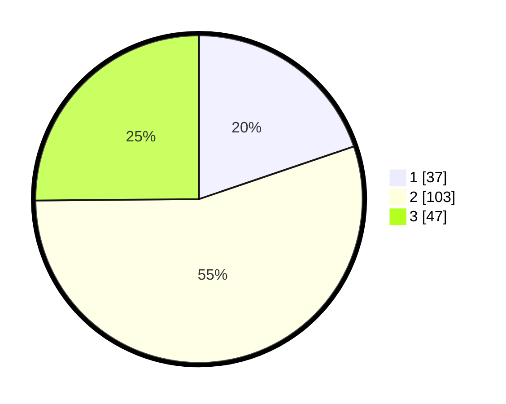

# Hasil

## Grafik

## Tabel

| No. | Nama Paslon    | Suara | Suara (raw) | Persentase |
|:--- |:-------------- | -----:| -----------:| ----------:|
| 1   | ANIES MUHAIMIN | 37    | [37][p-1]   | 19,79      |
| 2   | PRABOWO GIBRAN | 103   | [103][p-2]  | 55,08      |
| 3   | GANJAR MAHFUD  | 47    | [47][p-3]   | 25,13      |

[p-1]: https://github.com/gigit-pemilu/pemilu-2024-34-di-yogyakarta/blob/main/pilpres/hitung-suara/sub/34-di-yogyakarta/sub/02-bantul/sub/09-jetis/sub/2004-trimulyo/sub/030-tps/sub/paslon-1.txt
[p-2]: https://github.com/gigit-pemilu/pemilu-2024-34-di-yogyakarta/blob/main/pilpres/hitung-suara/sub/34-di-yogyakarta/sub/02-bantul/sub/09-jetis/sub/2004-trimulyo/sub/030-tps/sub/paslon-2.txt
[p-3]: https://github.com/gigit-pemilu/pemilu-2024-34-di-yogyakarta/blob/main/pilpres/hitung-suara/sub/34-di-yogyakarta/sub/02-bantul/sub/09-jetis/sub/2004-trimulyo/sub/030-tps/sub/paslon-3.txt

## Foto C Plano

https://sirekap-obj-formc.kpu.go.id/917d/pemilu/ppwp/34/02/09/20/04/3402092004030-20240214-205539--90ddff1f-5436-4e1b-9800-a0b74a2996ff.jpg

https://sirekap-obj-formc.kpu.go.id/917d/pemilu/ppwp/34/02/09/20/04/3402092004030-20240214-205759--480a5fbd-a4d3-4eb5-98cc-9888ce3bd19c.jpg

https://sirekap-obj-formc.kpu.go.id/917d/pemilu/ppwp/34/02/09/20/04/3402092004030-20240214-224355--b95ce7ec-b57b-42e5-8f20-43b845d37a78.jpg

## Metadata

| Key        | Value               |
| ---------- | ------------------- |
| Time Stamp | 2024-02-15 00:41:44 |

