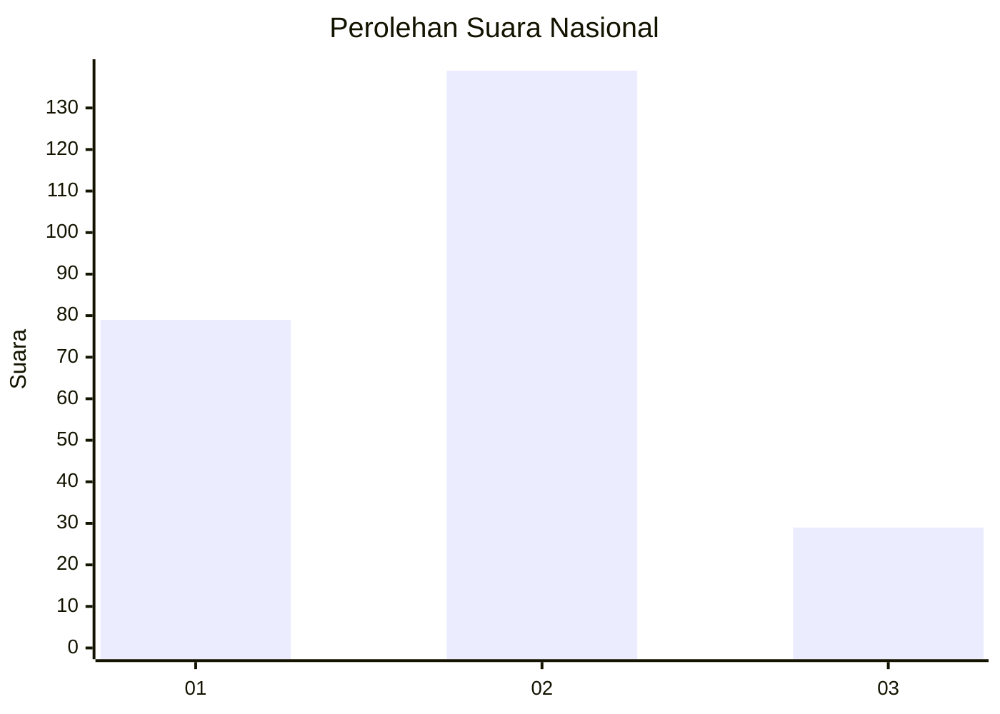
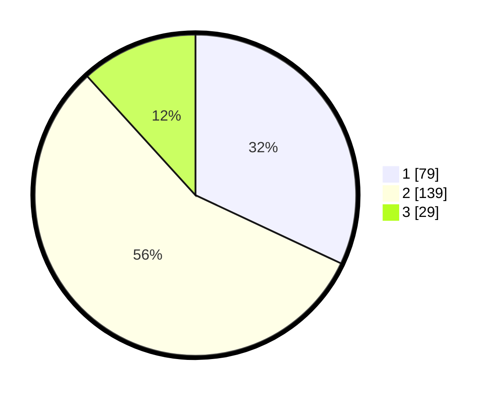

# Hasil

## Grafik

## Tabel

| No. | Nama Paslon    | Suara | Suara (raw) | Persentase |
|:--- |:-------------- | -----:| -----------:| ----------:|
| 1   | ANIES MUHAIMIN | 79    | [79][p-1]   | 31,98      |
| 2   | PRABOWO GIBRAN | 139   | [139][p-2]  | 56,28      |
| 3   | GANJAR MAHFUD  | 29    | [29][p-3]   | 11,74      |

[p-1]: https://github.com/gigit-pemilu/pemilu-2024/blob/main/pilpres/hitung-suara/sub/34-di-yogyakarta/sub/02-bantul/sub/09-jetis/sub/2004-trimulyo/sub/031-tps/sub/paslon-1.txt
[p-2]: https://github.com/gigit-pemilu/pemilu-2024/blob/main/pilpres/hitung-suara/sub/34-di-yogyakarta/sub/02-bantul/sub/09-jetis/sub/2004-trimulyo/sub/031-tps/sub/paslon-2.txt
[p-3]: https://github.com/gigit-pemilu/pemilu-2024/blob/main/pilpres/hitung-suara/sub/34-di-yogyakarta/sub/02-bantul/sub/09-jetis/sub/2004-trimulyo/sub/031-tps/sub/paslon-3.txt

## Foto C Plano

https://sirekap-obj-formc.kpu.go.id/e147/pemilu/ppwp/34/02/09/20/04/3402092004031-20240214-193959--18d30206-874e-4f49-ad8b-e6112218c18f.jpg

https://sirekap-obj-formc.kpu.go.id/e147/pemilu/ppwp/34/02/09/20/04/3402092004031-20240214-190358--2c6d1baf-c4fa-4388-8cf3-a6f6aec4324c.jpg

https://sirekap-obj-formc.kpu.go.id/e147/pemilu/ppwp/34/02/09/20/04/3402092004031-20240214-194254--14d5c2ff-d105-4bac-a2af-56e5eb326a5a.jpg

## Metadata

| Key        | Value               |
| ---------- | ------------------- |
| Time Stamp | 2024-02-24 22:31:28 |

