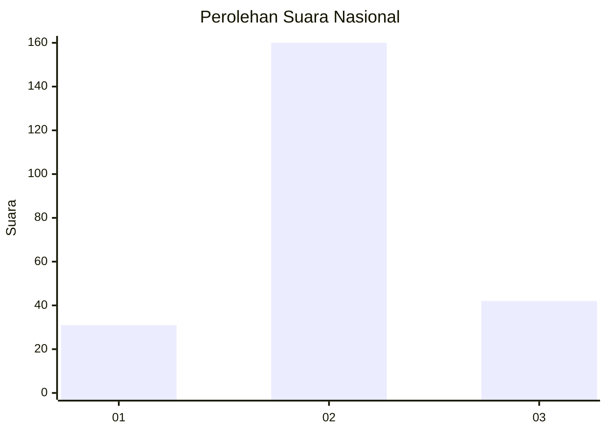
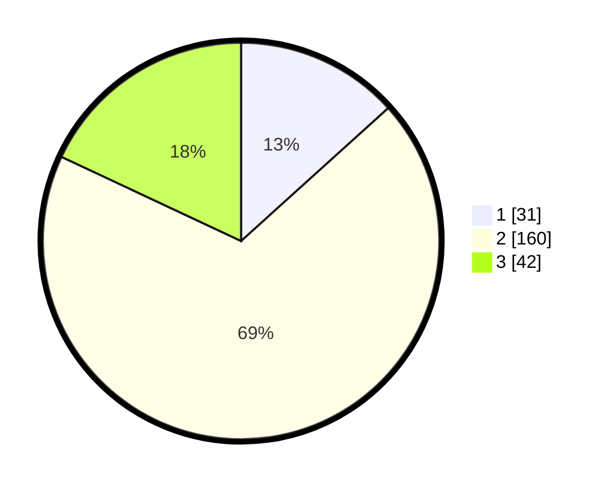

# Hasil

## Grafik

## Tabel

| No. | Nama Paslon    | Suara | Suara (raw) | Persentase |
|:--- |:-------------- | -----:| -----------:| ----------:|
| 1   | ANIES MUHAIMIN | 31    | [31][p-1]   | 13,30      |
| 2   | PRABOWO GIBRAN | 160   | [160][p-2]  | 68,67      |
| 3   | GANJAR MAHFUD  | 42    | [42][p-3]   | 18,03      |

[p-1]: https://github.com/gigit-pemilu/pemilu-2024/blob/main/pilpres/hitung-suara/sub/34-di-yogyakarta/sub/02-bantul/sub/09-jetis/sub/2004-trimulyo/sub/032-tps/sub/paslon-1.txt
[p-2]: https://github.com/gigit-pemilu/pemilu-2024/blob/main/pilpres/hitung-suara/sub/34-di-yogyakarta/sub/02-bantul/sub/09-jetis/sub/2004-trimulyo/sub/032-tps/sub/paslon-2.txt
[p-3]: https://github.com/gigit-pemilu/pemilu-2024/blob/main/pilpres/hitung-suara/sub/34-di-yogyakarta/sub/02-bantul/sub/09-jetis/sub/2004-trimulyo/sub/032-tps/sub/paslon-3.txt

## Foto C Plano

https://sirekap-obj-formc.kpu.go.id/cd50/pemilu/ppwp/34/02/09/20/04/3402092004032-20240214-225004--95e7a716-7215-4c20-b854-1481f6d30bd1.jpg

https://sirekap-obj-formc.kpu.go.id/cd50/pemilu/ppwp/34/02/09/20/04/3402092004032-20240214-212851--ca51f43a-750c-47f7-940c-b7a650c60107.jpg

https://sirekap-obj-formc.kpu.go.id/cd50/pemilu/ppwp/34/02/09/20/04/3402092004032-20240214-212749--074477c7-13f5-4e05-ac5c-abdc605d3f72.jpg

## Metadata

| Key        | Value               |
| ---------- | ------------------- |
| Time Stamp | 2024-02-24 22:31:28 |

