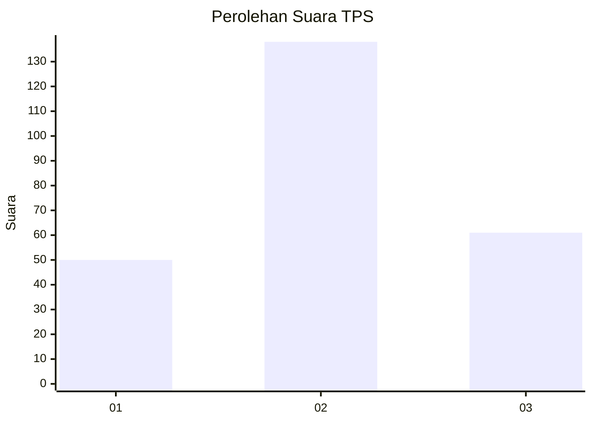
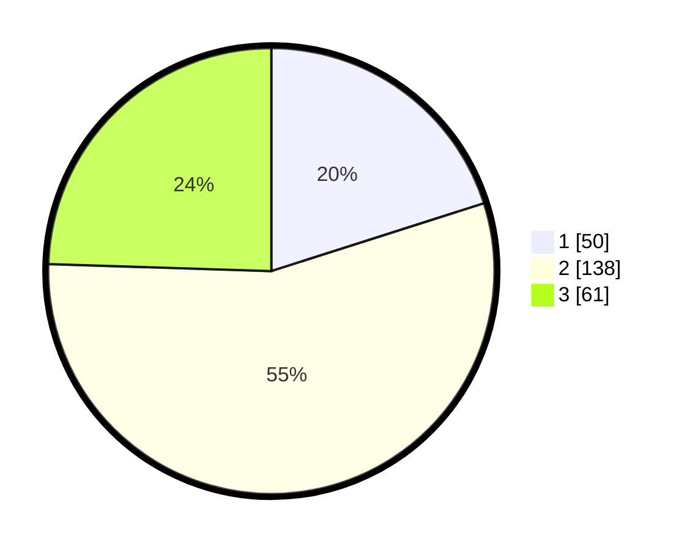

# Hasil

## Grafik

## Tabel

| No. | Nama Paslon    | Suara | Suara (raw) | Persentase |
|:--- |:-------------- | -----:| -----------:| ----------:|
| 1   | ANIES MUHAIMIN | 50    | [50][p-1]   | 20,08      |
| 2   | PRABOWO GIBRAN | 138   | [138][p-2]  | 55,42      |
| 3   | GANJAR MAHFUD  | 61    | [61][p-3]   | 24,50      |

[p-1]: https://github.com/gigit-pemilu/pemilu-2024-34-di-yogyakarta/blob/main/pilpres/hitung-suara/sub/34-di-yogyakarta/sub/02-bantul/sub/09-jetis/sub/2004-trimulyo/sub/033-tps/sub/paslon-1.txt
[p-2]: https://github.com/gigit-pemilu/pemilu-2024-34-di-yogyakarta/blob/main/pilpres/hitung-suara/sub/34-di-yogyakarta/sub/02-bantul/sub/09-jetis/sub/2004-trimulyo/sub/033-tps/sub/paslon-2.txt
[p-3]: https://github.com/gigit-pemilu/pemilu-2024-34-di-yogyakarta/blob/main/pilpres/hitung-suara/sub/34-di-yogyakarta/sub/02-bantul/sub/09-jetis/sub/2004-trimulyo/sub/033-tps/sub/paslon-3.txt

## Foto C Plano

https://sirekap-obj-formc.kpu.go.id/6603/pemilu/ppwp/34/02/09/20/04/3402092004033-20240215-013652--5024c0f8-30fd-4466-9cc3-401f98cf15e0.jpg

https://sirekap-obj-formc.kpu.go.id/6603/pemilu/ppwp/34/02/09/20/04/3402092004033-20240215-013850--e1d48d24-33eb-4e54-a909-e4c973ae396a.jpg

https://sirekap-obj-formc.kpu.go.id/6603/pemilu/ppwp/34/02/09/20/04/3402092004033-20240215-014138--6966dd20-b3b0-4ec8-a867-4814347bb89c.jpg

## Metadata

| Key        | Value               |
| ---------- | ------------------- |
| Time Stamp | 2024-02-24 22:31:28 |

