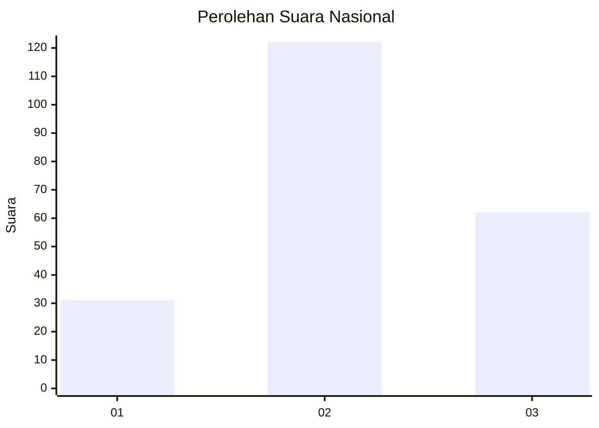
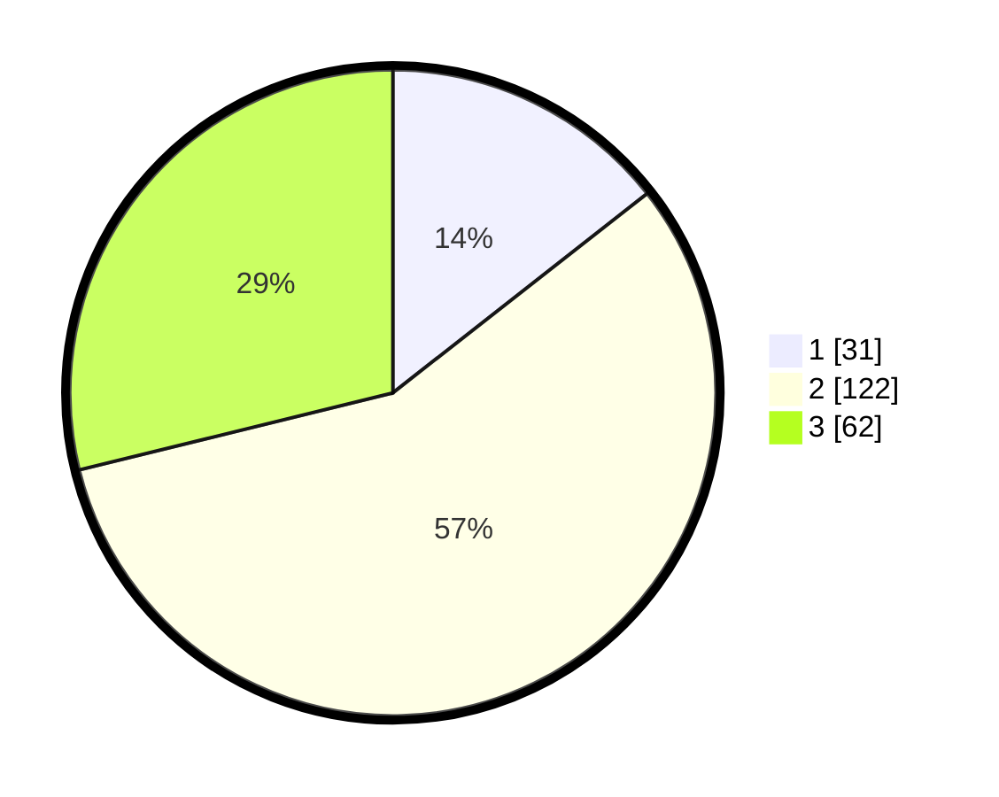

# Hasil

## Grafik

## Tabel

| No. | Nama Paslon    | Suara | Suara (raw) | Persentase |
|:--- |:-------------- | -----:| -----------:| ----------:|
| 1   | ANIES MUHAIMIN | 31    | [31][p-1]   | 14,42      |
| 2   | PRABOWO GIBRAN | 122   | [122][p-2]  | 56,74      |
| 3   | GANJAR MAHFUD  | 62    | [62][p-3]   | 28,84      |

[p-1]: https://github.com/gigit-pemilu/pemilu-2024/blob/main/pilpres/hitung-suara/sub/34-di-yogyakarta/sub/02-bantul/sub/09-jetis/sub/2004-trimulyo/sub/036-tps/sub/paslon-1.txt
[p-2]: https://github.com/gigit-pemilu/pemilu-2024/blob/main/pilpres/hitung-suara/sub/34-di-yogyakarta/sub/02-bantul/sub/09-jetis/sub/2004-trimulyo/sub/036-tps/sub/paslon-2.txt
[p-3]: https://github.com/gigit-pemilu/pemilu-2024/blob/main/pilpres/hitung-suara/sub/34-di-yogyakarta/sub/02-bantul/sub/09-jetis/sub/2004-trimulyo/sub/036-tps/sub/paslon-3.txt

## Foto C Plano

https://sirekap-obj-formc.kpu.go.id/2b19/pemilu/ppwp/34/02/09/20/04/3402092004036-20240214-192837--f6a0c03f-cbdc-4027-acbb-b240a711b9d6.jpg

https://sirekap-obj-formc.kpu.go.id/2b19/pemilu/ppwp/34/02/09/20/04/3402092004036-20240215-010509--b4c158d7-8c5a-4a82-9cb1-f8e0a9c6d524.jpg

https://sirekap-obj-formc.kpu.go.id/2b19/pemilu/ppwp/34/02/09/20/04/3402092004036-20240215-010612--222a9361-e6b3-4ced-8919-3fff3771a2f6.jpg

## Metadata

| Key        | Value               |
| ---------- | ------------------- |
| Time Stamp | 2024-02-25 16:00:00 |

