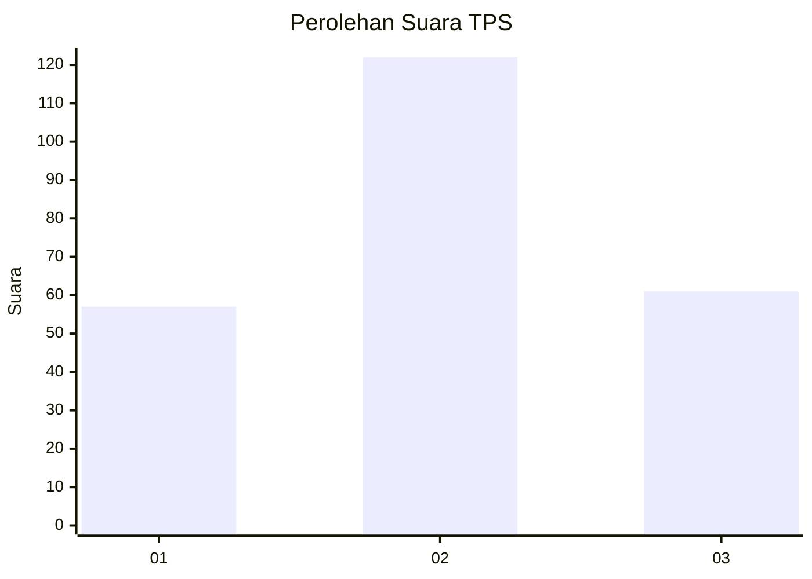
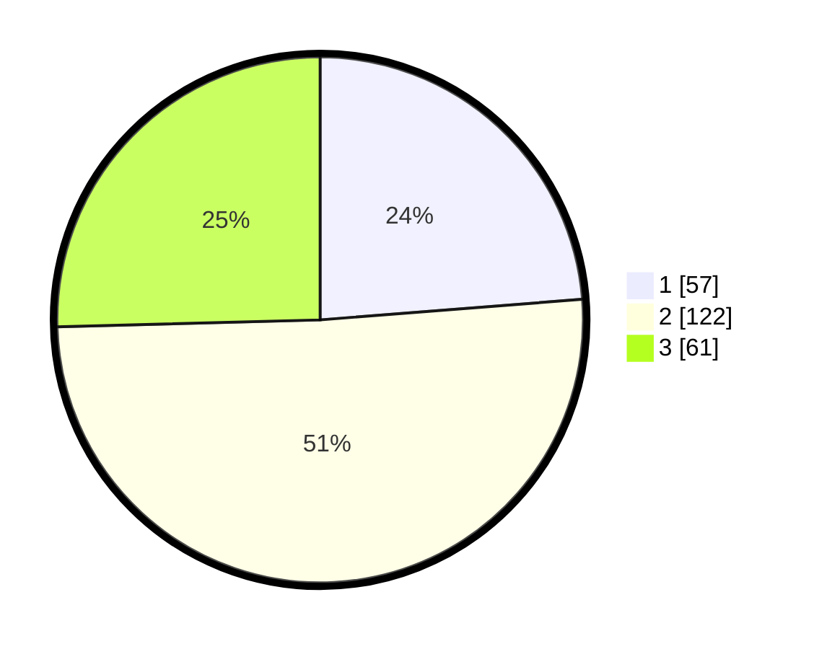

# Hasil

## Grafik

## Tabel

| No. | Nama Paslon    | Suara | Suara (raw) | Persentase |
|:--- |:-------------- | -----:| -----------:| ----------:|
| 1   | ANIES MUHAIMIN | 57    | [57][p-1]   | 23,75      |
| 2   | PRABOWO GIBRAN | 122   | [122][p-2]  | 50,83      |
| 3   | GANJAR MAHFUD  | 61    | [61][p-3]   | 25,42      |

[p-1]: https://github.com/gigit-pemilu/pemilu-2024-34-di-yogyakarta/blob/main/pilpres/hitung-suara/sub/34-di-yogyakarta/sub/02-bantul/sub/09-jetis/sub/2004-trimulyo/sub/037-tps/sub/paslon-1.txt
[p-2]: https://github.com/gigit-pemilu/pemilu-2024-34-di-yogyakarta/blob/main/pilpres/hitung-suara/sub/34-di-yogyakarta/sub/02-bantul/sub/09-jetis/sub/2004-trimulyo/sub/037-tps/sub/paslon-2.txt
[p-3]: https://github.com/gigit-pemilu/pemilu-2024-34-di-yogyakarta/blob/main/pilpres/hitung-suara/sub/34-di-yogyakarta/sub/02-bantul/sub/09-jetis/sub/2004-trimulyo/sub/037-tps/sub/paslon-3.txt

## Foto C Plano

https://sirekap-obj-formc.kpu.go.id/e244/pemilu/ppwp/34/02/09/20/04/3402092004037-20240215-020944--fb046a03-382e-4b68-ab00-dbbc1ab1447d.jpg

https://sirekap-obj-formc.kpu.go.id/e244/pemilu/ppwp/34/02/09/20/04/3402092004037-20240214-234532--9db56429-9eb5-4f9f-9762-443693ebf408.jpg

https://sirekap-obj-formc.kpu.go.id/e244/pemilu/ppwp/34/02/09/20/04/3402092004037-20240214-234644--06d1f89f-a45e-4cfc-848b-8a14bd30da3e.jpg

## Metadata

| Key        | Value               |
| ---------- | ------------------- |
| Time Stamp | 2024-02-24 22:31:28 |

