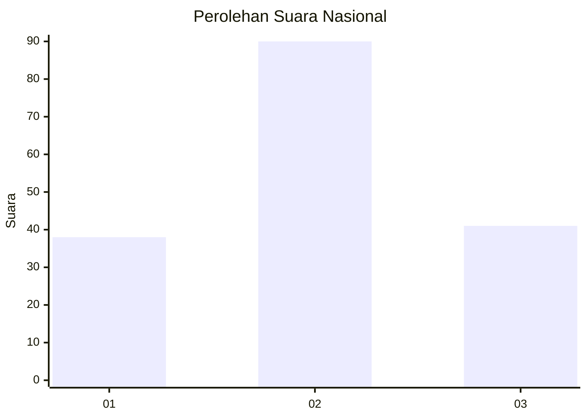
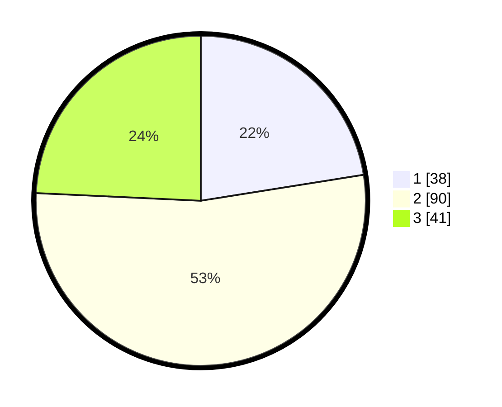

# Hasil

## Grafik

## Tabel

| No. | Nama Paslon    | Suara | Suara (raw) | Persentase |
|:--- |:-------------- | -----:| -----------:| ----------:|
| 1   | ANIES MUHAIMIN | 38    | [38][p-1]   | 22,49      |
| 2   | PRABOWO GIBRAN | 90    | [90][p-2]   | 53,25      |
| 3   | GANJAR MAHFUD  | 41    | [41][p-3]   | 24,26      |

[p-1]: https://github.com/gigit-pemilu/pemilu-2024/blob/main/pilpres/hitung-suara/sub/34-di-yogyakarta/sub/02-bantul/sub/09-jetis/sub/2004-trimulyo/sub/038-tps/sub/paslon-1.txt
[p-2]: https://github.com/gigit-pemilu/pemilu-2024/blob/main/pilpres/hitung-suara/sub/34-di-yogyakarta/sub/02-bantul/sub/09-jetis/sub/2004-trimulyo/sub/038-tps/sub/paslon-2.txt
[p-3]: https://github.com/gigit-pemilu/pemilu-2024/blob/main/pilpres/hitung-suara/sub/34-di-yogyakarta/sub/02-bantul/sub/09-jetis/sub/2004-trimulyo/sub/038-tps/sub/paslon-3.txt

## Foto C Plano

https://sirekap-obj-formc.kpu.go.id/2c3c/pemilu/ppwp/34/02/09/20/04/3402092004038-20240214-202448--f1718dd0-989a-4321-96e2-eb63f78ce495.jpg

https://sirekap-obj-formc.kpu.go.id/2c3c/pemilu/ppwp/34/02/09/20/04/3402092004038-20240214-202642--93631a0c-f21e-442e-97d6-12c1530cddba.jpg

https://sirekap-obj-formc.kpu.go.id/2c3c/pemilu/ppwp/34/02/09/20/04/3402092004038-20240214-223158--1fe8c246-796e-4e0b-8acc-855c6ac5dcf3.jpg

## Metadata

| Key        | Value               |
| ---------- | ------------------- |
| Time Stamp | 2024-02-15 00:41:44 |

