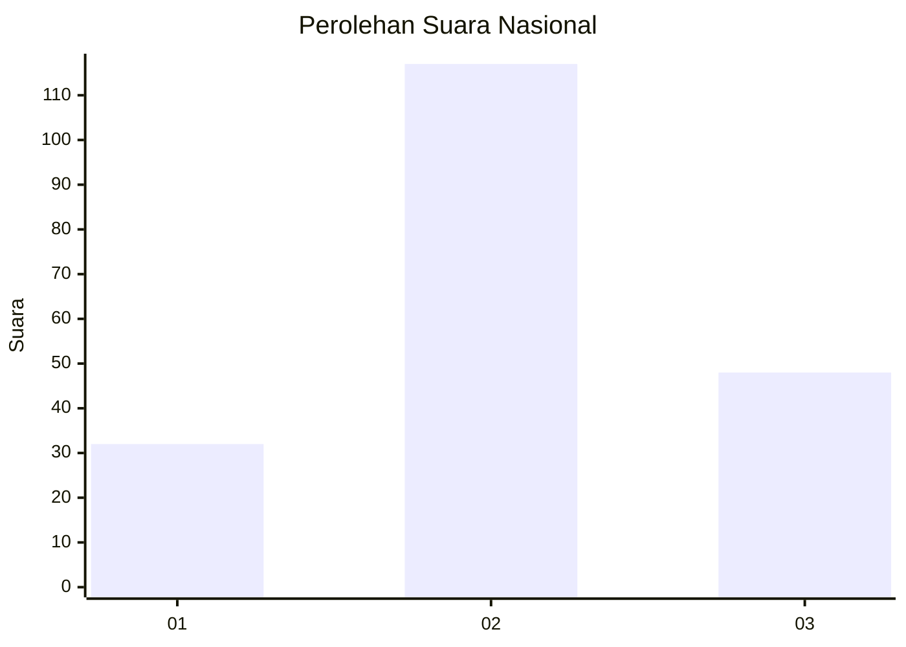
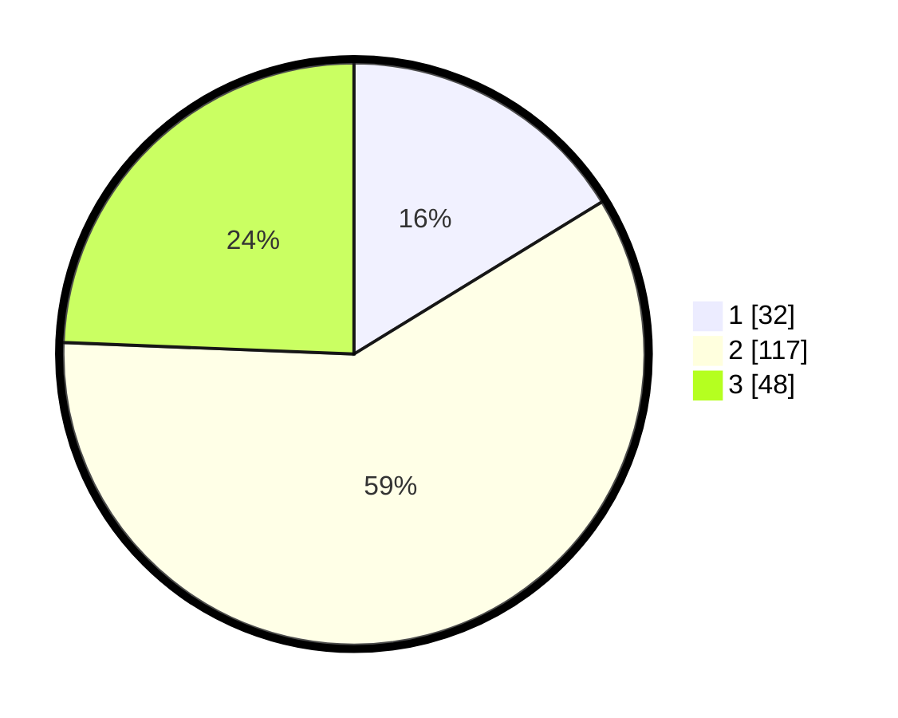

# Hasil

## Grafik

## Tabel

| No. | Nama Paslon    | Suara | Suara (raw) | Persentase |
|:--- |:-------------- | -----:| -----------:| ----------:|
| 1   | ANIES MUHAIMIN | 32    | [32][p-1]   | 16,24      |
| 2   | PRABOWO GIBRAN | 117   | [117][p-2]  | 59,39      |
| 3   | GANJAR MAHFUD  | 48    | [48][p-3]   | 24,37      |

[p-1]: https://github.com/gigit-pemilu/pemilu-2024/blob/main/pilpres/hitung-suara/sub/34-di-yogyakarta/sub/02-bantul/sub/09-jetis/sub/2004-trimulyo/sub/040-tps/sub/paslon-1.txt
[p-2]: https://github.com/gigit-pemilu/pemilu-2024/blob/main/pilpres/hitung-suara/sub/34-di-yogyakarta/sub/02-bantul/sub/09-jetis/sub/2004-trimulyo/sub/040-tps/sub/paslon-2.txt
[p-3]: https://github.com/gigit-pemilu/pemilu-2024/blob/main/pilpres/hitung-suara/sub/34-di-yogyakarta/sub/02-bantul/sub/09-jetis/sub/2004-trimulyo/sub/040-tps/sub/paslon-3.txt

## Foto C Plano

https://sirekap-obj-formc.kpu.go.id/6614/pemilu/ppwp/34/02/09/20/04/3402092004040-20240214-224320--2e9cf88c-f322-46ea-877f-7285a5585964.jpg

https://sirekap-obj-formc.kpu.go.id/6614/pemilu/ppwp/34/02/09/20/04/3402092004040-20240214-224606--11a3be89-0205-427e-af7e-253a63fdea56.jpg

https://sirekap-obj-formc.kpu.go.id/6614/pemilu/ppwp/34/02/09/20/04/3402092004040-20240214-225216--5341da05-3847-4a8d-9b8e-2ced6982a5e4.jpg

## Metadata

| Key        | Value               |
| ---------- | ------------------- |
| Time Stamp | 2024-02-24 22:31:28 |

