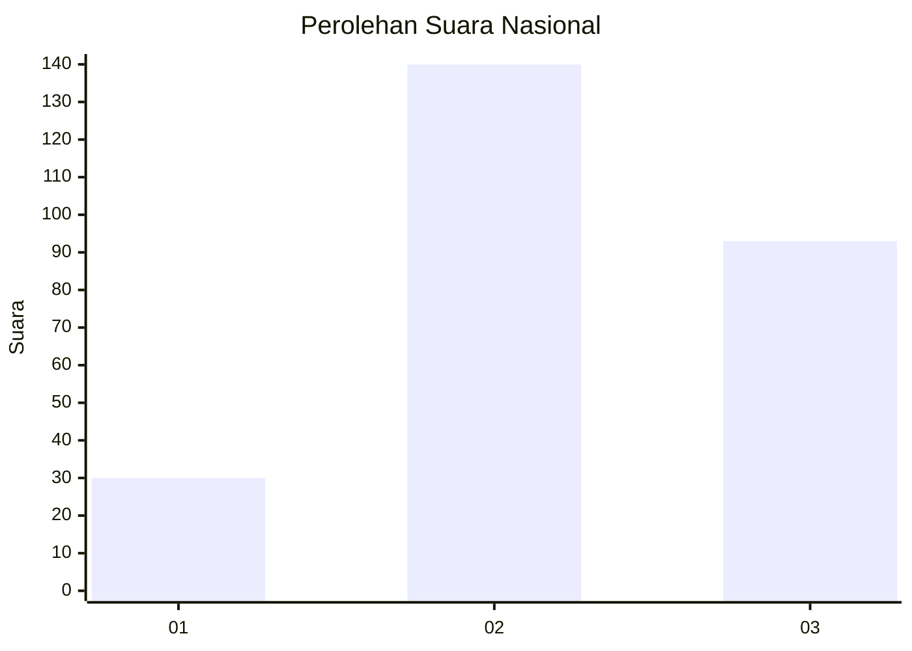
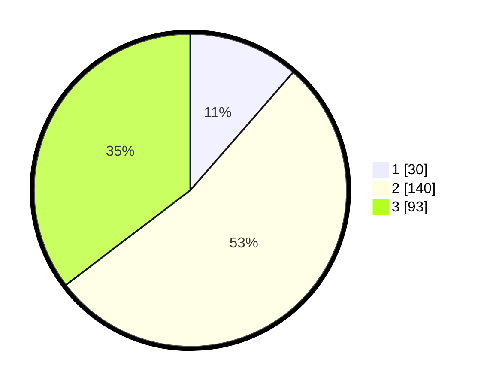

# Hasil

## Grafik

## Tabel

| No. | Nama Paslon    | Suara | Suara (raw) | Persentase |
|:--- |:-------------- | -----:| -----------:| ----------:|
| 1   | ANIES MUHAIMIN | 30    | [30][p-1]   | 11,41      |
| 2   | PRABOWO GIBRAN | 140   | [140][p-2]  | 53,23      |
| 3   | GANJAR MAHFUD  | 93    | [93][p-3]   | 35,36      |

[p-1]: https://github.com/gigit-pemilu/pemilu-2024/blob/main/pilpres/hitung-suara/sub/34-di-yogyakarta/sub/02-bantul/sub/09-jetis/sub/2004-trimulyo/sub/045-tps/sub/paslon-1.txt
[p-2]: https://github.com/gigit-pemilu/pemilu-2024/blob/main/pilpres/hitung-suara/sub/34-di-yogyakarta/sub/02-bantul/sub/09-jetis/sub/2004-trimulyo/sub/045-tps/sub/paslon-2.txt
[p-3]: https://github.com/gigit-pemilu/pemilu-2024/blob/main/pilpres/hitung-suara/sub/34-di-yogyakarta/sub/02-bantul/sub/09-jetis/sub/2004-trimulyo/sub/045-tps/sub/paslon-3.txt

## Foto C Plano

https://sirekap-obj-formc.kpu.go.id/ec49/pemilu/ppwp/34/02/09/20/04/3402092004045-20240215-001622--aed0dbd7-382b-486a-99d9-eb01420a0cf6.jpg

https://sirekap-obj-formc.kpu.go.id/ec49/pemilu/ppwp/34/02/09/20/04/3402092004045-20240215-001857--d43e58c7-7fb3-4bbe-856b-ec8d702ddb89.jpg

https://sirekap-obj-formc.kpu.go.id/ec49/pemilu/ppwp/34/02/09/20/04/3402092004045-20240215-002324--8c4a00b4-8765-40ba-9886-0af4e503a723.jpg

## Metadata

| Key        | Value               |
| ---------- | ------------------- |
| Time Stamp | 2024-02-24 22:31:28 |

