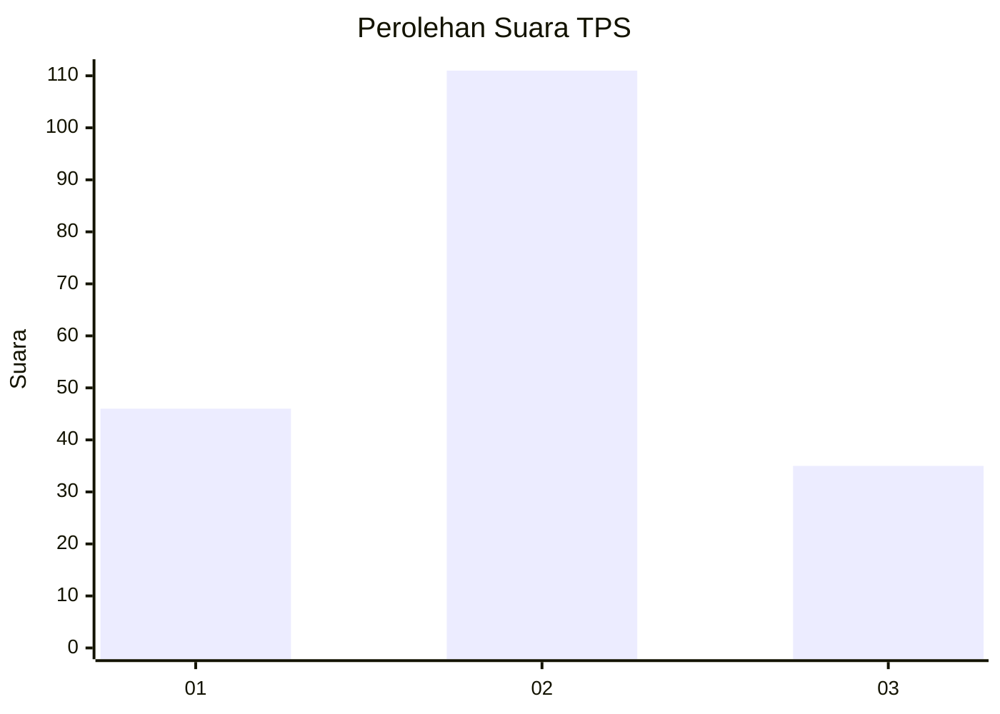
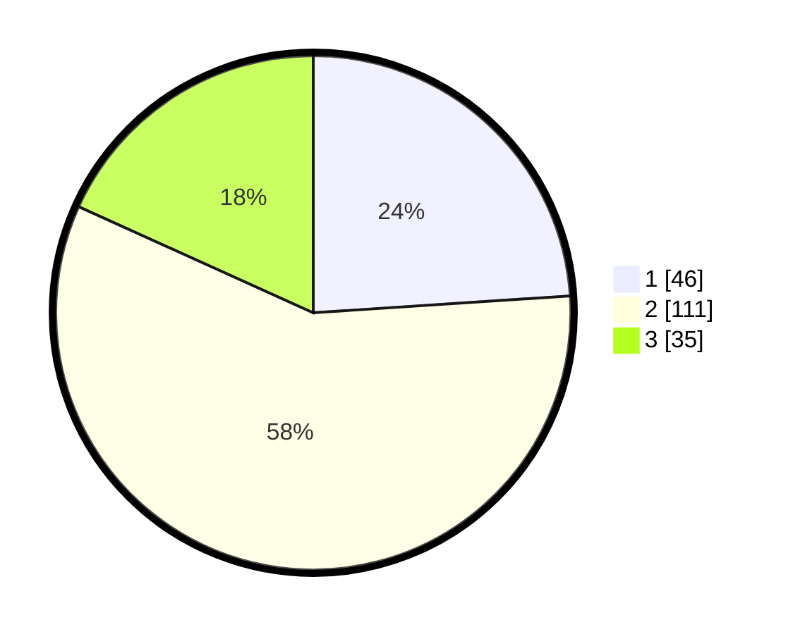

# Hasil

## Grafik

## Tabel

| No. | Nama Paslon    | Suara | Suara (raw) | Persentase |
|:--- |:-------------- | -----:| -----------:| ----------:|
| 1   | ANIES MUHAIMIN | 46    | [46][p-1]   | 23,96      |
| 2   | PRABOWO GIBRAN | 111   | [111][p-2]  | 57,81      |
| 3   | GANJAR MAHFUD  | 35    | [35][p-3]   | 18,23      |

[p-1]: https://github.com/gigit-pemilu/pemilu-2024-34-di-yogyakarta/blob/main/pilpres/hitung-suara/sub/34-di-yogyakarta/sub/02-bantul/sub/09-jetis/sub/2004-trimulyo/sub/046-tps/sub/paslon-1.txt
[p-2]: https://github.com/gigit-pemilu/pemilu-2024-34-di-yogyakarta/blob/main/pilpres/hitung-suara/sub/34-di-yogyakarta/sub/02-bantul/sub/09-jetis/sub/2004-trimulyo/sub/046-tps/sub/paslon-2.txt
[p-3]: https://github.com/gigit-pemilu/pemilu-2024-34-di-yogyakarta/blob/main/pilpres/hitung-suara/sub/34-di-yogyakarta/sub/02-bantul/sub/09-jetis/sub/2004-trimulyo/sub/046-tps/sub/paslon-3.txt

## Foto C Plano

https://sirekap-obj-formc.kpu.go.id/48d2/pemilu/ppwp/34/02/09/20/04/3402092004046-20240214-234112--44b0abf4-4847-4e77-bbe6-e8114e28fa6e.jpg

https://sirekap-obj-formc.kpu.go.id/48d2/pemilu/ppwp/34/02/09/20/04/3402092004046-20240214-234631--68256b00-e580-45a0-ab93-e4ce9754297e.jpg

https://sirekap-obj-formc.kpu.go.id/48d2/pemilu/ppwp/34/02/09/20/04/3402092004046-20240214-235005--482b86ee-1af6-4c97-bd61-034fc2901edb.jpg

## Metadata

| Key        | Value               |
| ---------- | ------------------- |
| Time Stamp | 2024-02-24 22:31:28 |

