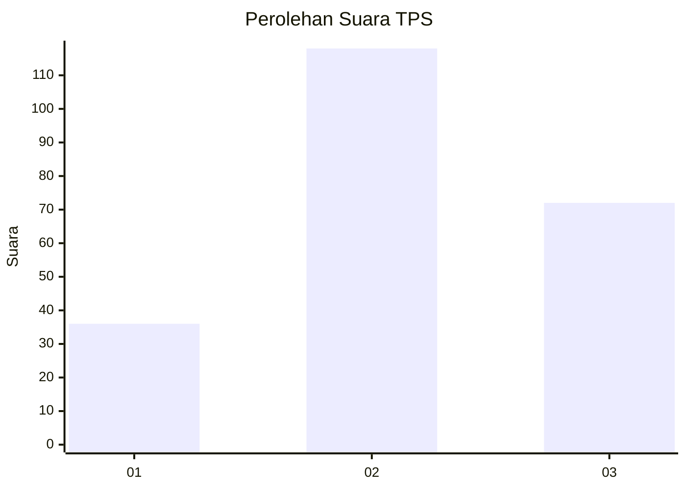
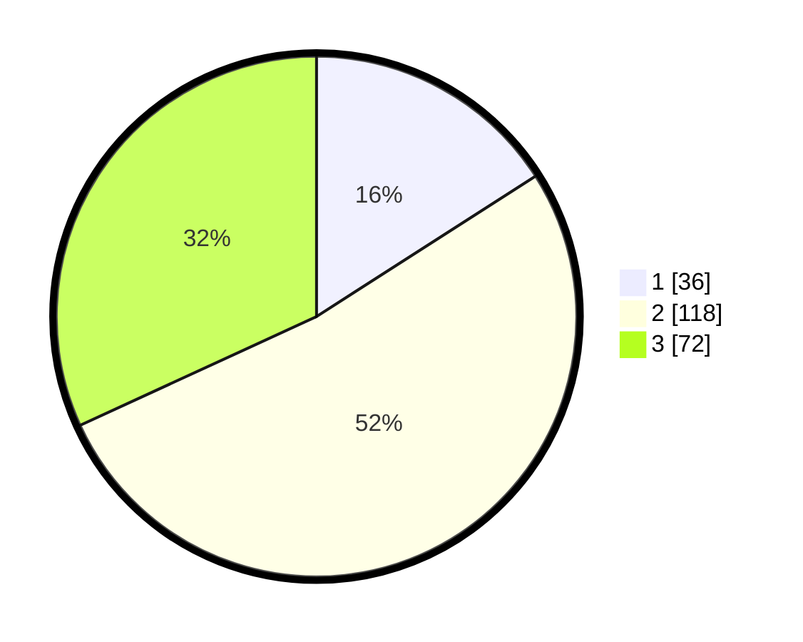

# Hasil

## Grafik

## Tabel

| No. | Nama Paslon    | Suara | Suara (raw) | Persentase |
|:--- |:-------------- | -----:| -----------:| ----------:|
| 1   | ANIES MUHAIMIN | 36    | [36][p-1]   | 15,93      |
| 2   | PRABOWO GIBRAN | 118   | [118][p-2]  | 52,21      |
| 3   | GANJAR MAHFUD  | 72    | [72][p-3]   | 31,86      |

[p-1]: https://github.com/gigit-pemilu/pemilu-2024-34-di-yogyakarta/blob/main/pilpres/hitung-suara/sub/34-di-yogyakarta/sub/02-bantul/sub/09-jetis/sub/2004-trimulyo/sub/048-tps/sub/paslon-1.txt
[p-2]: https://github.com/gigit-pemilu/pemilu-2024-34-di-yogyakarta/blob/main/pilpres/hitung-suara/sub/34-di-yogyakarta/sub/02-bantul/sub/09-jetis/sub/2004-trimulyo/sub/048-tps/sub/paslon-2.txt
[p-3]: https://github.com/gigit-pemilu/pemilu-2024-34-di-yogyakarta/blob/main/pilpres/hitung-suara/sub/34-di-yogyakarta/sub/02-bantul/sub/09-jetis/sub/2004-trimulyo/sub/048-tps/sub/paslon-3.txt

## Foto C Plano

https://sirekap-obj-formc.kpu.go.id/de9e/pemilu/ppwp/34/02/09/20/04/3402092004048-20240215-171827--9d1baa3b-8b59-47d4-9f72-c03f52a6e32d.jpg

https://sirekap-obj-formc.kpu.go.id/de9e/pemilu/ppwp/34/02/09/20/04/3402092004048-20240215-172031--c95e9d16-6e38-4747-ba96-76a1eba309da.jpg

https://sirekap-obj-formc.kpu.go.id/de9e/pemilu/ppwp/34/02/09/20/04/3402092004048-20240215-172131--10b6722f-887a-41ff-b1fa-9c15decb03d7.jpg

## Metadata

| Key        | Value               |
| ---------- | ------------------- |
| Time Stamp | 2024-02-24 22:31:28 |

