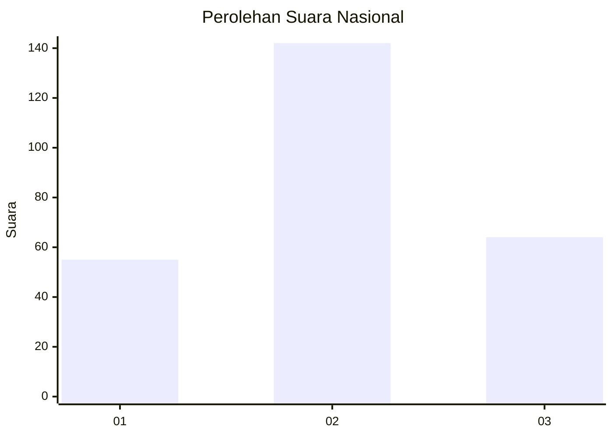
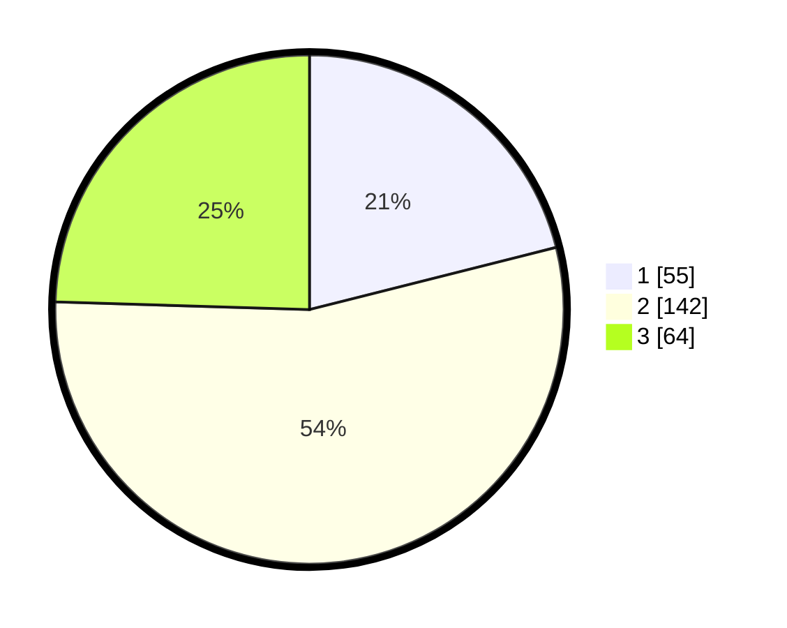

# Hasil

## Grafik

## Tabel

| No. | Nama Paslon    | Suara | Suara (raw) | Persentase |
|:--- |:-------------- | -----:| -----------:| ----------:|
| 1   | ANIES MUHAIMIN | 55    | [55][p-1]   | 21,07      |
| 2   | PRABOWO GIBRAN | 142   | [142][p-2]  | 54,41      |
| 3   | GANJAR MAHFUD  | 64    | [64][p-3]   | 24,52      |

[p-1]: https://github.com/gigit-pemilu/pemilu-2024/blob/main/pilpres/hitung-suara/sub/34-di-yogyakarta/sub/02-bantul/sub/09-jetis/sub/2004-trimulyo/sub/049-tps/sub/paslon-1.txt
[p-2]: https://github.com/gigit-pemilu/pemilu-2024/blob/main/pilpres/hitung-suara/sub/34-di-yogyakarta/sub/02-bantul/sub/09-jetis/sub/2004-trimulyo/sub/049-tps/sub/paslon-2.txt
[p-3]: https://github.com/gigit-pemilu/pemilu-2024/blob/main/pilpres/hitung-suara/sub/34-di-yogyakarta/sub/02-bantul/sub/09-jetis/sub/2004-trimulyo/sub/049-tps/sub/paslon-3.txt

## Foto C Plano

https://sirekap-obj-formc.kpu.go.id/0a37/pemilu/ppwp/34/02/09/20/04/3402092004049-20240215-003941--f421755a-2343-4afb-863a-7ff184794b62.jpg

https://sirekap-obj-formc.kpu.go.id/0a37/pemilu/ppwp/34/02/09/20/04/3402092004049-20240215-004050--f3313944-512b-4f10-ae32-a2668d2a1c91.jpg

https://sirekap-obj-formc.kpu.go.id/0a37/pemilu/ppwp/34/02/09/20/04/3402092004049-20240215-004234--0ea0ef5a-e59f-472f-823c-82b88f49de40.jpg

## Metadata

| Key        | Value               |
| ---------- | ------------------- |
| Time Stamp | 2024-02-25 00:00:00 |

