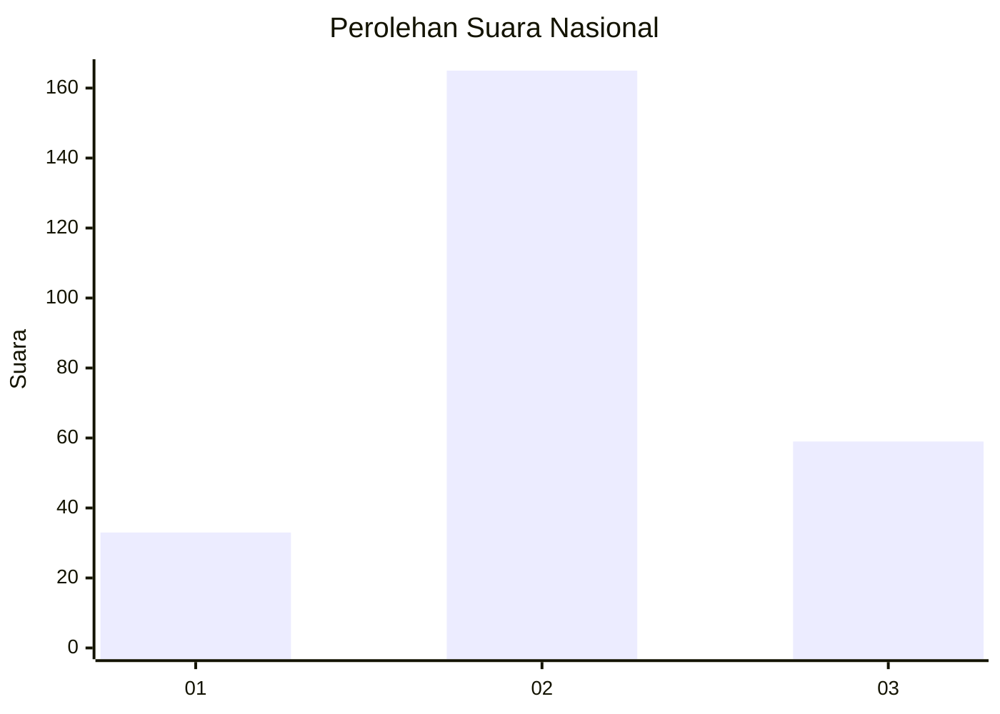
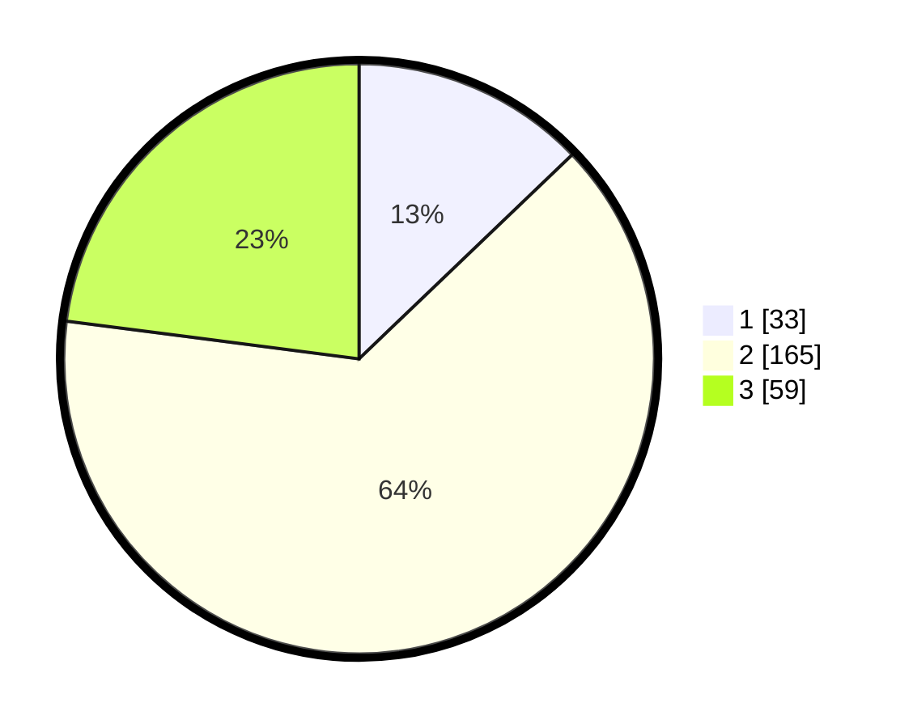

# Hasil

## Grafik

## Tabel

| No. | Nama Paslon    | Suara | Suara (raw) | Persentase |
|:--- |:-------------- | -----:| -----------:| ----------:|
| 1   | ANIES MUHAIMIN | 33    | [33][p-1]   | 12,84      |
| 2   | PRABOWO GIBRAN | 165   | [165][p-2]  | 64,20      |
| 3   | GANJAR MAHFUD  | 59    | [59][p-3]   | 22,96      |

[p-1]: https://github.com/gigit-pemilu/pemilu-2024/blob/main/pilpres/hitung-suara/sub/34-di-yogyakarta/sub/02-bantul/sub/09-jetis/sub/2004-trimulyo/sub/050-tps/sub/paslon-1.txt
[p-2]: https://github.com/gigit-pemilu/pemilu-2024/blob/main/pilpres/hitung-suara/sub/34-di-yogyakarta/sub/02-bantul/sub/09-jetis/sub/2004-trimulyo/sub/050-tps/sub/paslon-2.txt
[p-3]: https://github.com/gigit-pemilu/pemilu-2024/blob/main/pilpres/hitung-suara/sub/34-di-yogyakarta/sub/02-bantul/sub/09-jetis/sub/2004-trimulyo/sub/050-tps/sub/paslon-3.txt

## Foto C Plano

https://sirekap-obj-formc.kpu.go.id/343c/pemilu/ppwp/34/02/09/20/04/3402092004050-20240216-082838--73a87c42-0e7f-438c-9fdc-bc04d66c2967.jpg

https://sirekap-obj-formc.kpu.go.id/343c/pemilu/ppwp/34/02/09/20/04/3402092004050-20240216-082844--ed4a1c11-90de-4dc2-b3fb-9b37d00db34d.jpg

https://sirekap-obj-formc.kpu.go.id/343c/pemilu/ppwp/34/02/09/20/04/3402092004050-20240216-082851--6dcc2a3e-ffc4-47b3-a232-09f9e3348be9.jpg

## Metadata

| Key        | Value               |
| ---------- | ------------------- |
| Time Stamp | 2024-02-24 22:31:28 |

