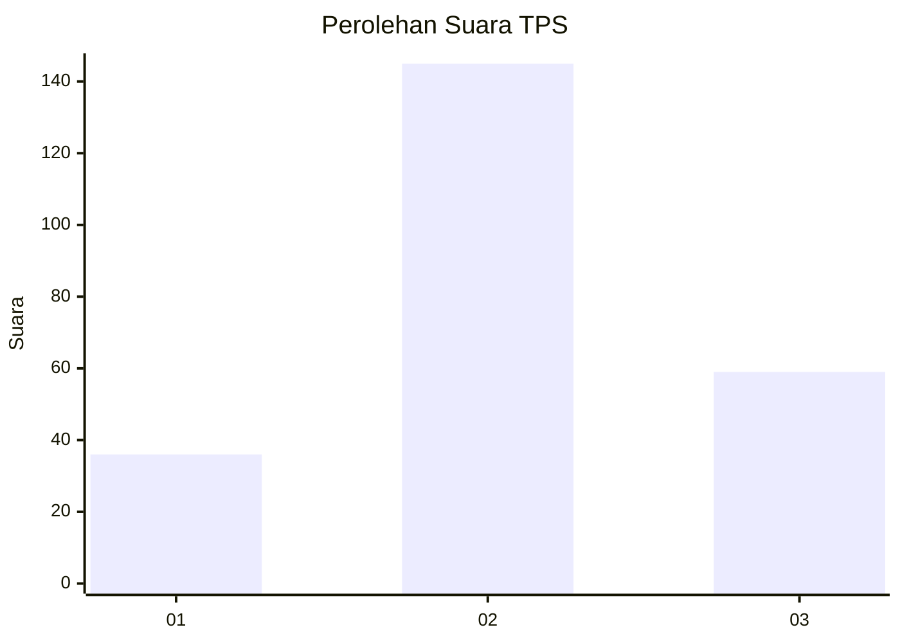
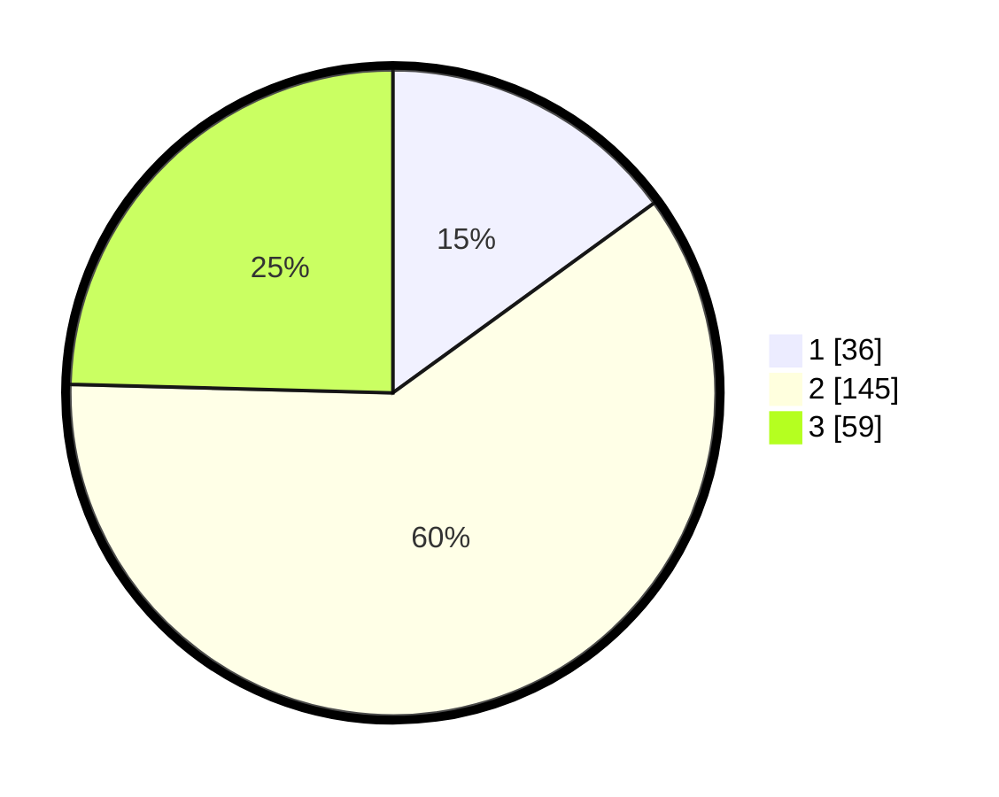

# Hasil

## Grafik

## Tabel

| No. | Nama Paslon    | Suara | Suara (raw) | Persentase |
|:--- |:-------------- | -----:| -----------:| ----------:|
| 1   | ANIES MUHAIMIN | 36    | [36][p-1]   | 15,00      |
| 2   | PRABOWO GIBRAN | 145   | [145][p-2]  | 60,42      |
| 3   | GANJAR MAHFUD  | 59    | [59][p-3]   | 24,58      |

[p-1]: https://github.com/gigit-pemilu/pemilu-2024-34-di-yogyakarta/blob/main/pilpres/hitung-suara/sub/34-di-yogyakarta/sub/02-bantul/sub/09-jetis/sub/2004-trimulyo/sub/052-tps/sub/paslon-1.txt
[p-2]: https://github.com/gigit-pemilu/pemilu-2024-34-di-yogyakarta/blob/main/pilpres/hitung-suara/sub/34-di-yogyakarta/sub/02-bantul/sub/09-jetis/sub/2004-trimulyo/sub/052-tps/sub/paslon-2.txt
[p-3]: https://github.com/gigit-pemilu/pemilu-2024-34-di-yogyakarta/blob/main/pilpres/hitung-suara/sub/34-di-yogyakarta/sub/02-bantul/sub/09-jetis/sub/2004-trimulyo/sub/052-tps/sub/paslon-3.txt

## Foto C Plano

https://sirekap-obj-formc.kpu.go.id/9680/pemilu/ppwp/34/02/09/20/04/3402092004052-20240214-214906--990e667f-148c-42fc-80b9-1cf937a7db4c.jpg

https://sirekap-obj-formc.kpu.go.id/9680/pemilu/ppwp/34/02/09/20/04/3402092004052-20240214-215031--6c3504fe-247f-40b1-9577-b1e7d0f6988d.jpg

https://sirekap-obj-formc.kpu.go.id/9680/pemilu/ppwp/34/02/09/20/04/3402092004052-20240214-215141--a3937779-5036-45f8-b2e1-aedbbd1d6b5a.jpg

## Metadata

| Key        | Value               |
| ---------- | ------------------- |
| Time Stamp | 2024-02-25 11:00:00 |

