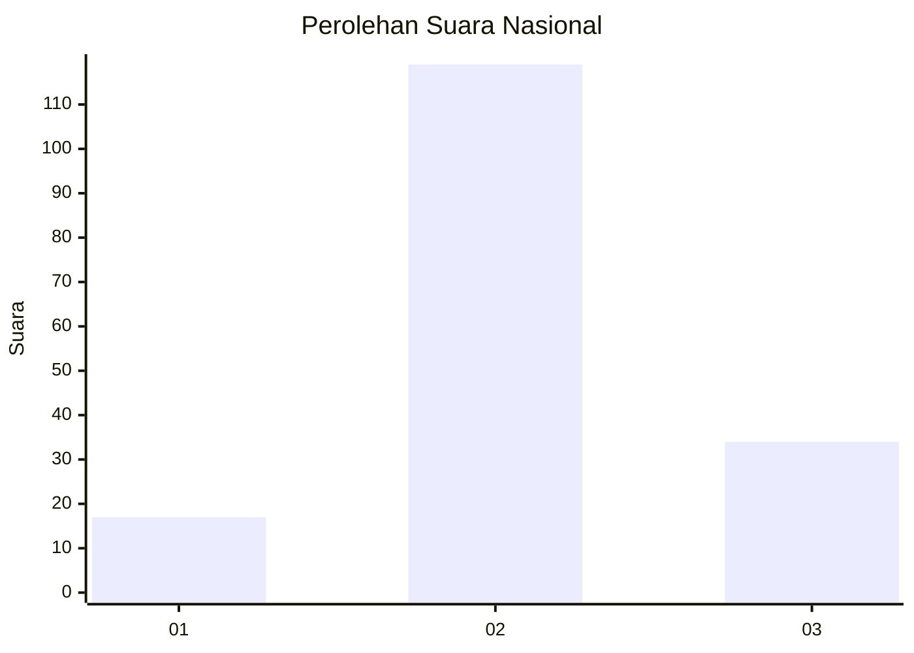
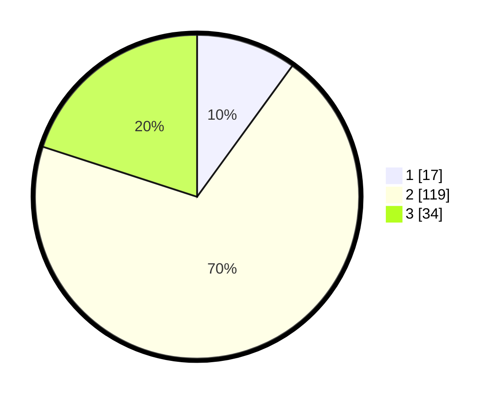

# Hasil

## Grafik

## Tabel

| No. | Nama Paslon    | Suara | Suara (raw) | Persentase |
|:--- |:-------------- | -----:| -----------:| ----------:|
| 1   | ANIES MUHAIMIN | 17    | [17][p-1]   | 10,00      |
| 2   | PRABOWO GIBRAN | 119   | [119][p-2]  | 70,00      |
| 3   | GANJAR MAHFUD  | 34    | [34][p-3]   | 20,00      |

[p-1]: https://github.com/gigit-pemilu/pemilu-2024/blob/main/pilpres/hitung-suara/sub/34-di-yogyakarta/sub/02-bantul/sub/10-imogiri/sub/2001-selopamioro/sub/002-tps/sub/paslon-1.txt
[p-2]: https://github.com/gigit-pemilu/pemilu-2024/blob/main/pilpres/hitung-suara/sub/34-di-yogyakarta/sub/02-bantul/sub/10-imogiri/sub/2001-selopamioro/sub/002-tps/sub/paslon-2.txt
[p-3]: https://github.com/gigit-pemilu/pemilu-2024/blob/main/pilpres/hitung-suara/sub/34-di-yogyakarta/sub/02-bantul/sub/10-imogiri/sub/2001-selopamioro/sub/002-tps/sub/paslon-3.txt

## Foto C Plano

https://sirekap-obj-formc.kpu.go.id/e813/pemilu/ppwp/34/02/10/20/01/3402102001002-20240216-151524--e801a3cc-b36d-4695-8a3f-dcd287626bbd.jpg

https://sirekap-obj-formc.kpu.go.id/e813/pemilu/ppwp/34/02/10/20/01/3402102001002-20240216-151525--8726fb3d-730c-4a1e-b21e-8c67c76add0a.jpg

https://sirekap-obj-formc.kpu.go.id/e813/pemilu/ppwp/34/02/10/20/01/3402102001002-20240216-151524--05f14b30-831a-4bb1-995e-4d83a6d4057e.jpg

## Metadata

| Key        | Value               |
| ---------- | ------------------- |
| Time Stamp | 2024-02-21 10:00:00 |

## DATA PEMILIH TETAP

Jumlah pemilih dalam DPT: **192**.
 * L: **95**.
 * P: **97**.

## DATA PENGGUNA HAK PILIH

Jumlah pengguna hak pilih dalam DPT: **170**.
 * L: **85**.
 * P: **85**.

Jumlah pengguna hak pilih dalam DPTb: **3**.
 * L: **0**.
 * P: **3**.

Jumlah pengguna hak pilih dalam DPK: **0**.
 * L: **0**.
 * P: **0**.

Jumlah pengguna hak pilih: **173**.
 * L: **85**.
 * P: **88**.

## JUMLAH SUARA SAH DAN TIDAK SAH

JUMLAH SELURUH SUARA SAH: **170**.

JUMLAH SUARA TIDAK SAH: **3**.

JUMLAH SELURUH SUARA SAH DAN SUARA TIDAK SAH: **173**.

