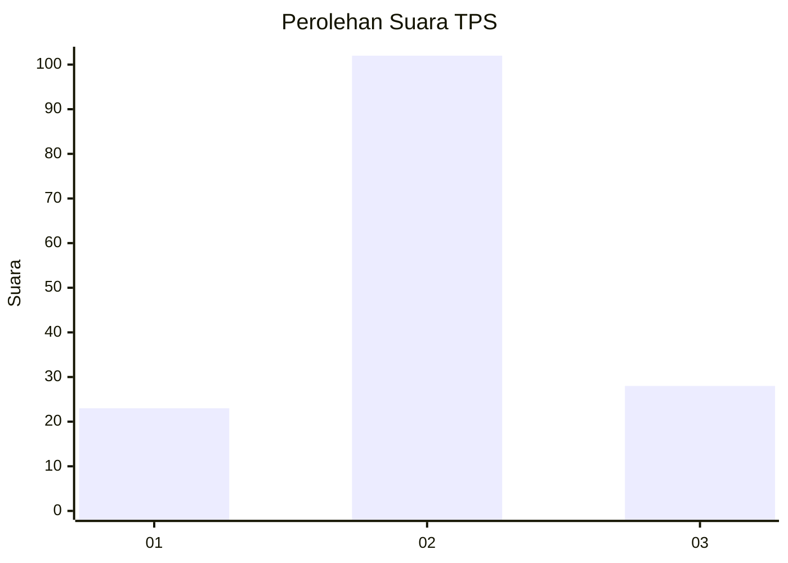
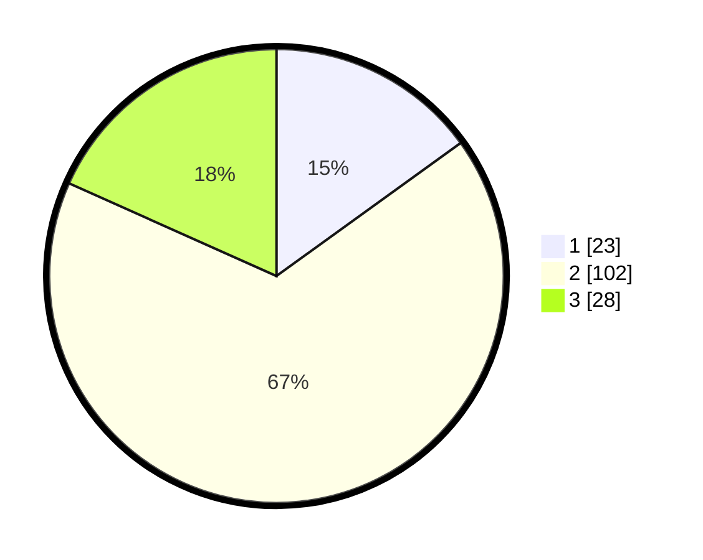

# Hasil

## Grafik

## Tabel

| No. | Nama Paslon    | Suara | Suara (raw) | Persentase |
|:--- |:-------------- | -----:| -----------:| ----------:|
| 1   | ANIES MUHAIMIN | 23    | [23][p-1]   | 15,03      |
| 2   | PRABOWO GIBRAN | 102   | [102][p-2]  | 66,67      |
| 3   | GANJAR MAHFUD  | 28    | [28][p-3]   | 18,30      |

[p-1]: https://github.com/gigit-pemilu/pemilu-2024-34-di-yogyakarta/blob/main/pilpres/hitung-suara/sub/34-di-yogyakarta/sub/02-bantul/sub/10-imogiri/sub/2001-selopamioro/sub/003-tps/sub/paslon-1.txt
[p-2]: https://github.com/gigit-pemilu/pemilu-2024-34-di-yogyakarta/blob/main/pilpres/hitung-suara/sub/34-di-yogyakarta/sub/02-bantul/sub/10-imogiri/sub/2001-selopamioro/sub/003-tps/sub/paslon-2.txt
[p-3]: https://github.com/gigit-pemilu/pemilu-2024-34-di-yogyakarta/blob/main/pilpres/hitung-suara/sub/34-di-yogyakarta/sub/02-bantul/sub/10-imogiri/sub/2001-selopamioro/sub/003-tps/sub/paslon-3.txt

## Foto C Plano

https://sirekap-obj-formc.kpu.go.id/241f/pemilu/ppwp/34/02/10/20/01/3402102001003-20240216-185841--ecca091b-1cfe-452b-bc4e-3b8f72a8ce6e.jpg

https://sirekap-obj-formc.kpu.go.id/241f/pemilu/ppwp/34/02/10/20/01/3402102001003-20240216-185842--e5059778-24af-4e3f-a82b-477bd8fef32e.jpg

https://sirekap-obj-formc.kpu.go.id/241f/pemilu/ppwp/34/02/10/20/01/3402102001003-20240216-185841--cce00f0f-dafe-4001-b977-cd585002b07c.jpg

## Metadata

| Key        | Value               |
| ---------- | ------------------- |
| Time Stamp | 2024-02-21 10:00:00 |

## DATA PEMILIH TETAP

Jumlah pemilih dalam DPT: **173**.
 * L: **88**.
 * P: **85**.

## DATA PENGGUNA HAK PILIH

Jumlah pengguna hak pilih dalam DPT: **159**.
 * L: **81**.
 * P: **78**.

Jumlah pengguna hak pilih dalam DPTb: **0**.
 * L: **0**.
 * P: **0**.

Jumlah pengguna hak pilih dalam DPK: **1**.
 * L: **0**.
 * P: **1**.

Jumlah pengguna hak pilih: **160**.
 * L: **81**.
 * P: **79**.

## JUMLAH SUARA SAH DAN TIDAK SAH

JUMLAH SELURUH SUARA SAH: **153**.

JUMLAH SUARA TIDAK SAH: **7**.

JUMLAH SELURUH SUARA SAH DAN SUARA TIDAK SAH: **160**.

