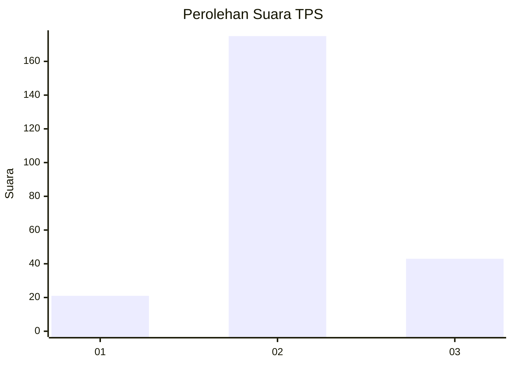
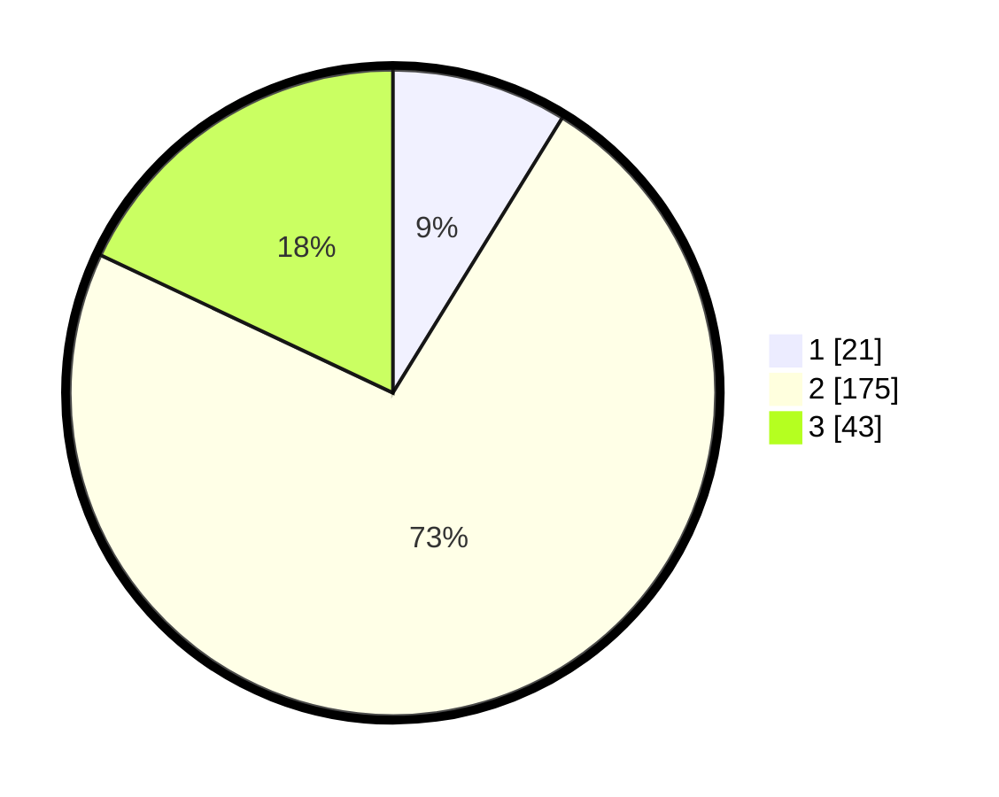

# Hasil

## Grafik

## Tabel

| No. | Nama Paslon    | Suara | Suara (raw) | Persentase |
|:--- |:-------------- | -----:| -----------:| ----------:|
| 1   | ANIES MUHAIMIN | 21    | [21][p-1]   | 8,79       |
| 2   | PRABOWO GIBRAN | 175   | [175][p-2]  | 73,22      |
| 3   | GANJAR MAHFUD  | 43    | [43][p-3]   | 17,99      |

[p-1]: https://github.com/gigit-pemilu/pemilu-2024-34-di-yogyakarta/blob/main/pilpres/hitung-suara/sub/34-di-yogyakarta/sub/02-bantul/sub/10-imogiri/sub/2001-selopamioro/sub/004-tps/sub/paslon-1.txt
[p-2]: https://github.com/gigit-pemilu/pemilu-2024-34-di-yogyakarta/blob/main/pilpres/hitung-suara/sub/34-di-yogyakarta/sub/02-bantul/sub/10-imogiri/sub/2001-selopamioro/sub/004-tps/sub/paslon-2.txt
[p-3]: https://github.com/gigit-pemilu/pemilu-2024-34-di-yogyakarta/blob/main/pilpres/hitung-suara/sub/34-di-yogyakarta/sub/02-bantul/sub/10-imogiri/sub/2001-selopamioro/sub/004-tps/sub/paslon-3.txt

## Foto C Plano

https://sirekap-obj-formc.kpu.go.id/6cc8/pemilu/ppwp/34/02/10/20/01/3402102001004-20240216-154522--98e975a9-5985-4b8f-94d6-70e178fd6c66.jpg

https://sirekap-obj-formc.kpu.go.id/6cc8/pemilu/ppwp/34/02/10/20/01/3402102001004-20240216-154524--cb277b4e-fdaa-4b97-bb0e-eccf4dcb22f5.jpg

https://sirekap-obj-formc.kpu.go.id/6cc8/pemilu/ppwp/34/02/10/20/01/3402102001004-20240216-154523--de941311-57b4-4f0f-a94d-45ea060da487.jpg

## Metadata

| Key        | Value               |
| ---------- | ------------------- |
| Time Stamp | 2024-02-21 00:00:00 |

## DATA PEMILIH TETAP

Jumlah pemilih dalam DPT: **292**.
 * L: **143**.
 * P: **149**.

## DATA PENGGUNA HAK PILIH

Jumlah pengguna hak pilih dalam DPT: **253**.
 * L: **120**.
 * P: **133**.

Jumlah pengguna hak pilih dalam DPTb: **2**.
 * L: **1**.
 * P: **1**.

Jumlah pengguna hak pilih dalam DPK: **0**.
 * L: **0**.
 * P: **0**.

Jumlah pengguna hak pilih: **255**.
 * L: **121**.
 * P: **134**.

## JUMLAH SUARA SAH DAN TIDAK SAH

JUMLAH SELURUH SUARA SAH: **239**.

JUMLAH SUARA TIDAK SAH: **16**.

JUMLAH SELURUH SUARA SAH DAN SUARA TIDAK SAH: **255**.

