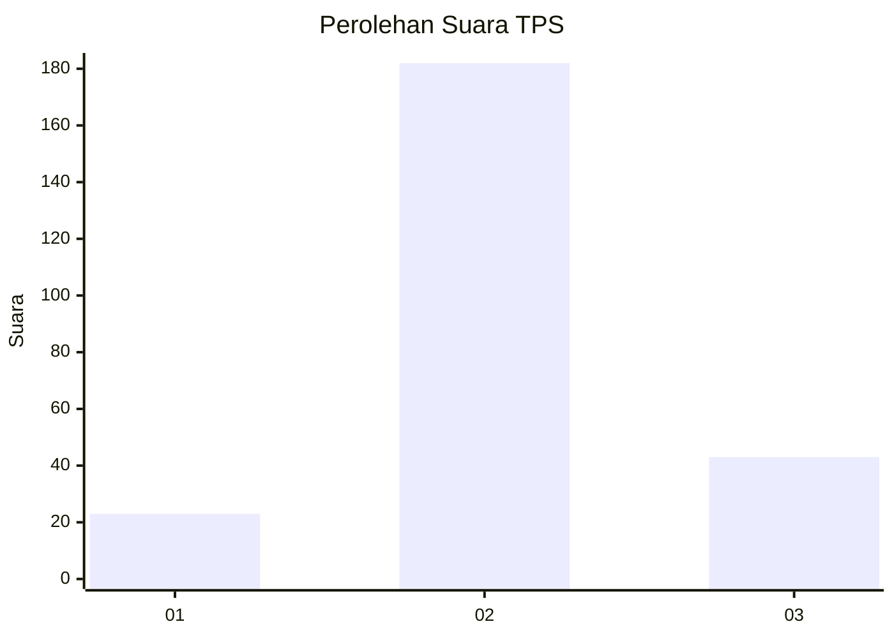
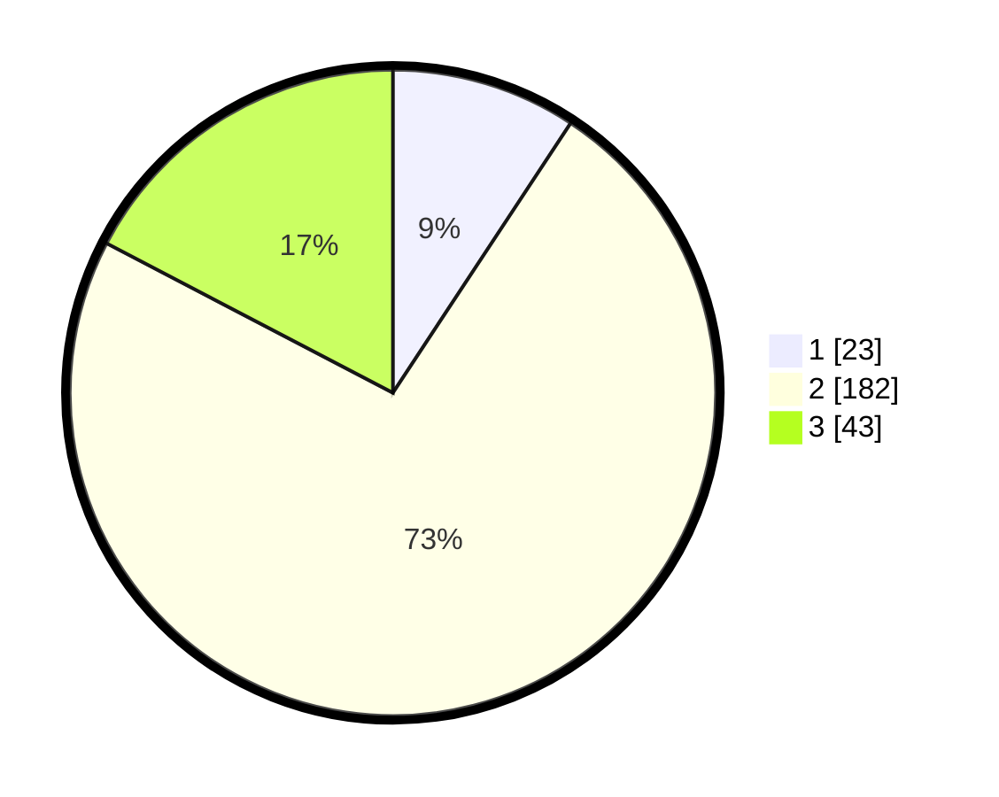

# Hasil

## Grafik

## Tabel

| No. | Nama Paslon    | Suara | Suara (raw) | Persentase |
|:--- |:-------------- | -----:| -----------:| ----------:|
| 1   | ANIES MUHAIMIN | 23    | [23][p-1]   | 9,27       |
| 2   | PRABOWO GIBRAN | 182   | [182][p-2]  | 73,39      |
| 3   | GANJAR MAHFUD  | 43    | [43][p-3]   | 17,34      |

[p-1]: https://github.com/gigit-pemilu/pemilu-2024-34-di-yogyakarta/blob/main/pilpres/hitung-suara/sub/34-di-yogyakarta/sub/02-bantul/sub/10-imogiri/sub/2001-selopamioro/sub/005-tps/sub/paslon-1.txt
[p-2]: https://github.com/gigit-pemilu/pemilu-2024-34-di-yogyakarta/blob/main/pilpres/hitung-suara/sub/34-di-yogyakarta/sub/02-bantul/sub/10-imogiri/sub/2001-selopamioro/sub/005-tps/sub/paslon-2.txt
[p-3]: https://github.com/gigit-pemilu/pemilu-2024-34-di-yogyakarta/blob/main/pilpres/hitung-suara/sub/34-di-yogyakarta/sub/02-bantul/sub/10-imogiri/sub/2001-selopamioro/sub/005-tps/sub/paslon-3.txt

## Foto C Plano

https://sirekap-obj-formc.kpu.go.id/f9b5/pemilu/ppwp/34/02/10/20/01/3402102001005-20240217-192949--1cd2203f-40c9-46d7-b94e-e5716924b8b8.jpg

https://sirekap-obj-formc.kpu.go.id/f9b5/pemilu/ppwp/34/02/10/20/01/3402102001005-20240217-192950--d2928351-68b0-4c34-855c-94c22c8a1e7c.jpg

https://sirekap-obj-formc.kpu.go.id/f9b5/pemilu/ppwp/34/02/10/20/01/3402102001005-20240217-192949--b32146a3-481c-47a7-998b-962a4971b79c.jpg

## Metadata

| Key        | Value               |
| ---------- | ------------------- |
| Time Stamp | 2024-02-21 10:00:00 |

## DATA PEMILIH TETAP

Jumlah pemilih dalam DPT: **269**.
 * L: **139**.
 * P: **130**.

## DATA PENGGUNA HAK PILIH

Jumlah pengguna hak pilih dalam DPT: **251**.
 * L: **131**.
 * P: **120**.

Jumlah pengguna hak pilih dalam DPTb: **1**.
 * L: **0**.
 * P: **1**.

Jumlah pengguna hak pilih dalam DPK: **2**.
 * L: **1**.
 * P: **1**.

Jumlah pengguna hak pilih: **254**.
 * L: **132**.
 * P: **122**.

## JUMLAH SUARA SAH DAN TIDAK SAH

JUMLAH SELURUH SUARA SAH: **248**.

JUMLAH SUARA TIDAK SAH: **6**.

JUMLAH SELURUH SUARA SAH DAN SUARA TIDAK SAH: **254**.

