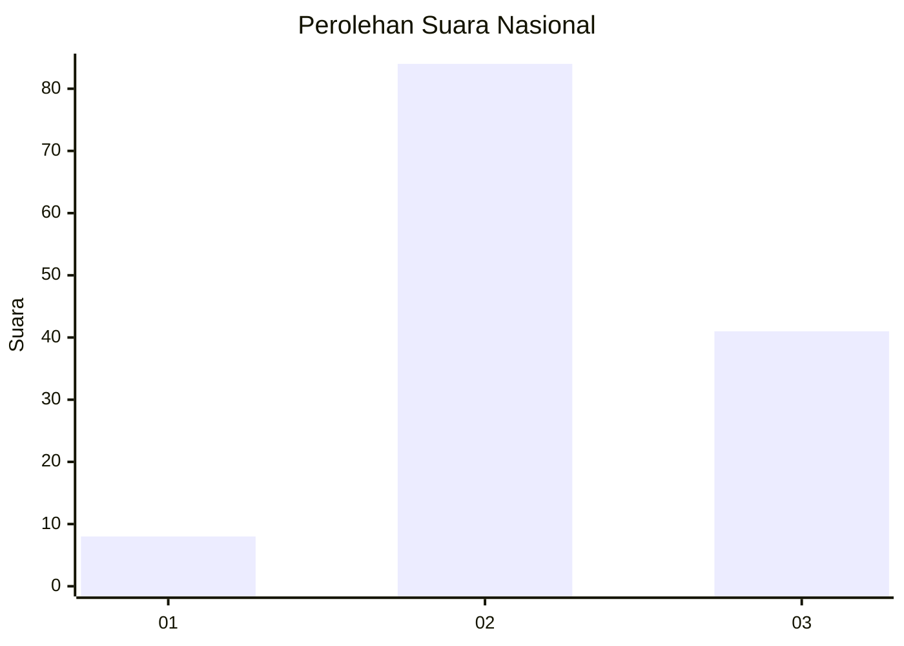
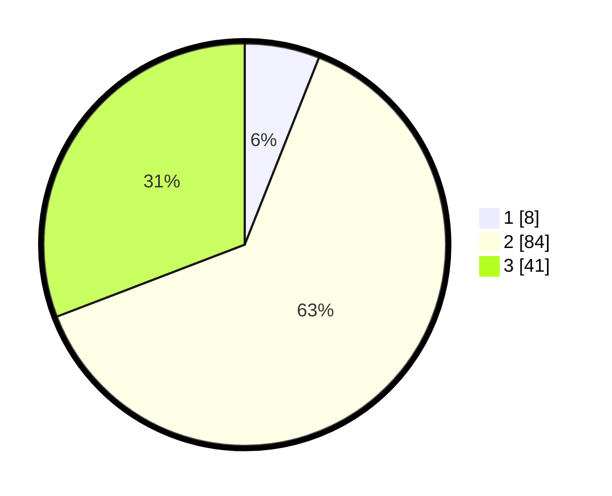

# Hasil

## Grafik

## Tabel

| No. | Nama Paslon    | Suara | Suara (raw) | Persentase |
|:--- |:-------------- | -----:| -----------:| ----------:|
| 1   | ANIES MUHAIMIN | 8     | [8][p-1]    | 6,02       |
| 2   | PRABOWO GIBRAN | 84    | [84][p-2]   | 63,16      |
| 3   | GANJAR MAHFUD  | 41    | [41][p-3]   | 30,83      |

[p-1]: https://github.com/gigit-pemilu/pemilu-2024/blob/main/pilpres/hitung-suara/sub/34-di-yogyakarta/sub/02-bantul/sub/10-imogiri/sub/2001-selopamioro/sub/041-tps/sub/paslon-1.txt
[p-2]: https://github.com/gigit-pemilu/pemilu-2024/blob/main/pilpres/hitung-suara/sub/34-di-yogyakarta/sub/02-bantul/sub/10-imogiri/sub/2001-selopamioro/sub/041-tps/sub/paslon-2.txt
[p-3]: https://github.com/gigit-pemilu/pemilu-2024/blob/main/pilpres/hitung-suara/sub/34-di-yogyakarta/sub/02-bantul/sub/10-imogiri/sub/2001-selopamioro/sub/041-tps/sub/paslon-3.txt

## Foto C Plano

https://sirekap-obj-formc.kpu.go.id/6512/pemilu/ppwp/34/02/10/20/01/3402102001041-20240216-173440--8478f43c-eebe-4046-be2e-5d82c695e3e9.jpg

https://sirekap-obj-formc.kpu.go.id/6512/pemilu/ppwp/34/02/10/20/01/3402102001041-20240216-173441--5bca837c-5884-4fc7-93ed-1c6ad515e2ec.jpg

https://sirekap-obj-formc.kpu.go.id/6512/pemilu/ppwp/34/02/10/20/01/3402102001041-20240216-173441--38c81c97-9c0b-4c13-bb09-863de040d04f.jpg

## Metadata

| Key        | Value               |
| ---------- | ------------------- |
| Time Stamp | 2024-02-21 13:00:00 |

## DATA PEMILIH TETAP

Jumlah pemilih dalam DPT: **160**.
 * L: **69**.
 * P: **91**.

## DATA PENGGUNA HAK PILIH

Jumlah pengguna hak pilih dalam DPT: **160**.
 * L: **69**.
 * P: **91**.

Jumlah pengguna hak pilih dalam DPTb: **0**.
 * L: **1**.
 * P: **0**.

Jumlah pengguna hak pilih dalam DPK: **0**.
 * L: **0**.
 * P: **0**.

Jumlah pengguna hak pilih: **161**.
 * L: **70**.
 * P: **91**.

## JUMLAH SUARA SAH DAN TIDAK SAH

JUMLAH SELURUH SUARA SAH: **133**.

JUMLAH SUARA TIDAK SAH: **4**.

JUMLAH SELURUH SUARA SAH DAN SUARA TIDAK SAH: **137**.

