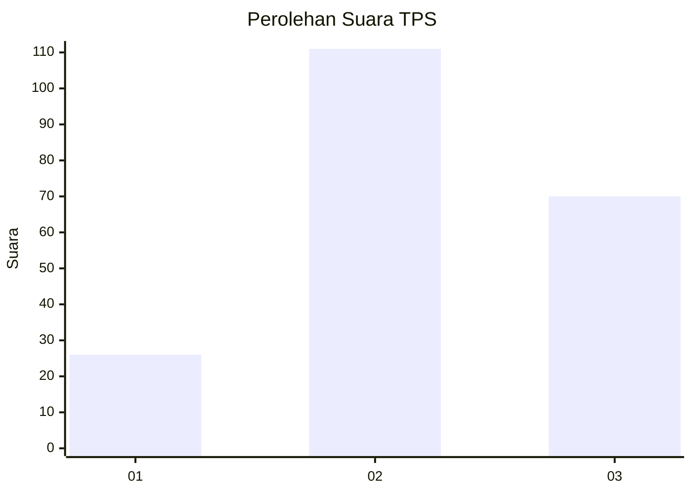
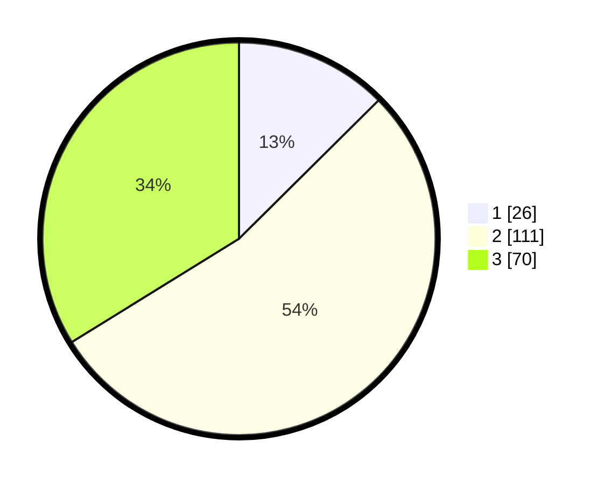

# Hasil

## Grafik

## Tabel

| No. | Nama Paslon    | Suara | Suara (raw) | Persentase |
|:--- |:-------------- | -----:| -----------:| ----------:|
| 1   | ANIES MUHAIMIN | 26    | [26][p-1]   | 12,56      |
| 2   | PRABOWO GIBRAN | 111   | [111][p-2]  | 53,62      |
| 3   | GANJAR MAHFUD  | 70    | [70][p-3]   | 33,82      |

[p-1]: https://github.com/gigit-pemilu/pemilu-2024-34-di-yogyakarta/blob/main/pilpres/hitung-suara/sub/34-di-yogyakarta/sub/02-bantul/sub/10-imogiri/sub/2002-sriharjo/sub/005-tps/sub/paslon-1.txt
[p-2]: https://github.com/gigit-pemilu/pemilu-2024-34-di-yogyakarta/blob/main/pilpres/hitung-suara/sub/34-di-yogyakarta/sub/02-bantul/sub/10-imogiri/sub/2002-sriharjo/sub/005-tps/sub/paslon-2.txt
[p-3]: https://github.com/gigit-pemilu/pemilu-2024-34-di-yogyakarta/blob/main/pilpres/hitung-suara/sub/34-di-yogyakarta/sub/02-bantul/sub/10-imogiri/sub/2002-sriharjo/sub/005-tps/sub/paslon-3.txt

## Foto C Plano

https://sirekap-obj-formc.kpu.go.id/d12f/pemilu/ppwp/34/02/10/20/02/3402102002005-20240215-034739--2d7671ba-ae36-4ff6-adc0-a2068c4a5794.jpg

https://sirekap-obj-formc.kpu.go.id/d12f/pemilu/ppwp/34/02/10/20/02/3402102002005-20240215-034946--077dbba2-7dc9-493a-a4b6-4c2ee523f86c.jpg

https://sirekap-obj-formc.kpu.go.id/d12f/pemilu/ppwp/34/02/10/20/02/3402102002005-20240215-035429--31e8f30c-9fb5-4d77-bafd-a012505099d6.jpg

## Metadata

| Key        | Value               |
| ---------- | ------------------- |
| Time Stamp | 2024-02-25 15:00:00 |

