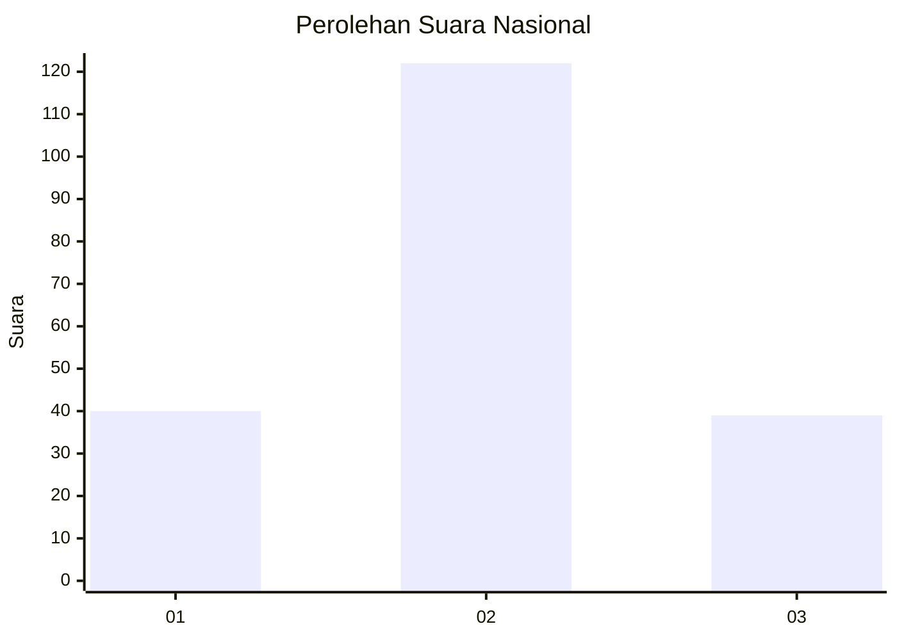
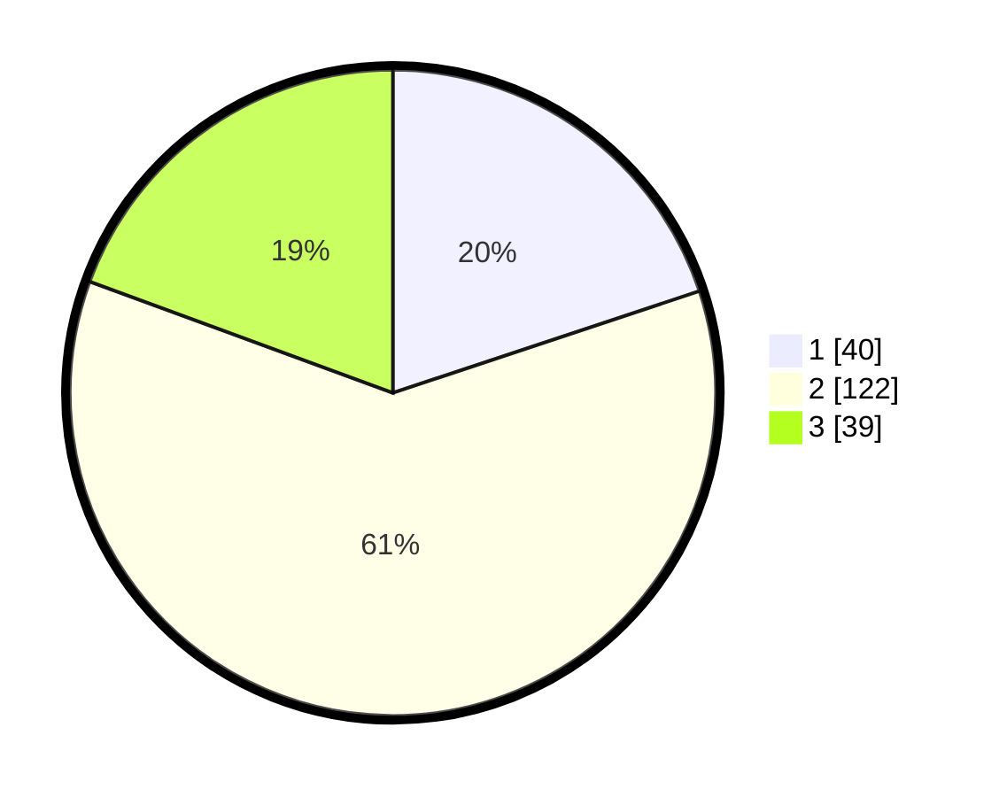

# Hasil

## Grafik

## Tabel

| No. | Nama Paslon    | Suara | Suara (raw) | Persentase |
|:--- |:-------------- | -----:| -----------:| ----------:|
| 1   | ANIES MUHAIMIN | 40    | [40][p-1]   | 19,90      |
| 2   | PRABOWO GIBRAN | 122   | [122][p-2]  | 60,70      |
| 3   | GANJAR MAHFUD  | 39    | [39][p-3]   | 19,40      |

[p-1]: https://github.com/gigit-pemilu/pemilu-2024/blob/main/pilpres/hitung-suara/sub/34-di-yogyakarta/sub/02-bantul/sub/10-imogiri/sub/2002-sriharjo/sub/010-tps/sub/paslon-1.txt
[p-2]: https://github.com/gigit-pemilu/pemilu-2024/blob/main/pilpres/hitung-suara/sub/34-di-yogyakarta/sub/02-bantul/sub/10-imogiri/sub/2002-sriharjo/sub/010-tps/sub/paslon-2.txt
[p-3]: https://github.com/gigit-pemilu/pemilu-2024/blob/main/pilpres/hitung-suara/sub/34-di-yogyakarta/sub/02-bantul/sub/10-imogiri/sub/2002-sriharjo/sub/010-tps/sub/paslon-3.txt

## Foto C Plano

https://sirekap-obj-formc.kpu.go.id/ec7f/pemilu/ppwp/34/02/10/20/02/3402102002010-20240217-135603--41d912fe-330d-45de-ab2b-b7a57b49cbde.jpg

https://sirekap-obj-formc.kpu.go.id/ec7f/pemilu/ppwp/34/02/10/20/02/3402102002010-20240218-205140--2f0dd6cd-c874-4779-a378-76f2cb3245d8.jpg

https://sirekap-obj-formc.kpu.go.id/ec7f/pemilu/ppwp/34/02/10/20/02/3402102002010-20240218-210835--11ae50ab-cae0-4066-9e16-f062ce9148b9.jpg

## Metadata

| Key        | Value               |
| ---------- | ------------------- |
| Time Stamp | 2024-02-19 06:16:00 |

